# 1.Getting Ready

## 1. ArmPi mini Introduction

### 1.1 Product Introduction

Powered by Raspberry Pi 5, ArmPi mini is an open source robotic arm for  beginners. It takes OpenCV as the image processing library and is loaded with 130° HD camera with the first person view.
With built-in inverse kinematics algorithm, ArmPi mini can use Python to perform different AI vision functions like color recognition, color sorting, target tracking and intelligent stacking.
Not only can it fit the users’ needs for learning and testing machine vision, robotic arm motion control and inverse kinematics, but also provide easy-to-learn integration solution for secondary development. Abundance of tutorial material and source code are available for you to start ArmPi mini immediately!

### 1.2  Packing List

### 1.3 Usage Precautions

Please pay attention to the following points when using and storing this product:

This product contains conductive components. Avoid contact with metal objects when powered on.

After the robot is powered on, do not forcibly move the servo, as this may cause damage.

If the robot runs for an extended period, the servos may become hot. Allow the robot to “rest” and wait for the servos to cool before resuming operation.

Keep your face, glasses, and other body parts away from the robot while it is operating. Do not place fingers within the joint movement range to prevent injury. Also, be cautious of falls from high edges.

The robot’s servos are precision components and consumable parts. They may need replacement after long-term or intensive use.

If the product will not be used for an extended period, fully charge the battery, remove it, and store it in a cool, dry place.

 

### 1.4 Copyright Notice

This manual is the property of Shenzhen Hiwonder Technology Co., Ltd. No organization or individual is permitted to reproduce, copy, translate, or distribute any content from this manual without authorization.

Any unauthorized use or infringement of this manual's copyright will be subject to legal action by our company.

 

### 1.5 Disclaimer

The product described in this manual (including hardware, software, etc.) is provided "as is." Every effort has been made to ensure the accuracy of this manual, but we cannot guarantee it is completely free from errors or omissions. This document is regularly reviewed, and we welcome feedback for improvements.

Product features and specifications may change with version upgrades. For the latest product information, please contact customer service when placing your order.

Furthermore, unless explicitly stated by Hiwonder, we are not responsible for any losses resulting from product malfunctions or damage under extreme conditions outside of typical use cases.

## 2.Introduction to Raspberry Pi 5

Raspberry Pi, known as "树莓派" in Chinese, abbreviated as RPi or RasPi/RPI. It is a credit-card sized computer developed by the Raspberry Pi Foundation in the UK. It is hoped that it can help children worldwide to learn programming and understand how computers work. The Raspberry Pi can connect to a keyboard, mouse, and Internet cable. It also features a TV output interface for analog video signals and an HDMI high-definition video output interface. It is a capable little device that enables people of all ages to explore computing and to learn how to program in languages like Python. And it is capable of doing everything you’d expect a desktop computer to do, from browsing the internet and playing high-definition video, to making spreadsheets, word-processing, and playing games.

Raspberry Pi icon

### 2.1 Brief Introduction of Raspberry Pi 5

Raspberry Pi 5 features a 64-bit quad-core Cortex A76 processor with 2.4 GHz operating frequency. Compared to the Raspberry Pi 4, the CPU performance has increased by 2 to 3 times. Apart from the significant improvement in graphics performance with the 800MHz VideoCore VII GPU, it also supports dual 4Kp60 display output via HDMI, and advanced camera through restructuring Raspberry Pi Image Signal Processor. It provides consumers with a smooth desktop experience and opens up new applications for industrial customers.

This is the first full-sized Raspberry Pi computer, utilizing chips built internally by Raspberry Pi. RP1 provides the majority of the I/O functions for Raspberry Pi 5 and achieves a significant leap in peripheral performance and functionality. The total USB bandwidth has more than doubled, thus speeding up the transfer rate to external UAS drives and other high-speed peripherals. The dedicated dual-channel 1Gbps MIPI camera and display interface on earlier models have been replaced by a pair of quad-channel 1.5Gbps MIPI transceivers, tripling the total bandwidth and supporting a maximum of two cameras or displays in any combination. By supporting SDR104 high-speed mode, the peak performance of the SD card is doubled. This platform introduces a single-channel PCI Express 2.0 interface for the first time, providing support for high-bandwidth peripherals.

### 2.2 Hardware Structure and Feature

**2.2.1 Hardware structure of Raspberry Pi 5 is as pictured**

**2.2.2 Main features**

(1) Four Arm Cortex-A76 cores @ 2.4GHz, with hardware AES encryption support, 512KB L2 cache per core, and a 2MB L3 cache;

(2) 4GB or 8GB LPDDR4X-4267 SDRAM;

(3) Dual 4Kp60 HDMI display output, supporting HDR, and a 4Kp60 HEVC decoder;

(4) VideoCore VII Graphics, support OpenGL-ES 3.1、Vulkan 1.2;

(5) Raspberry Pi Image sensor processor;

(6) Raspberry Pi connector for PCIe (one 2.0 port, additional HAT is needed);

(7) 802.11ac Dual-band Wi-Fi and Bluetooth 5.0 (support BLE);

(8) Gigabit Ethernet;

(9) Two USB2.0, two USB 3.0 (capable of achieving full throughput simultaneously);

(10) Poe support (additional HAT is needed);

(11) Two-lane 4-lane MIPI CSI/DSI connector, support 2x display; or 2x camera; or one display + one camera;

(12) Raspberry Pi 40 pin GPIO connector;

(13) fan port;

(14) Real-time clock;

(15) Power supply key;

**2.2.3 Advantages**

(1) Powerful computational performance;

(2) Open-source hardware and ease of use;

(3) Compared to Microsoft systems, tools are free;

(4) A low-cost development platform and troubleshooting tool;

(5) All applications can be opened without internet access;

(6) Compact size, equivalent to the size of a credit card;

It is precisely because of these advantages that people around the world choose Raspberry Pi more often to learn programming skills, build hardware projects, undertake home automation projects, and even use them in industrial applications.

### 2.3 Parameter Comparison

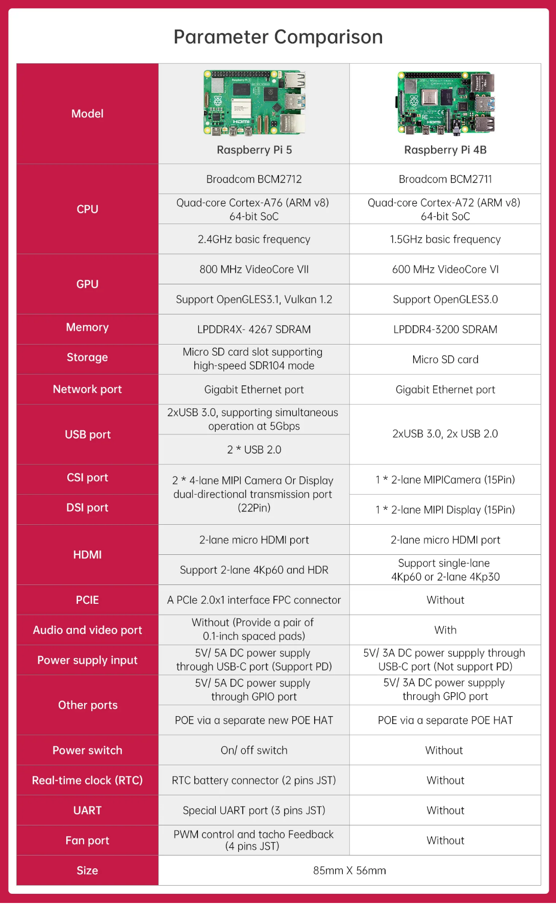

### 2.4 Dimension Diagram (unit: mm)

### 2.5 The Use of Raspberry Pi

(1）Web server

The Raspberry Pi can stay around the clock because it only requires very little power. No need for cooling fans or large amounts of electricity; accessing web pages through the internet or solely within a local network is also sufficiently fast.

(2）Laptop

The Raspberry Pi can be used as the "brain" of a laptop, just need to equip it with a computer screen.

(3）Home theater set-top box

There are many free operating systems that can turn the Raspberry Pi into a set-top box that can run your favorite content.

(4）Game simulator

Use the free RetroPie OS on any Raspberry Pi to play Game Boy, arcade, SNES and other games.

(5）Monitor

With simple steps and an external camera, a simple monitoring system can be built.

(6）Wi-Fi extender

If you cannot get a good Wi-Fi signal in some rooms of your home, your Raspberry Pi can help by turning into an extender. On the Raspberry Pi’s built-in Wi-Fi, only a USB Wi-Fi adapter is required to repeat the signal.

(7）Music streamer and multi-room audio

Using the right software and some Raspberry Pi, you can create an inexpensive sound system to play music in different locations in your home.

As mentioned above, Raspberry Pi is not only a small developer, but also a "caring companion" in life.

## 3.Burn Raspberry Pi Image

Raspberry Pi can work after operating system is installed to SD card. System image and tools can be found in the same folder.

### 3.1 Preparation

**3.1.1 Hardware:**

Prepare a card reader, SD card (over 16GB) and a computer (WIN10).

**3.1.2 Software:**

Install SD card formatting tool, SD Card Formatter and image burning tool, Win32DiskImager. This section uses these two tools as examples for illustration.

### **3.2** Format SD Card 

:::{Note}

if SD card is empty, you can skip this step.

:::

(1) Insert SD card to card reader, and then connect it to your computer.

(2) Open SD Card Formatter. Select corresponding card, and then click “**Format**”.

(3) If window below appears, click “Yes”. It takes time to format. Please be patient!

### 3.3 Burn Image

(1) Open Win32DiskImager. Click on  to select system image. (TurboPi image can be found in the same folder. Download and extract the image before operation. The following pictures are just for reference, please subject to the actual TurboPi’s system image.) In “**Device**” bar, select boot of SD card. Next, click “**Write**”.

:::{Note}

the storage path for image file cannot contain Chinese.

:::

(2) Click “**Yes**” when the following window pops up.

(3) Once “Write Successful” prompt shows up, the image is written successfully. If error is reported, please close firewall, and then reinsert SD card to operate again.

:::{Note}

if you are asked to whether to format partition after writing image, just ignore it.

:::

## 4. Assembly

### Step 1：Install suction cup

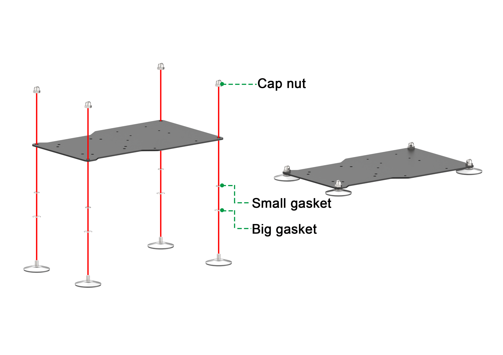

### Step 2：Install battery box

### Step 3：Install Raspberry Pi boad and expansion board

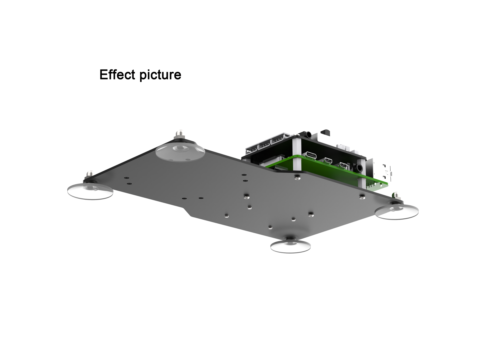

### Step 4：Install base bracket

### Step 5：Install robotic arm and wiring

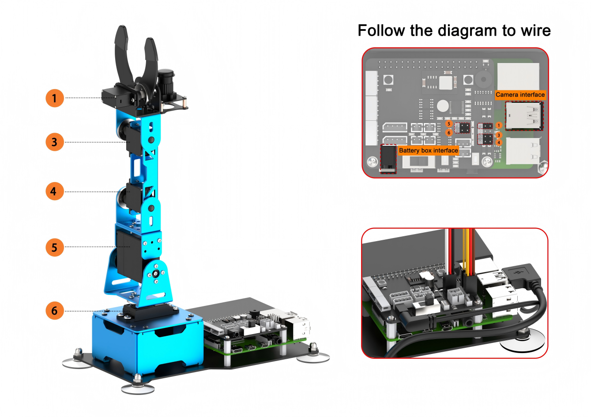

##  5. Charging and Power-On Status Explanation

Before starting this lesson, ArmPi mini needs to be assembled according to [4.Assembly](#anchor_2).

### 5.1 Charging Battery

Please fully charge robot arm at the first use and operate according to the following method.

(1) Take out battery charger and put two 18650 batteries into battery charger. Please pay attention to the positive and negative direction of the batteries.

Then connect the battery charger and charging plug (5V 3A prepare your own one) over a USB cable, and plug it into socket.

(2) Wait for the charging to complete (The indicator light of charger is green    before charging and turns red when charging. It need to take about 6h to fully charge. When the batteries is fully charged, the indicator will turn green from
red). After the charging is complete, please unplug the charger as soon as possible.

### 5.2  Install Battery

(1) Push the switch of battery holder box from “ON” to “OFF” .

(2) Install the fully charged batteries into the battery box and attach the cover. Note: Do not make mistake when the batteries are installed!

### 5.3 Camera Connection

Before turning on robot, please make sure that the camera cable is firmly connected (The camera cable can be connected to any one of USB interfaces of Raspberry Pi).

### 5.4 Turn On ArmPi mini

(1) Push the switch of battery box to “ON” side to turn on Raspberry Pi.

(2) At this time, the LED1 and LED2 of the Raspberry Pi will be on firstly and then the LED2 will flash every 2 seconds. ArmPi mini will return to the

initial posture and buzzer will make “ Di” sound, which means the robot is turned on successfully.

:::{Note}

The Raspberry Pi is a small minicomputer. It usually takes about 1 minute to boot up after it is Powered ON, which is normal.

:::

(3) After turning on, Raspberry Pi will be in an AP direct connection mode by default and launch a Wi-Fi hotspot starting with “ HW” .

(4) After turning on ArmPi mini successfully, please refer to “[8.Position Calibration]()” to calibrate gripping position (Do not skip this step!)

### 5.5 Start Self-check Service

After successfully powering on the robot, you can press the KEY1 button on the expansion board to start the self-check service to check its servos. This helps you to ensure the correct wiring.

If the servos fail to run as described below after starting the self-check service, please refer to "[1.Getting Ready\4.Assembly]()" to rewire them.

The servos should rotate in the following sequence: 1->3->4->5->6.

### 5.6 Check Battery Level

(1) If the LED1 and LED2 on expansion board emit a bright blue light, which means the battery level is enough and robot can be use normally , as the figure shown below:

(2) If the  LED  lights on expansion  board emit faint blue light, it means the battery level is is almost dead, you need to charge the battery as soon as possible, as the figure shown below:

## 6.Remote Desktop Installation and Connection

### 6.1 Preparation

**6.1.1 Hardware**

Prepare a computer. If you are using desktop computer, wireless network card is required.The network card should support 5G band.

**6.1.2 Install VNC**

VNC is a graphical remote desktop control software. Through connecting your computer to the WiFi generated by Raspberry Pi, you can control Raspberry Pi. Installation of VNC is as below.

(1) Double-click the installation program “VNC-Viewer-6.17.731-Windows” in the same directory as this section. Select the installation language as “English” and lick “OK”.

(2) Click “**Next**”.

(3) Tick **“I accept the terms in the License Agreement”**. Then click **“Next”**.

(4) Remain default location where the software is installed. Click **“Next”** to proceed next interface. Then directly click **“Install”**.

(5) When the installation completes, click **“Finish”**.

(6) Clickto open VNC.

**6.1.3 Start Robot**

Start Robot When LED1 on expansion board starts flickering and buzzer emits one beep, robot boots up successfully.

### 6.2 Connect to Robot

(1) After turning Robot on successfully, the default mode is AP direct connection mode. Robot generates a WiFi starting with HW. Connect your computer to this WiFi.

(2) Input password. The password is **“hiwonder”**.

(3) After connection, open VNC Viewer. Input the default IP address of Raspberry Pi, **192.168.149.1**, and then press Enter. If you receive security warning, select **“Continue”**.

(4) Input username and password. **(Username: pi  Password: raspberrypi)**. Click **“OK”** to enter Raspberry Pi desktop.

(5) The desktop is as pictured. If black screen occurs or only cursor leaves on the screen, restart Raspberry Pi.

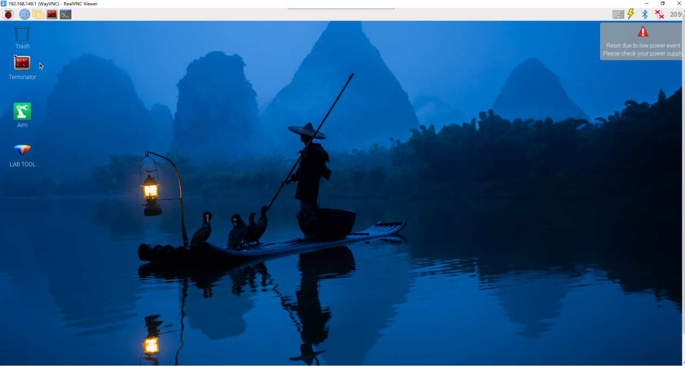

### 6.3 Introduction to Desktop

The desktop is as pictured after connecting Robot through VNC successfully.

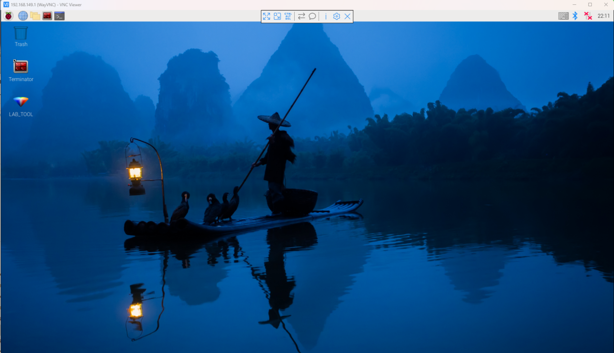

The following table demonstrates common functions:

<table  class="docutils-nobg" style="margin:0 auto" border="1">
<colgroup>
<col  />
<col  />
</colgroup>
<tbody>
<tr>
<td >Icon</td>
<td >Function</td>
</tr>
<tr>
<td ></td>
<td >
Application menu. Click to select different applications.

</td>
</tr>
<tr>
<td ></td>
<td >Browser.</td>
</tr>
<tr>
<td ></td>
<td >File manager.</td>
</tr>
<tr>
<td ></td>
<td >LX terminal. Click to input command line in the opened interface.</td>
</tr>
<tr>
<td ></td>
<td >Trash. You can find the files deleted here.</td>
</tr>
<tr>
<td ></td>
<td >PC software. You can adjust pan tilt and adjust color threshold on it.</td>
</tr>
<tr>
<td ></td>
<td >Full screen or exit full screen.。</td>
</tr>
<tr>
<td ></td>
<td >Exit full screen.</td>
</tr>
<tr>
<td ></td>
<td >
Shut down, reboot and logout

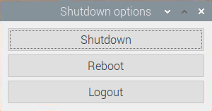
</td>
</tr>
</tbody>
</table>

## 7. Deviation Adjustment

If the deviation of the servo main shaft is caused by the fall of the robot arm during assembly, or the replacement servo, and other operations, the generated deviation must be adjusted. Deviation is divided into two cases: small deviation and large deviation. Depending on the situation, the debugging method is also different.

### 7.1  Preparation

(1) Turn on ArmPi mini according to the tutorial in “[1. Getting Ready->5.Charging and Power-On Status Explanation]()”.

(2) Connect the robot via VNC remote tool according to “[1. Getting Ready->6.Remote Desktop Installation and Connection]()”.

### 7.2 Deviation Judgment

(1) Aftering connecting ArmPi mini, open PC software. 

(2) Then click “Reset servo” in the software interface, and then the robot arm will stand up straight.

(3) Then click “Read deviation” to synchronize the deviation to the left servo control area.

(4) After resetting robotic arm, the main shaft screws of servo ID3-ID5 are in a straight line (it is named as “centerline” in the following steps), as the figure shown below:

(5) The the groove line of the U shape bracket of ID6 servo are parallel with the edge of the upper cover of the base, as the left figure shown below, and the gripper is closed, as the right figure show below. Under this situation, the robotic arm is ready to use, you can skip this lesson.

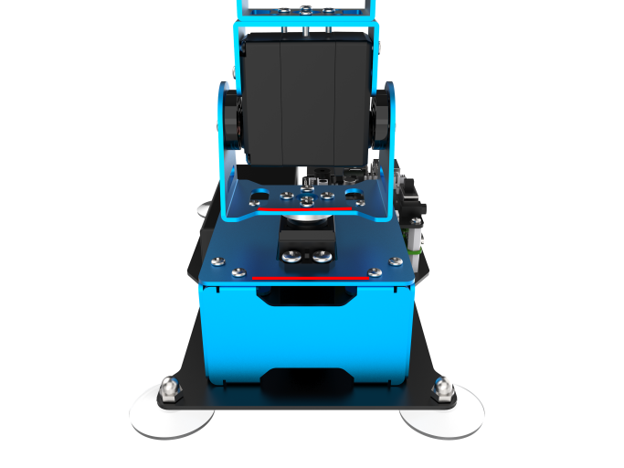

(6) If the angle between centerline and servo is less than 13 degrees, it is classified as small deviation and can be adjusted by PC software. You can follow the operation instruction in “[7.3 Small Deviation Adjustment]()” to adjust the small deviation. Here i will take ID3 servo as example, as the figure shown below. 

(7) If the angle between center line and servo is larger than 13 degree, it is classified as large deviation and can not be adjusted by PC software which the extreme adjustment value is between -150 and +150. Under this situation, you can follow the operation instruction in “[7.4 Large Deviation Adjustment]()” to adjust large deviation.

### 7.3 Small Deviation Adjustment

(1) Small deviation can be adjusted by dragging the deviation adjustment slider of PC software. Note: the short slider bar below is for adjusting deviation.

(2) Drag the slider of ID3 servo to make robot arm stretch straight. (the values in following figure is just for reference, you need to adjust your own robot according to the actual situation.)

(3) Then click “Save deviation” to save the deviation value into the robot arm.

### 7.4 Large Deviation Adjustment

(1) When adjusting the large deviation, U shape bracket must be removed from servo and reset the servo to initial position. Then repeat the operation steps of small deviation adjustment. Again. 

(2) Click “Reset servo” in PC software to make robot arm stretch straight.

(3) At this time, you can find ID3 servo with obvious deviation and the deviation angle is larger than 13 degrees.

(4) Unplug the robot arm. Servo will be removed in the following steps, so do not operate when power is supplied. 

(5) Unscrew the main servo horn of ID3 servo.

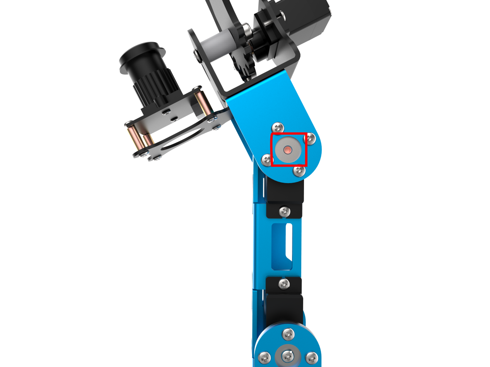

(6) Next, remove the rivet holding U shape bracket.

(7) Then pull out the main shaft from the metal servo horn. 

(8) In addition to ID3 servo, remove all the servo cables from Raspberry Pi expansion board (Do not skip this step), and then turn on Raspberry Pi.

(9) After turning on robot arm, connect it via VNC and open PC software. Then click “Reset servo”. At this time, servo ID3 has been reset to initial position.

(10) Turn off robot arm. Then assemble the servo horn back to servo in cross shape. 

:::{Note}

the servo has been at initial position, do not forcefully rotate the main servo. If the servo horn is not assembled in cross shape, you need to repeat the operations steps 6-8 to adjust deviation again. 

:::

(11) Then fix the metal servo horn with screws.

(12) Assemble the rivet to the side of bracket.

(13) Connect the servo cables back to the Raspberry Pi expansion board.

:::{Note}

the servo ID tag corresponds to the interface number of expansion board. The yellow cable should be connected to “S” signal terminal, red cable to “+”, brown cable to “-”, white cable to “S”, red cable to “+”, black cable to “-”. Do not wrongly connect the cables, otherwise the servo will be burned out.

:::

(14) Then, repeat the operation steps of “[7.3 Small Deviation Adjustment]()” to adjust the small deviation. 

## 8. **MAP Placement**

### 8.1 Map Layout Instruction

**8.1.1 Map Layout Instruction**

From the image below, we can know that map consists of four areas, which are robot placement area, picking area, sorting area and stacking area.

Place ArmPi mini in the placement area, and place colored blocks in the picking area.
After the color sorting is started, robot arm will pick the blocks in robot placement area, and place them in color sorting area. (About color sorting, please go to folder “[Quick User Experience->2App Control]()” and “[AI Vision Learning->5.Color Sorting]()”)
After the intelligent stacking is started, robot arm will pick the colored blocks in picking area and place them in stacking area. (About intelligent stacking, please go to folder “[Quick User Experience->2 APP Control]()” and “[AI Vision Learning->6 Intelligent Stacking]()”)

### 8.2 Map Placement

(1) Put map in a flat and smooth surface and glue four corners of the map to avoid map movement when starting game.

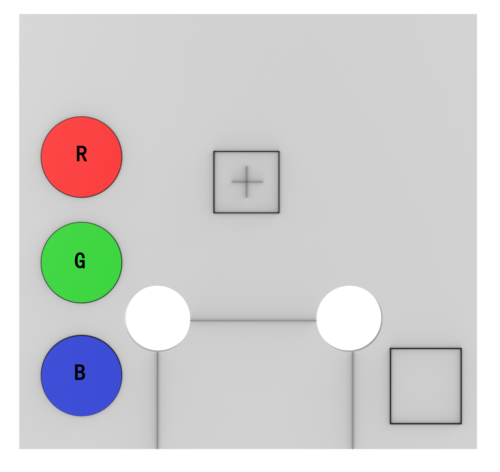

(2) Place the robotic arm in the placement area, and the base board must overlap the three blacks line on map ,as the figure shown below.

(3) After placement, gently press on the suction cups better adhere to the desktop.

:::{Note}
When starting color sorting and intelligent stacking, do not have similar color object within the frame to avoid interference.
:::

### 8.3 Position Calibration

Before starting game, the picking position of gripper must be calibrated, otherwise the robot may fail to pick object and affect the normal use.

**8.3.1 Preparation**

(1) Turn on ArmPi mini according to the tutorial “[Getting Ready\5. Charging and Power-On Status Explanation]()”.

(2) Connect robot via VNC remote tool according to the tutorial “[Getting Ready\6.Set Development Environment]()”.

(3) Adjust deviation according to the tutorial “[Getting Ready\7.Deviation Adjustment]()”.

(4) Place the robot on map according to the tutorial “[Getting Ready\8.3 Position Calibration]()”.

**8.3.2 Whether the picking position needs to be calibrated?** 

(1) Double click  to open PC software.

(2) Click “Execute” to enter the editing interface of PC software.

(3) Then click “Read” in the upper left corner and click “Ok” to read the initial position information of the gripper.

(4) Click “Run to Coordinate” to control the robot arm to move to the top of the picking area and observe its position. If the gripper is right at the 1cm above the center of the cross mark in picking area, the position does not need to calibrate, as the figure shown below. If it does not meet the requirements, you need to continue the following steps for calibration.

(5) If the following deviation situation occurs, as the figure shown below, you need to calibrate the picking position. Thus the following operation steps will calibrate this deviation.

**8.3.3 Calibration Principle**

Take the robot arm as the first person view and take the centre point of the base as the coordinate original point, as the figure shown below.

The default initial value of the gripping position is X=1.00cm, Y=14.00cm and Z=0.00cm. The pitch angle is 90 degrees and the running time is 1500ms.
The coordinate value of gripper can be set in the position calibration interface of PC software, as the figure shown below.

| Parameter | Function |
|:--:|:--:|
| X | Adjust x-axis value to control the gripper to move left or right. |
| Y | Adjust y-axis value to control the gripper to move forwards and backwards. |
| Z | Adjust z-axis value to control the gripper move up and down. (The z-axis value has been set as 1cm which is a right position for the gripper to stop the middle position between two blocks. It is not commended to modify this value.) |
| Pitch angle | The angle between gripper and x axis, i.e., the angles when the gripper looks upward and downward. This parameter does not need to be modified. |
| Running time | The movement time used by the gripper to move from the previous position to the set coordinate value. (just for checking the running effect ) |
| Read | Read the current position information of gripper. |
| Save | Save the coordinate value of the adjusted gripping position. |
| Run to Coordinate | Click it to move robot arm to the set coordinate value |

8.3.4 Calibration Steps

Observing the following example, you can find that the picking position of gripper is offset upward relative to the cross mark in the picking area of the map, and then we need to adjust it to 1cm directly above the cross mark.

(1) Click “Read” button in the lower left corner, and click “OK” to read the position information of picking posture.

(2) Click “Run to Coordinate” to control the gripper to move to the picking area, and observe the offset between the cross mark and the gripper.

(3) You can find that the gripper is offset to the right (take robot as the first person view), and the offset distance is close to 0.5cm.

(4) Therefore, subtract 0.5cm from the x-axis value, that is, the X value is set to "0.5". Then click "Run to Coordinate" to see the effect after adjustment.

(5) Now, the gripper is very close to the center of the cross mark.

(6) Now let's look at the y-axis. The gripper is offset forward a little bit. In this case, y-axis value needs to be adjusted.

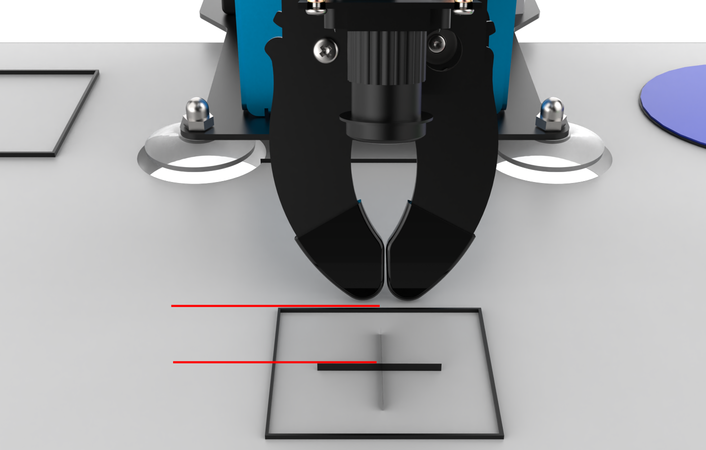

(7) subtract 0.5cm from they-axis value, that is, the y-axis value is set to "13.5". Then click "Run to Coordinate" to see the effect after adjustment.

(8) Now, the gripper is offset to the right a little bit. Therefore, observe and adjust the x-axis value until the centre of the gripper directly above the centre of the cross mark.

(9) Because the program has set the z-axis value to 1cm, the gripper is directly above the middle of the two sides of the block, so it is not recommended to modify the values of z-axis and pitch angle.

(10) Then click “Save” to save the coordinate value to controller. The gripper will run to this position to pick object next time.

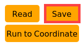

