# 学前先看

## 1. 认识ArmPi mini

### 1.1 产品介绍

ArmPi mini是一款面向初学者的开源机械臂，它以树莓派5为主控，以OpenCV为图像处理库，搭载高清130°广角摄像头，拥有第一视觉。

它内置运动学，通过Python编程，它可以实现颜色识别、颜色分拣、目标追踪、智能码垛等多种AI视觉识别功能！

它不仅能满足用户对机器视觉、机械臂运动控制、逆运动学算法的学习和验证，还为手眼协作、视觉抓取等二次开发提供快速、便捷的集成方案。我们提供学习资料，开放源代码，让您快速玩转AI智能机械臂！

### 1.2 产品清单

## 2. 图文组装教程

### Step 1：安装吸盘

### Step 2：安装电池盒

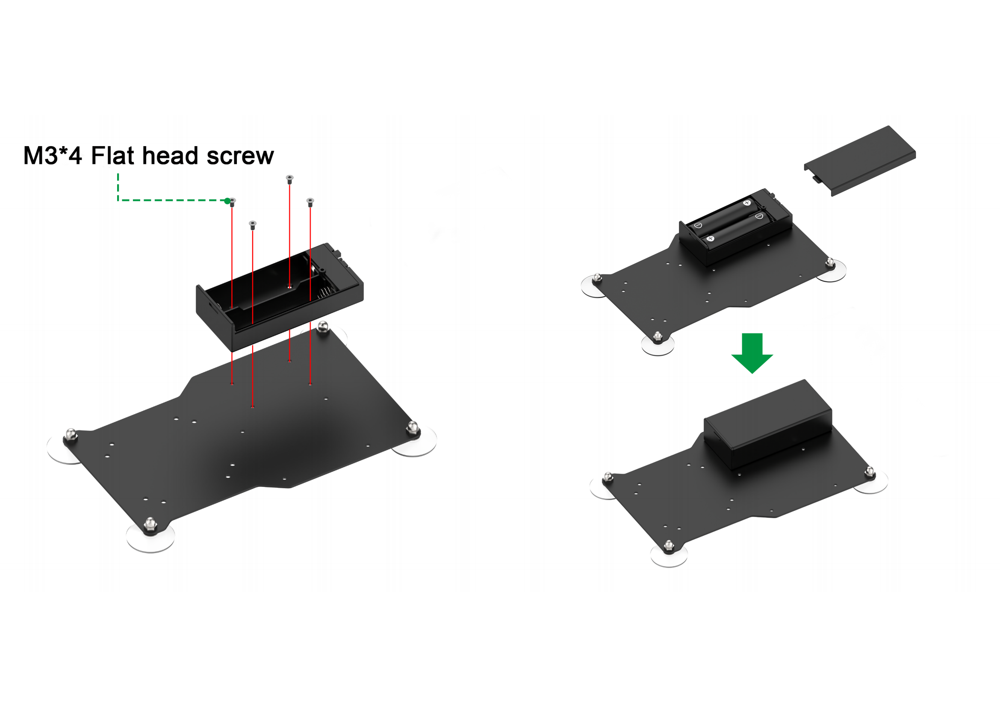

### Step 3：安装树莓派主板与扩展板

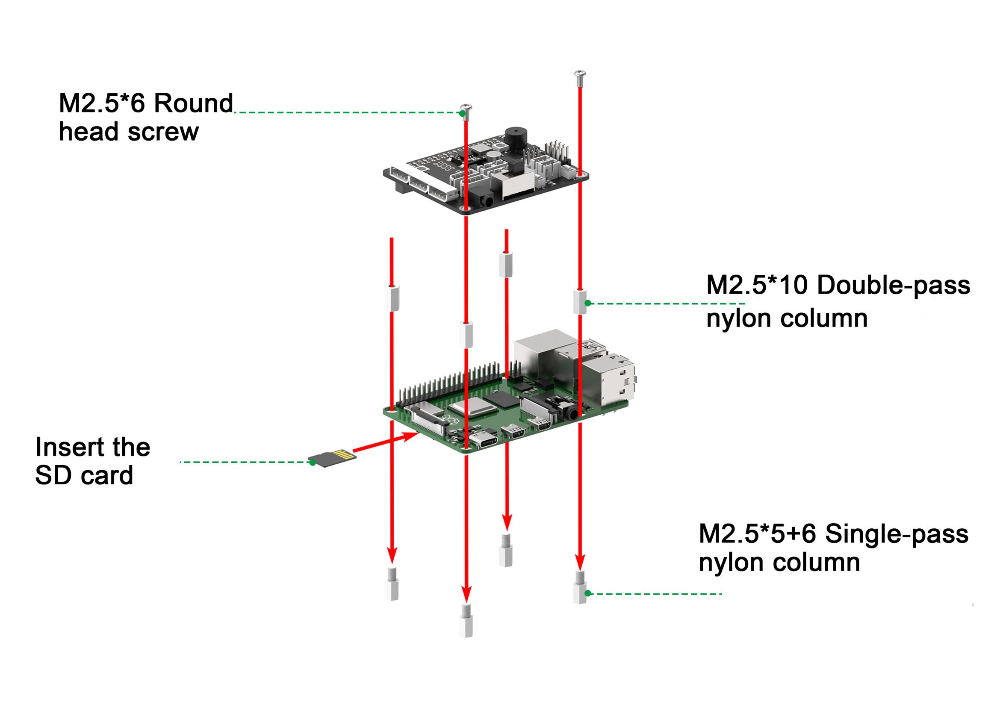

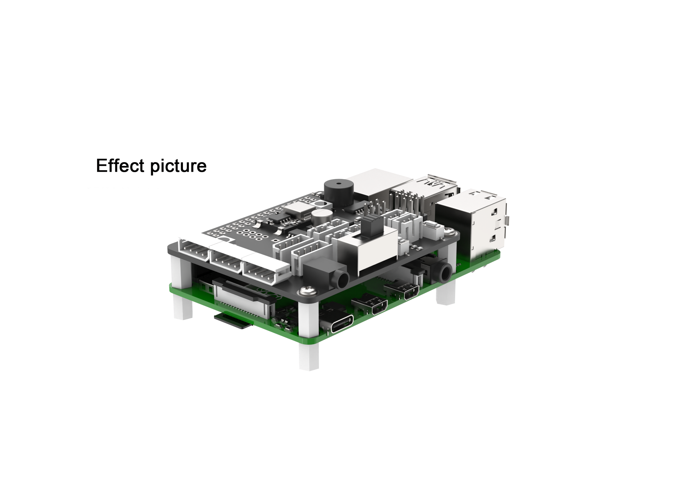

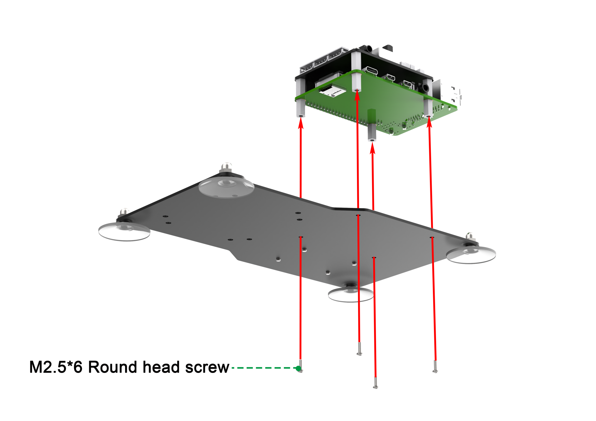

### Step 4：安装底座支架

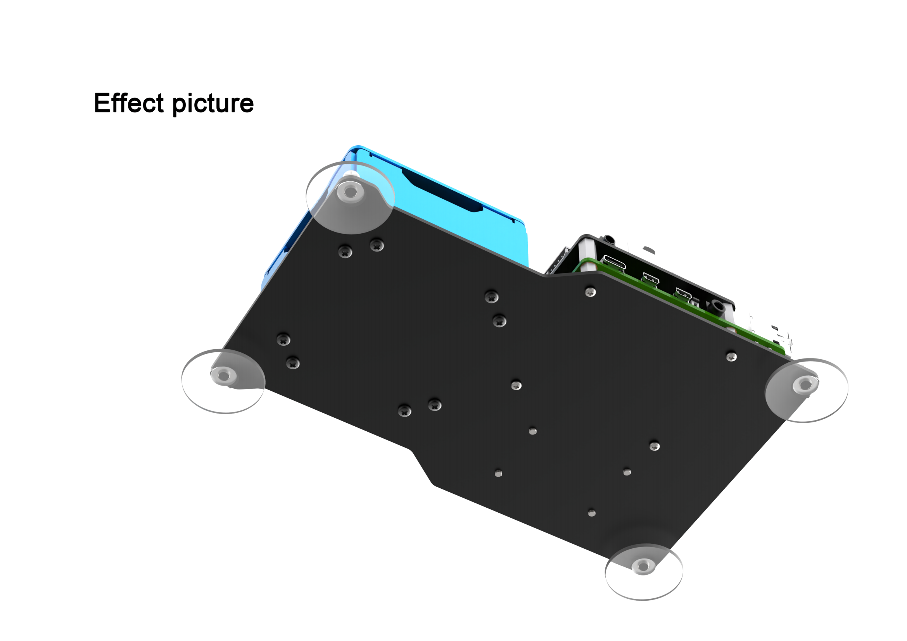

### Step 5：安装机械臂并接线

##  3. 设备充电及首次开机

**开机之前请先按照"[2. 组装教程](#anchor_2)"内容组装好机器人。**

### 3.1 电池充电

初次开机前建议先给电池充满电，以下是具体充电方法：

1)  拿出电池充电器，将两节18650的电池（选配）按照正负极对应（正对正，负对负）装到电池充电器中，注意！电池正负极切勿装反！再通过数据线将电池充电器（选配）和充电头（5V 3A，需自备）进行连接，最后连接电源。

2)  等待充电完成（适配器指示灯在未通电的状态下为绿色，通电后为红色代表充电中（充电时长约为6个小时左右）、指示灯由红色变为绿色代表充电完成），充电完成后，请尽快拔掉充电器，切勿一直充电。

### 3.2 安装电池

1)  安装电池前请确保电池盒的开关拨到"**OFF**"档。

2)  将充满电的电池安装到电池盒中，并盖上电池盖。注意！电池正负极切勿装反！

### 3.3 检查摄像头是否连接

在开机之前请先确认摄像头连接线是否已连接牢固（摄像头连接线可接入树莓派主板上4个USB接口的任意一个）。

### 3.4 开机及状态说明

1)  先将电池盒的开关拨到"**ON**"档，再打开树莓派的开关。

2)  此时树莓派的LED1、LED2常亮，稍等片刻后LED2由常亮变为每隔2秒闪亮一次、机械臂回到初始姿态、蜂鸣器发出"嘀"的一声，即设备成功开机。

树莓派本身也是电脑，开机启动需要一小段时间，开机时间约30秒，请耐心等待。

3)  设备开机成功后，出厂默认为AP直连模式，并将产生一个以HW开头的热点。

4)  接下来，请前往"**[6. 位置校准]()**"对机械爪进行夹取位置的校准（切勿跳过此步骤！）。

### 3.5 启动自检程序

机器人在开机成功后，可通过按键KEY1来启动自检服务，用以对机器人的舵机进行检测，可以帮助用户排查接线是否正确。

若启动自检后设备无法按照下文所示内容进行转动，则需参照 "**[2. 组装教程](#anchor_2)**" 重新接线。

1)  按下扩展板上的KEY1按键即可开启自检功能。

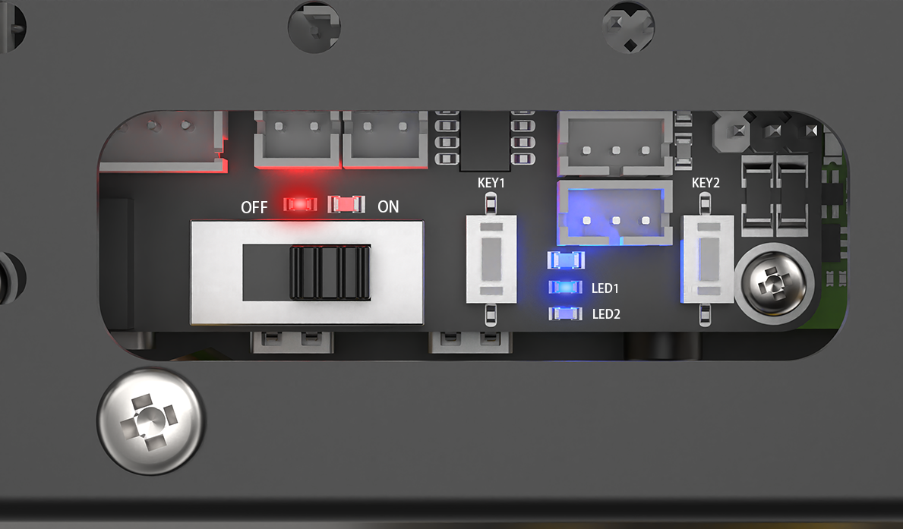

2)  舵机将按下图分布所示依次转动。（1-\>3-\>4-\>5-\>6）

### 3.6 电池电量查看方式

1)  扩展板上的LED灯亮强一些蓝光说明电池电量充足，可正常使用，如下图所示：

2)  若扩展板上的LED1与LED2亮微弱的蓝光，则证明电池快没电了，需要尽快给电池充电，如下图所示：

## 4. 远程桌面工具安装与连接

### 4.1 硬件准备

准备一台笔记本电脑，如使用台式电脑请自备无线网卡 (需支持5G频段) 。

### 4.2 VNC远程工具的安装

VNC是一款图形化远程控制软件。通过连接树莓派的Wi-Fi热点，可以直接在电脑端控制树莓派，VNC的安装步骤如下：

1)  双击"**[软件工具\3.远程连接工具\2.VNC（可视化桌面工具）\Windows版本]()**"，中的"**VNC-Viewer-6.17.731-Windows**"文件，将安装语言选择为"**English**"，并点击"**OK**"按键。

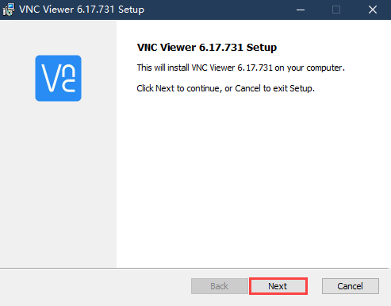

2)  点击"**Next**"按键。

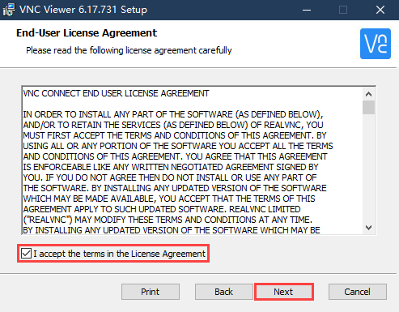

3)  勾选同意协议，并点击"**Next**"按键。

4)  保持默认安装位置，并点击"**Next**"按键。跳转至下一界面时，直接点击"**Install**"按键。

5)  等待片刻后，出现安装完成的提示界面，点击"**Finish**"按键即可。

6)  安装完成，点击图标即可打开VNC。

### 4.3 设备开机

参照本章节"**[3. 设备充电及首次开机](#anchor_3)**"课程，打开设备开关，将设备开机。稍等片刻后，扩展板上的LED2会开始闪烁，蜂鸣器会鸣叫一次，代表设备开机成功。

### 4.4 设备连接

1)  ArmPi mini开机成功后，默认连接模式是AP直连模式，此时将会产生一个以"HW"开头的热点，我们可以在电脑端搜索并连接这个热点，如下图所示：

2)  点击连接，输入密码"**hiwonder**"。

3)  连接成功后，打开VNC Viewer，在地址栏输入树莓派默认的IP地址：192.168.149.1，按下回车。如果出现安全连接相关的提示框，点击"Continue"按键即可。  

4)  在账号登录窗口填写所需信息，账号栏（Username）输入"**pi**"，密码栏（Password）输入"**raspberrypi**"，并勾选记住密码（Remember password）。点击"OK"按键后，便可远程打开树莓派桌面。

5)  桌面如下图所示。（如果出现黑屏，只显示鼠标指针，可尝试重启树莓派。）

### 4.5 界面介绍

通过VNC成功连接ArmPi mini之后，操作界面如下所示：

下表为常用功能说明：

<table class="docutils-nobg" border="1">
<tbody>
<tr>
<td style="text-align: center;">图标</td>
<td style="text-align: center;">功能</td>
</tr>
<tr>
<td style="text-align: center;"></td>
<td>
应用菜单，点击之后可选择不同应用。

</td>
</tr>
<tr>
<td style="text-align: center;"></td>
<td style="text-align: left;">系统自带浏览器</td>
</tr>
<tr>
<td style="text-align: center;"></td>
<td style="text-align: left;">文件管理器</td>
</tr>
<tr>
<td style="text-align: center;"></td>
<td style="text-align: left;">LX终端，点击之后，可在打开界面输入命令行。</td>
</tr>
<tr>
<td style="text-align: center;"></td>
<td style="text-align: left;">回收站，可找回近期删除的文件。</td>
</tr>
<tr>
<td style="text-align: center;"></td>
<td style="text-align: left;">上位机软件，可通过此软件调整机械臂、调节颜色阈值。</td>
</tr>
<tr>
<td style="text-align: center;"></td>
<td style="text-align: left;">点击可使系统桌面显示全屏或退出全屏。</td>
</tr>
<tr>
<td style="text-align: center;"></td>
<td style="text-align: left;">退出全屏。</td>
</tr>
<tr>
<td style="text-align: center;"></td>
<td>
电源，点击可选择关机、重启、退出

</td>
</tr>
</tbody>
</table>

## 5. 偏差调试

ArmPi mini在组装过程中，若因机械臂摔落使舵机主轴偏移产生偏差，或更换舵机，以及其他操作使舵机主轴发生偏移，都需要进行偏差调试，而偏差分为小偏差和大偏差两种情况。根据情况不同，调试的方法也有所不同。

### 5.1 准备工作

1)  根据"**[3. 设备充电及首次开机](#anchor_3)**"内容，将机械臂成功开机。

2)  再参考路径"**[4. 远程桌面工具安装与连接](#anchor_4)**"内容，通过VNC远程连接工具连接机械臂。

### 5.2 判断大小偏差

1)  远程连接机械臂之后，点击系统桌面的上位机图标。

2)  然后在上位机界面点击"**复位舵机**"，让机械臂笔直立起。

3)  然后再点击"**读取偏差**"，使机械臂的偏差同步到左边的舵机操控区域。

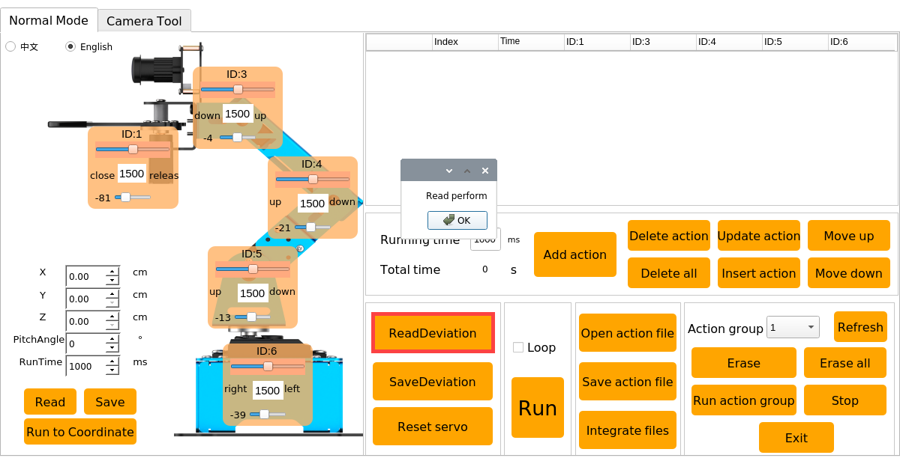

4)  如果舵机复位后，机械臂3-5号舵机的主轴螺丝呈笔直的一条线（下文以中心线代称），如下图：

5)  6号舵机U型支架的凹槽横线与底座上盖的横线平行，如下方左图；1号舵机机械爪处于刚刚闭合的状态，如下方右图；则表明机械臂无需调整偏差，可跳过本节内容。

6)  若舵机与与中心线夹角小于13°(即舵机的脉宽范围在\[1350，1650\])，通过上位机调节可以归位，则为小偏差，可以通过"[5.3 小偏差调节](#anchor_5_3)"来进行调节；偏差情况以3号舵机为例，如下图所示：

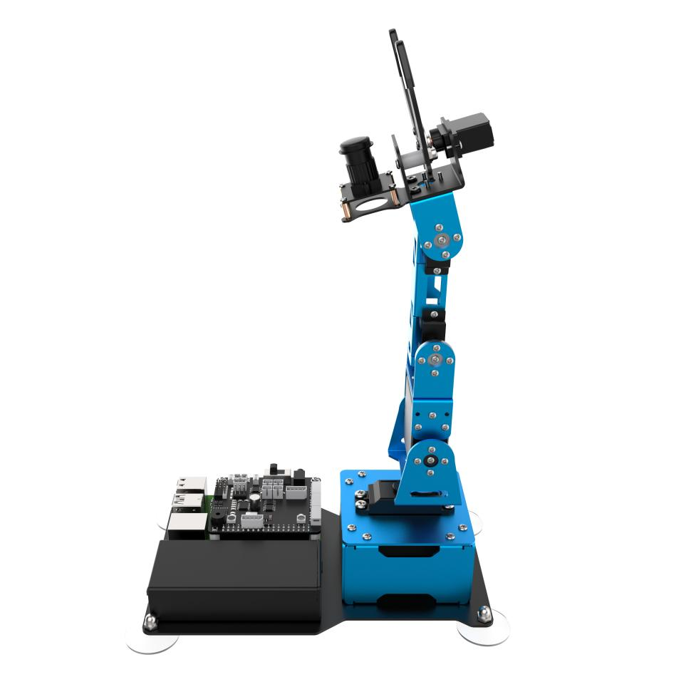

**PWM舵机的脉宽范围为：\[500,2500\]，对应的角度范围为0°~180°，角度换算公式为：脉宽 = (角度 \* 11.1) + 500。云台舵机初始角度为90°，即脉宽为1500。**

7)  如舵机与中心线的夹角大于13°（即舵机的脉宽范围在小于1350或者大于1650），通过上位机调节到极限数值（±150）也无法归位，则为大偏差，可以通过"[5.4 大偏差调节](#anchor_5_4)"来进行调节；偏差情况以3号舵机为例，如下图所示：

### 5.3 小偏差调节

小偏差的调节可直接在上位机的界面拖动舵机的偏差滑杆来调节(注意：调节偏差的是小滑杆)。

1)  我们拖动3号舵机的小滑杆，使机械臂呈直线（下图所示数值仅为参考，用户需调节目标，结合实际情况进行调节）。

2)  然后点击"**保存偏差**"，将调节的偏差值保存到机械臂中。

### 5.4 大偏差调节

大偏差的调节则需要将舵机从U型支架上拆下来，进行中位后，再重复小偏差调节的步骤。

1)  在上位机界面点击"**舵机复位**"，让机械臂笔直立起。

2)  此时可以发现3号舵机有明显的偏差，偏差角度大于13°。

3)  将机械臂断电（以下涉及拆卸步骤，切勿在通电下进行）。

4)  将3号舵机主舵盘上的螺丝拧下。

5)  再将用于固定U型支架的铆钉拆下。

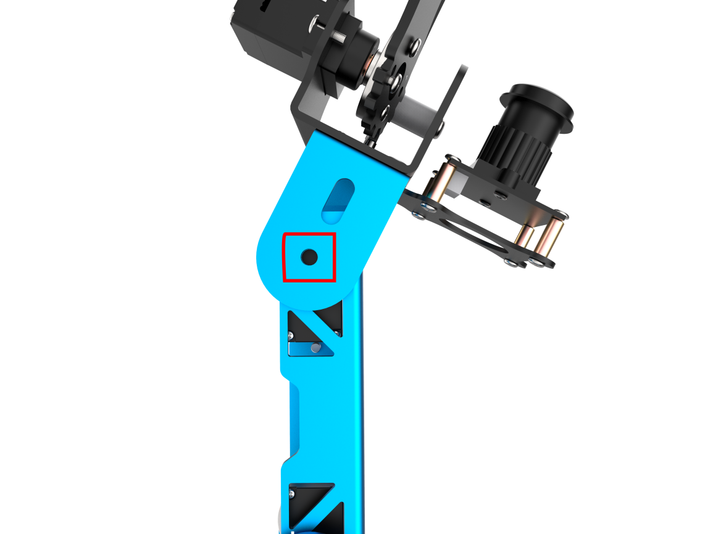

6)  然后将金属舵盘从主轴中轻轻拔出。

7)  除3号舵机线之外，将树莓派扩展板上的舵机线全部拔下（此步骤不可跳过），然后再打开树莓派的开关。

8)  开机成功后，远程连接机械臂，打开上位机，并点击"**复位舵机**"，此时，3号舵机的中位就调好了。

9)  舵机中位好之后，需再将机械臂断电，再将舵盘以"**十**"字的形态安装上去（注意：此时舵机已中位，切勿用力掰动舵机主轴，若舵盘"十"字没有安装到位，需重复本文[5.4 大偏差调节](#anchor_5_4)步骤6-8）。

10) 再将螺丝拧上固定金属舵盘。

11) 安装支架侧面的铆钉。

12) 然后将舵机线重新接入树莓派扩展板上接口（接线时需要注意舵机标签上的序号，与扩展板上的接口号相对应；黄线接入扩展板上的信号端"S"，红线接入"+"，棕线接入"-"；白线接入"S"，红线接入"+"，黑线接入"-"；**千万不要接反了，接反会烧坏舵机的**）。

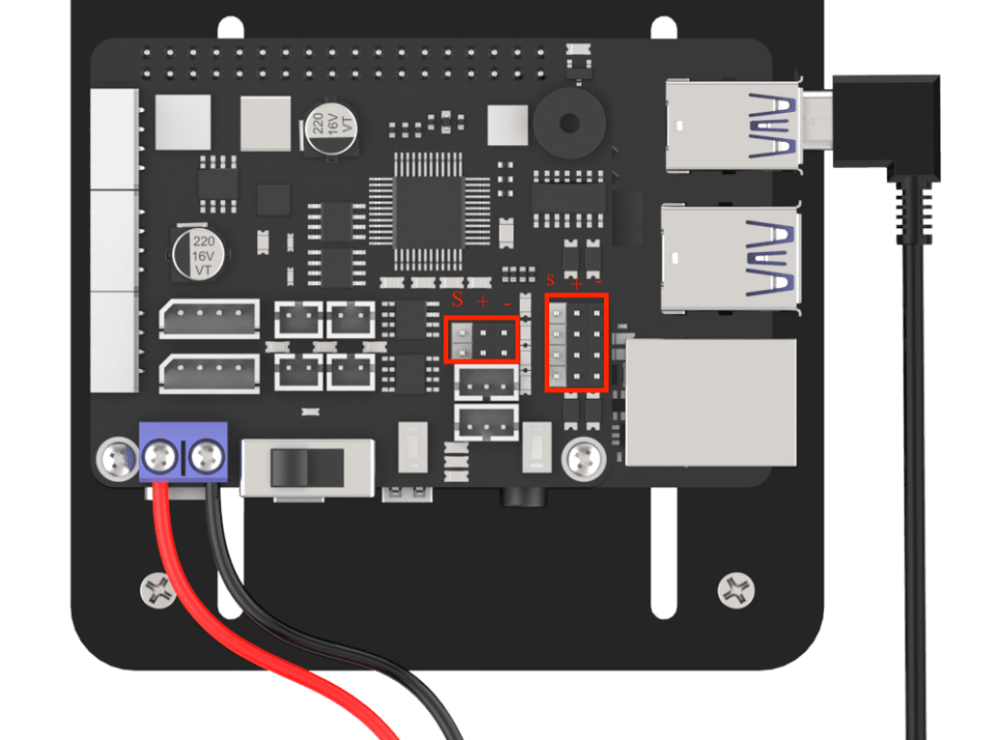

13) 接下来，请重复本文"[5.3 小偏差调节](#anchor_5_3)"的步骤，对偏差进行微调。

## 6. 位置校准

### 6.1 地图摆放

1. **地图分布区域说明**

由下图可知，地图分为4个区域，分别为机械臂放置区域、夹取区域、分拣区、码垛区。

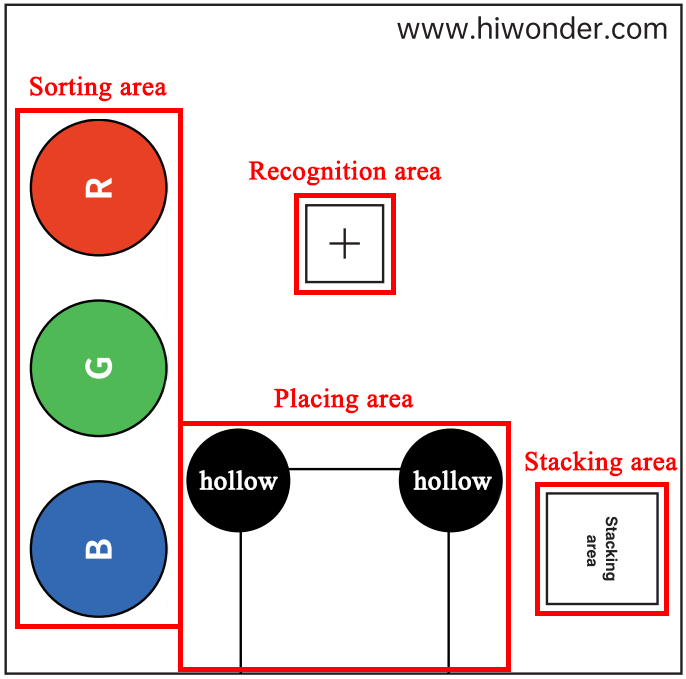

将机械臂放置在机械臂放置区域，将色块放置在夹取区域；

启动颜色分拣玩法时，机械臂会将色块从夹取区域放置到分拣区（颜色分拣玩法可前往："**[上手试玩\ 2. 手机APP试玩]()**"与"**[AI视觉项目课程\ 5. 颜色分拣]()**"进行学习）；

启动智能码垛玩法时，机械臂将色块从夹取区放置到码垛区（智能码垛玩法可前往"**[上手试玩\ 2. 手机APP试玩]()**"与"**[AI视觉项目课程\ 6. 智能码垛]()**"进行学习）。

### 6.2 地图铺设

1)  将地图放在平整光滑的桌面，可使用双面胶将它的四个角粘住，避免启动玩法时不小心移动了地图。

2)  将机械臂放置在放置区，底板与地图上3条黑色的线条重合，如下图所示。

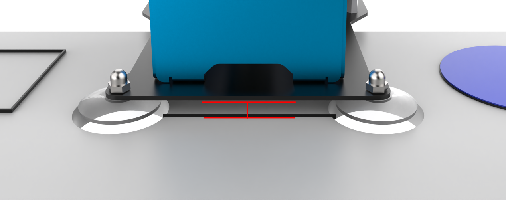

3)  放置完成后用手轻轻将吸盘向下压，使其与桌面更加贴合。

:::{Note}
启动颜色分拣或智能码垛玩法时，摄像头识别范围内不要出现与要识别色块颜色相同或相近的杂物，避免造成干扰。
:::

### 6.3 位置校准

在开启玩法前，我们必须对机械爪的夹取位置进行校准，否则在后续的玩法中可能会出现夹取不准的情况出现。

- #### 6.3.1 准备工作

1)  根据路径"**[3. 设备充电及首次开机](#anchor_3)**"内容，将机器人成功开机。

2)  根据路径"**[4. 远程桌面工具安装与连接](#anchor_4)**"内容，通过远程连接工具连接机器人。

3)  根据路径"**[5. 偏差调试](#anchor_5)**"内容对机器人进行偏差调试。

4)  根据路径"**[6.1 地图摆放](#anchor_6_1)**"内容，将机器人正确的摆放到地图上。

- #### 6.3.2 判断是否需要校准

1)  双击系统桌面的上位机图标。

2)  点击"**执行**"，即可进入上位机编辑界面。

3)  点击界面的左下角的"**读取**"按钮，再点击"**OK**"，即可读取机械爪的初始位置信息。

4)  点击"**运行到坐标点**"，让机械臂运行到夹取区域上方，并观看此时机械爪的位置。若机械爪刚好在夹取区域"**十**"字的中心点上方1cm处，则无需进行位置校准，如下图所示。若没有达到如下要求，则需要继续下面的步骤进行校准。

5)  若出现位置偏差的情况，如下图所示，则需要对夹取的位置进行校准，那以下的步骤就针对下图情况来进行校准。

- #### 6.3.3 校准原理

我们以机械臂为第一视角，并以底座中点作为原点建立坐标系，如下图所示：

而机械爪默认的夹取位置初始值为（X=1.00cm、Y=14.00cm、Z=0.00cm、俯仰角=90°、运行时间=1500ms）。

我们可以通过上位机的位置校准界面来设置机械爪的坐标值，如下图所示：

| **参数** | **功能** |
|:--:|:--:|
| X | 调节X轴的值可以控制机械爪在左右方向上移动。 |
| Y | 调节Y轴的值可以控制机械爪在前后方向上移动。 |
| Z | 调节Z轴的值可以控制机械爪在上下方向上移动（程序已设定Z轴的值为1cm，此时机械爪刚好在木块的两侧的中间位置，因此不建议对此处数值进行修改）。 |
| 俯仰角 | 机械爪与X轴水平面的夹角，即机械爪向上仰视与向下俯视的角度，程序设定原因，无需进行修改。 |
| 运行时间 | 机械爪从上一个位置移动到我们设置的坐标数值的所用的运动时间（**这里的时间仅作调整坐标时查看效果时用**）。 |
| 读取 | 读取当前机械爪的夹取位置信息。 |
| 保存 | 保存调整好的夹取位置坐标值。 |
| 运行到坐标点 | 点击之后，即可将机械爪移动到我们设定的坐标值。 |

- #### 6.3.4 校准步骤

我们以下图的位置校准作为案例进行学习。可以看出机械爪的夹取位置相对夹取区域的"**十**"字是往上偏了，接下来，我们通过位置校准将它调整到"**十**"字的正上方1cm处。

1)  再点击界面的左下角的"**读取**"按钮，再点击"**OK**"，读取机械爪的初始夹取姿态的位置信息。

2)  点击"**运行到坐标点**"，让机械爪移动夹取区域，并观察此时机械爪与"**十**"字的偏差距离。

3)  可以看出机械爪是向右偏移（这里的左右是以机械臂为第一视角），距离接近0.5cm。

4)  我们可以将X轴的值减去0.5cm，即将X值设为"**0.5**"；然后点击"**运行到坐标点**"，看一下调整之后的效果。

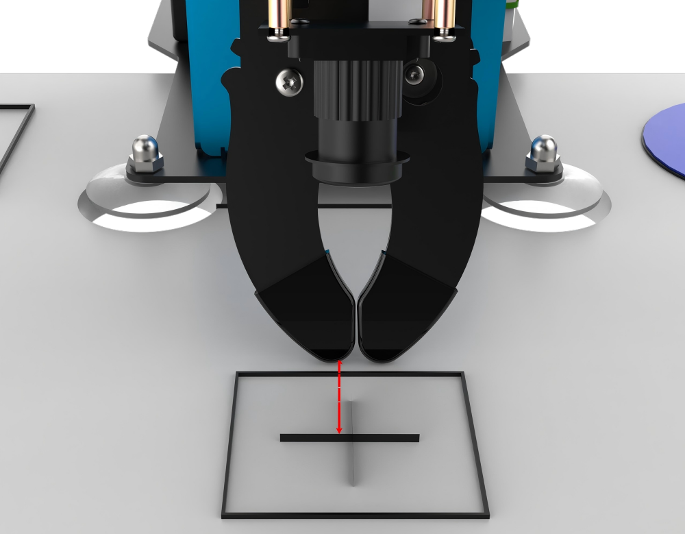

5)  可以看到现在机械爪的位置已经很接近于"**十**"字的中心。

6)  这时我们再看一下Y轴。我们可以看到机械爪是向前偏移了一点点，这种情况我们还需调整Y轴的值。

7)  将Y值减少0.5，即为"**13.5**"；然后点击"**运行到坐标点**"，看一下调整之后的效果。

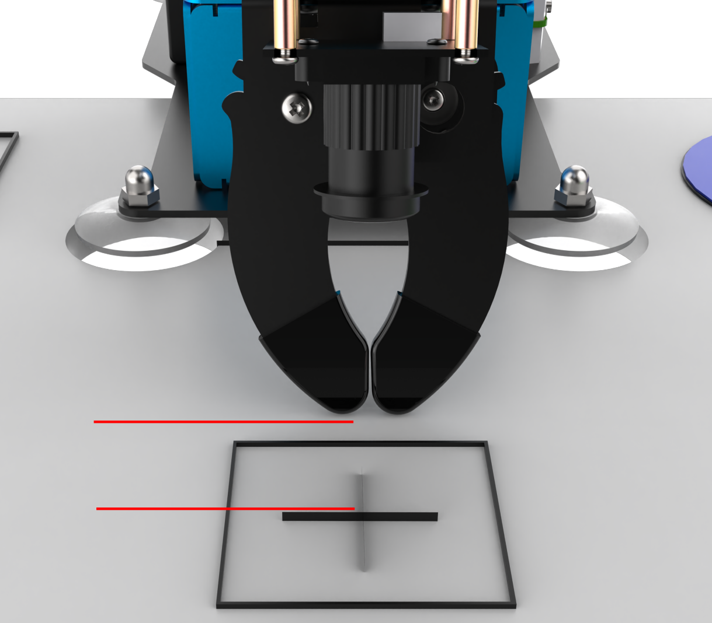

8)  我们可以看到机械爪还是有一点点向右偏，我们还需要对它的X轴位置进行调整，就这样边调节边观察，直到它的中心点正对十字的上方。

9)  因为程序已设定Z轴的值为1cm，此时机械爪刚好在木块的两侧的中间位置，因此不建议对Z轴和俯仰角的数值进行修改。

10) 调整好之后，就可以点击"**保存**"，将调整好的夹取坐标值保存到主控器中，下一次夹取时，机械爪就会运行到此位置进行夹取。

