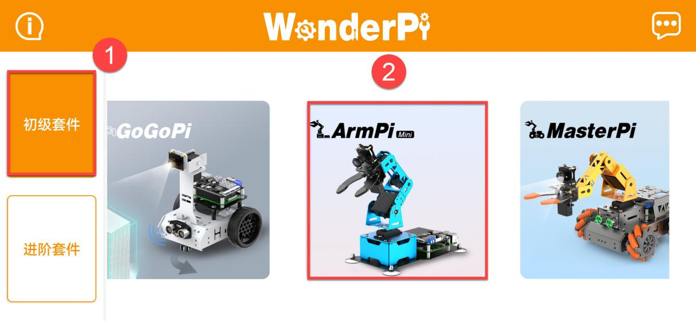
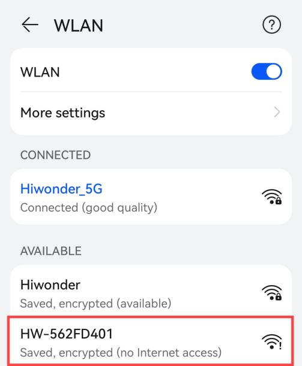
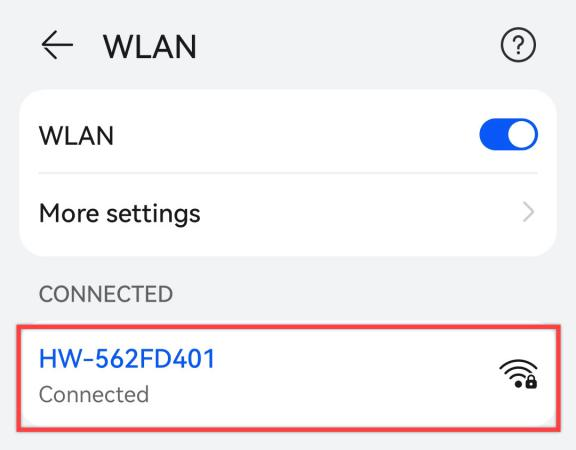
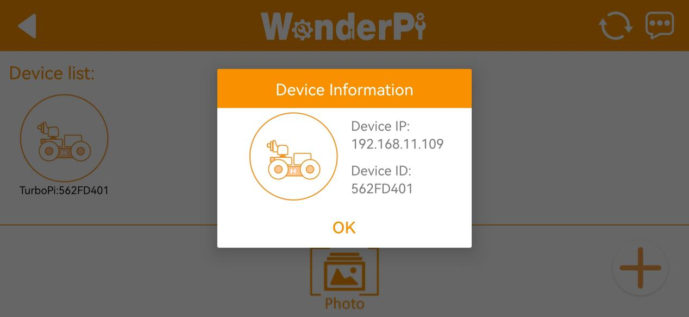
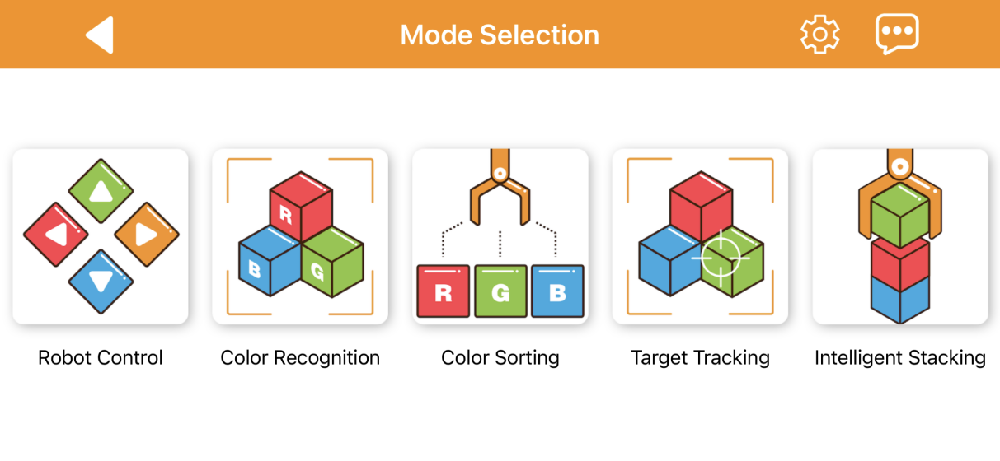
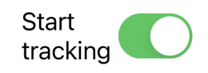

# 2. Quick User Experience

## 2.1 APP Installation and Connection 

The following instructions use TurboPi as an example and apply to other Hiwonder Raspberry Pi series products as well.
In this section, you will learn how to use APP "**WonderPi**" to control TurboPi. The installation method is as follows.

:::{Note}

* Make sure all APP permissions are turned on in settings, otherwise APP functions will be limited!

* Turn on Location and WiFi before operation.

:::

### 2.1.1 Installation

**[APP Installation Pack (Android)](https://play.google.com/store/apps/details?id=com.Wonder.Pi)**

**[APP Installation Pack (iOS)](https://apps.apple.com/cn/app/wonderpi/id1477946178)**

:::{Note}
- Please turn TurboPi on before connecting. 

- Make sure all APP permissions are turned on in settings, otherwise APP functions will be limited!

- Turn on Location and WiFi before operation.
:::

### 2.1.2 APP Connection

(1) Start robot. (The switch is on Raspberry Pi expansion board). For detailed instruction, please refer to the file in "[**Getting Ready -> 1.6 Charging and Power-On Status Explanation**](https://docs.hiwonder.com/projects/ArmPi_mini/en/latest/docs/1_read_before_studying.html#charging-and-power-on-status-explanation)".

(2) After TurboPi boots up successfully, it enters AP direct connection mode, and generates a WiFi starting with **"HW"**. Join this WiFi, and then you can experience robot games

* **Introduction to Connection Mode**

There are two connection modes, namely direct connection mode and LAN mode. APP functions are the same under these two modes.

(1) AP direct connection mode: RaspberryPi generates a WiFi which can be connected by phones. But this WiFi has no internet access. 

(2) STA LAN mode: Raspberry Pi actively connects to specific WiFi. In this mode, you can access internet.

* **Direct Connection Mode (MUST-READ)** 

:::{Note}
After TurboPi boots up successfully, it enters AP direct connection mode, and generates a WiFi starting with **"HW"**.
:::

(1) Open"**WonderPi**". Select **"Standard ->TurboPi"** in sequence.

(2) Tap **"+"** in bottom right corner, and then select **"Direct Connection Mode"**.

(3) Tap **"Go to connect device hotspot"**. Join WiFi starting with "**HW**". The password is **"hiwonder"**.

(4) Return back to APP after connection.

:::{Note}
 For iOS user, please don't return to APP until WiFi icon appears on status bar, otherwise robot cannot be searched. If robot cannot be searched by APP, tap  to refresh.
:::

(5) APP automatically connects to robot. When robot icon below occurs, connection completes. 

:::{Note}
If you are informed of "**No Internet. Whether to keep connection**", just select "**keep connected**".
:::

(6) Tap robot icon to enter mode selection interface.

For detailed introduction to robot games, please refer to the file in "**[2.2 APP Control](#anchor_2_2)**".

* **LAN Connection Mode**

(1) Disconnect the WiFi generated by TurboPi. Connect your phone to a WiFi. Take **"Hiwonder"** as example.

(2) After connection, open **"WonderPi"**. Select **"Standard ->TurboPi"** in sequence.

(3) Tap **"+"** in bottom right corner, and then select LAN Mode.

(4) Input the password of the WiFi your phone joins. Ensure the password you input is correct, otherwise APP fails to connect to robot. Tap **"OK"**.

(5) Tap **"Go to connect device hotspot"**.

(6) Join the WiFi starting with **"HW".** The password is **"hiwonder"**. After connection, return back to APP.

(7) APP automatically configures network.

(8) After a while, robot icon below occurs, and LED on expansion board keeps on.

(9) Long press robot icon to check TurboPi's IP and ID.

(10) Tap robot icon to enter mode selection interface.

For detailed introduction to robot games, please refer to the file in"**[2.2 APP Control](#anchor_2_2)**".

## 2.2 App Control

User can use app "WonderPi" to control ArmPi mini. This lesson will introduce the specific operation methods of each game.

### 2.2.1 Getting Ready

(1) Firstly, calibrate the picking position of ArmPi mini.

Please refer to the content in "[Getting Ready ->1.8 Position Calibration](https://docs.hiwonder.com/projects/ArmPi_mini/en/latest/docs/1_read_before_studying.html#deviation-adjustment)" to learn about the specific operation steps.

(2) Install app **"WonderPi"** and connect the robotic arm.

Please refer to the content in "[2.2 APP Control ](#anchor_2_2)" to learn about the specific operation steps.

### 2.2.2 Start Game

There are five games in app including remote control, color recognition, color tracking, target tracking and intelligent stacking.

The following list briefly introduces each game mode.

| Icon | Game mode | Instruction |
|:--:|:--:|:--:|
|  |    Robot Control     | Control the movement of robot arm |
|  | Color Recognition | It can recognize red, green and blue. When the target color is recognized, ArmPi mini will execute the corresponding action. |
|  | Color Sorting | It can recognize red, green and blue. When the target color is recognized and place the block in the middle of the gripper, ArmPi mini will pick the object and place it to the corresponding position. |
|  | Target Tracking | It can recognize red, green and blue. When the target color is recognized, ArmPi mini will pick the object and place it to the corresponding position. |
|  | Intelligent Stacking | When the target block is recognized, robot arm will pick and stack the blocks in the stacking area. |

The following list introduces the functions of the navigation bar in game selection interface. 

| Icon | Instruction |
|:--:|:--:|
|  | Back to the connection interface. |
|  | Adjust color threshold. If want to learn about the specific adjustment method, please refer to the content in "Quick User Experience->3.Color Threshold Adjustment". |
|  | Display the window of Hiwonder information |

* **Robot Control** 

:::{Note}
After entering the game "Remote control", ArmPi mini will stand straight up. Therefore, please make sure there is no obstacle in front of the robot before entering game.
:::

Select **"Robot Control"** to enter this game. The interface is divided into two parts:

(1) The left side is servo control area.

(2) The right side displays the image returned by camera.

**① Navigation Bar Icon Function**

The button function of navigation bar is explained in following list which is also applicable to other games.

<table  class="docutils-nobg" style="margin:0 auto" border="1">
<colgroup>
<col style="width: 21%" />
<col style="width: 78%" />
</colgroup>
<tbody>
<tr>
<td style="text-align: center;"><strong>Icon</strong></td>
<td style="text-align: center;"><strong>Function Instruction</strong></td>
</tr>
<tr>
<td style="text-align: center;"></td>
<td style="text-align: left;">Back to the previous interface.</td>
</tr>
<tr>
<td style="text-align: center;"></td>
<td style="text-align: left;">
Capture and save the returned image to photo.

Click on to check the image.
</td>
</tr>
<tr>
<td style="text-align: center;"></td>
<td style="text-align: left;">Hide the navigation bar.</td>
</tr>
<tr>
<td style="text-align: center;"></td>
<td style="text-align: left;">Display the window of Hiwonder information.</td>
</tr>
</tbody>
</table>

**② Game Interface Icon Function**

<table class="docutils-nobg" border="1">
<colgroup>
<col style="width: 35%" />
<col style="width: 64%" />
</colgroup>
<tbody>
<tr>
<td style="text-align: center;"><strong>Icon</strong></td>
<td style="text-align: center;"><strong>Function instruction</strong></td>
</tr>
<tr>
<td style="text-align: center;"></td>
<td style="text-align: left;">
Dragicon to "close" or "Release" side to control the gripper to open or close.

Click andto slightly adjust the servo rotation.
</td>
</tr>
<tr>
<td style="text-align: center;">

<td style="text-align: left;">
Dragicon to "Forward" or "Backward" side to control the corresponding servo to rotate forward or backward.

Clickandto slightly adjust the servo rotation.
</td>
</tr>
<tr>
<td style="text-align: center;"></td>
<td style="text-align: left;">
Dragicon to "Left" or "Right" side to control ID6 servo to rotate to left or right.

Clickandto slightly adjust the servo rotation.
</td>
</tr>
<tr>
<td style="text-align: center;"></td>
<td style="text-align: left;">Display the real-time returned image.</td>
</tr>
</tbody>
</table>

* **Color Recognition**

:::{Note}
* Please start this game under a moderate environment light, too bright or too dark light will influence the normal recognition affect.

* After starting game, please ensure there is no other object containing the recognition color except the target object within the camera frame, otherwise the recognition result will be affected.
:::

Firstly, click **"Color Recognition"** to enter game interface. The interface consists of two parts.

(1) At the left side, you can start or stop game, and set color threshold.

(2) The right side of interface displays the real-time returned image.

**① Icon Function**

| Icon |                                                                         Function                                                                          |
|:--:|:---------------------------------------------------------------------------------------------------------------------------------------------------------:|
|  |                                                                    Start or stop game                                                                     |
|  | Adjust color threshold.  You can refer to "[2. Quick User Experience -> 2.3 Adjust Color Threhold](#anchor_2_3)" to learn about the specific adjustment method. |
|  |                    Display the real-time image returned by camera. The current recognized color is displayed in the lower left corner.                    |

**② Operation Instruction and Realization Outcome**

(1) Click "**Start Recognition"** and position red, blue or green object in camera frame.

(2) When the red object is recognized, robot arm will nod. When the blue or green object is recognized, robot arm will shake its head.

* **Color Sorting**

:::{Note}

* Before starting game, you need to firstly calibrate the gripping position of the robot to avoid influencing the game effect. 

* Please start this game under a moderate environment light, too bright or too dark light will influence the normal recognition affect.

* After starting game, please ensure there is no other object containing the recognition color except the target object within the camera frame, otherwise the recognition result will be affected.

  :::

Firstly, click **"Color Sorting"** to enter game interface. The interface consists of two parts.

(1) At the left side, you can start or stop game.

(2) The right side of interface displays the real-time returned image.

**① Icon Function**

| Icon | Function |
|:--:|:--:|
|  | Start or stop game |
|  | Adjust color threshold.  You can refer to "Quick User Experience/3.Color Threshold Adjustment" to learn about the specific adjustment method. |
|  | Display the real-time image returned by camera. The current recognized color is displayed in the lower left corner. |

**② Operation Instruction and Realization Outcome**

(1) Click **"Start sorting"**, and put the colored block in camera frame.

(2) When the block is recognized, the gripper will open automatically.

(3) Position the block in the middle of the gripper, and then the gripper will pick the block and place it in the corresponding position.

* **Target Tracking**

:::{Note}

* Please start this game under a moderate environment light, too bright or too dark light will influence the normal recognition affect.

* After starting game, please ensure there is no other object containing the recognition color except the target object within the camera frame, otherwise the recognition result will be affected.

:::

Firstly, click **"Target Tracking"** to enter game interface. The interface consists of two parts.

(1) At the left side, you can start or stop game.

(2) The right side of interface displays the real-time returned image.

**① Icon Function**

<table class="docutils-nobg" border="1">
<colgroup>
<col style="width: 35%" />
<col style="width: 64%" />
</colgroup>
<tbody>
<tr>
<td style="text-align: center;"><strong>Icon</strong></td>
<td style="text-align: center;"><strong>Function</strong></td>
</tr>
<tr>
<td style="text-align: center;"></td>
<td style="text-align: left;">Start or stop game</td>
</tr>
<tr>
<td style="text-align: center;"></td>
<td style="text-align: left;">
Select target color.

"R" is red, "G" is green and "B" is blue.
</td>
</tr>
<tr>
<td style="text-align: center;"></td>
<td style="text-align: left;">Display the current tracked color</td>
</tr>
<tr>
<td style="text-align: center;"></td>
<td style="text-align: left;">Display the real-time image returned by camera. </td>
</tr>
</tbody>
</table>

**② Operation Instruction and Realization Outcome**

(1) Firstly, select the color to track in color selection area. Here take red for example, click **"R"**.

(2) Then click **"Start tracking"**, and position the red block in camera frame.

(3) When the block is recognized, robot arm will move with the block.

* **Intelligent Stacking**

:::{Note}

* Please start this game under a moderate environment light, too bright or too dark light will influence the normal recognition affect.

* After starting game, please ensure there is no other object containing the recognition color except the target object within the camera frame, otherwise the recognition result will be affected.

  :::

Firstly, click **"Intelligent Stacking"** to enter game interface. The interface consists of two parts.

(1) At the left side, you can start or stop game, and adjust color threshold.

(2) The right side of interface displays the real-time returned image.

**① Icon Function**

| Icon | Function |
|:--:|:--:|
|  | Start or stop game |
|  | Adjust color threshold.  You can refer to "Quick User Experience/ 3.Color Threshold Adjustment" to learn about the specific adjustment method. |
|  | Display the real-time image returned by camera. The current recognized color is displayed in the lower left corner. |

**② Operation Instruction and Realization Outcome**

(3) Click **"Start stacking"**, and place the colored block within detection area.

(4) When the block is recognized, robot arm will pick the block and place it in stacking area.

(5) The stacking area can stack up to three blocks. When the upper limit is reached, please remove the blocks in the stacking area before the next black is stacked.

## 2.3 Adjust Color Threshold

Different light source will have different influence on the colors, which will result in recognition discrepancy. To tackle this problem, you can adjust color threshold via "**WonderPi**" APP.

### 2.3.1 Preparation

Start TurboPi. Open "**WonderPi**" APP, and connect it to TurboPi. For how to connect robot to APP, operate referring to "**[2.1 APP Installation and Connection ](#anchor_2_1)**".

### 2.3.2 Interface Layout

Tap  in upper right corner to enter color threshold adjustment interface.

The table below list function of specific icon.

<table class="docutils-nobg" border="1">
<colgroup>
<col  />
<col  />
</colgroup>
<tbody>
<tr>
<td ><strong>Icon</strong></td>
<td ><strong>Function</strong></td>
</tr>
<tr>
<td ></td>
<td >
Processed camera returned image.

Target object is white, and other area is black.
</td>
</tr>
<tr>
<td ></td>
<td >Raw camera returned image.</td>
</tr>
<tr>
<td ></td>
<td >Select the color to be adjusted.</td>
</tr>
<tr>
<td ></td>
<td >
Adjust L component of camera returned image. "**L_min**" is lower limit and "**L_max**" is upper limit.

</tr>
<tr>
<td ></td>
<td >
Adjust A component of camera returned image. "**a_min**" is lower limit and "**a_max**" is upper limit.

</tr>
<tr>
<td ></td>
<td >
Adjust B component of camera returned image. "**b_min**" is lower limit and "**b_max**" is upper limit.

</tr>
<tr>
<td ></td>
<td >Get instruction to check how to adjust color threshold.</td>
</tr>
<tr>
<td ></td>
<td >Save the adjusted color threshold.</td>
</tr>
<tr>
<td ></td>
<td >Return back to mode selection interface.</td>
</tr>
<tr>
<td ></td>
<td >Hide navigation bar.</td>
</tr>
<tr>
<td ></td>
<td >Display Hiwonder info.</td>
</tr>
</tbody>
</table>

### 2.3.3 Adjust Color Threshold

(1) Select color to be adjusted. Take red as example.

(2) Put red object within camera recognition zone. Set L_min, a_min and b_min to 0, and L_max, a_max and b_max to 255.

(3) Tap "**Instruction**" icon to check how to adjust color threshold.

:::{Note}
if you need to close Instruction window, select "**OK**".
:::

(4) Red approaches "**+a**" zone, so you need to adjust A component.

(5) Keep "**a_max**" value the same, and then increase "**a_min**" value till red object turns white and other area is black.

(6) Adjust "**L**" and "**B**" values. If it belongs to light red, increase L_min. Otherwise, decrease L_max. If it belongs to warm tone, increase B_min. Otherwise, decrease B_max.

(7) Remember to save the value after adjustment.

