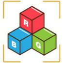
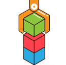
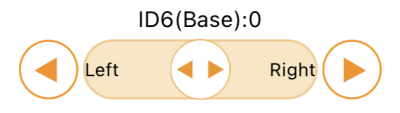
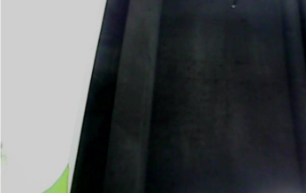
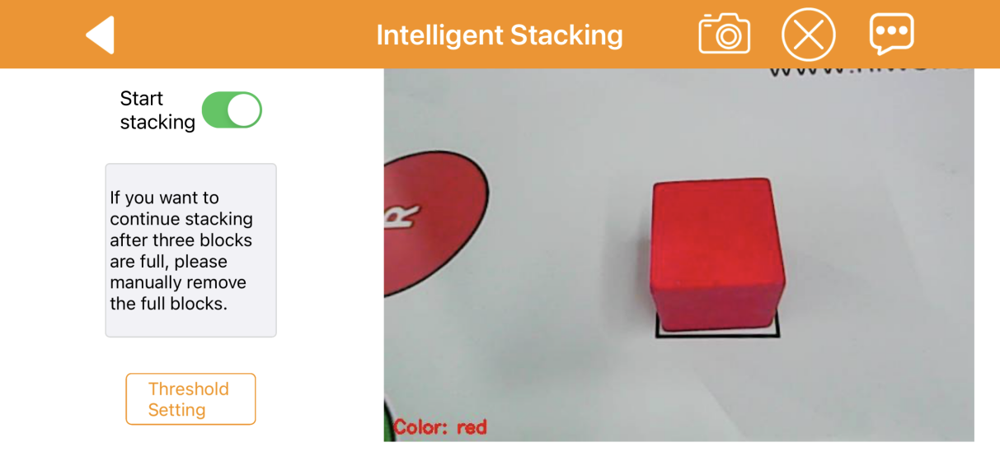

# 2.Quick User Experience

## [1. APP Installation and Connection ]()

## 2. App Control

User can use app “WonderPi” to control ArmPi mini. This lesson will introduce the specific operation methods of each game.

### 2.1 Getting Ready

(1) Firstly, calibrate the picking position of ArmPi mini.

Please refer to the content in “[Getting Ready/7.Position Calibration]()” to learn about the specific operation steps.

(2) Install app “WonderPi” and connect the robotic arm.

Please refer to the content in “[Quick User Experience/2. APP Control ]()” to learn about the specific operation steps.

### 2.2 Start Game

There are five games in app including remote control, color recognition, color tracking, target tracking and intelligent stacking.

The following list briefly introduces each game mode.

| Icon | Game mode | Instruction |
|:--:|:--:|:--:|
|  |    Robot Control     | Control the movement of robot arm |
|  | Color Recognition | It can recognize red, green and blue. When the target color is recognized, ArmPi mini will execute the corresponding action. |
|  | Color Sorting | It can recognize red, green and blue. When the target color is recognized and place the block in the middle of the gripper, ArmPi mini will pick the object and place it to the corresponding position. |
|  | Target Tracking | It can recognize red, green and blue. When the target color is recognized, ArmPi mini will pick the object and place it to the corresponding position. |
|  | Intelligent Stacking | When the target block is recognized, robot arm will pick and stack the blocks in the stacking area. |

The following list introduces the functions of the navigation bar in game selection interface. 

| Icon | Instruction |
|:--:|:--:|
|  | Back to the connection interface. |
|  | Adjust color threshold. If want to learn about the specific adjustment method, please refer to the content in “Quick User Experience->3.Color Threshold Adjustment”. |
|  | Display the window of Hiwonder information |

**2.2.1 Robot Control** 

:::{Note}
After entering the game “Remote control”, ArmPi mini will stand straight up. Therefore, please make sure there is no obstacle in front of the robot before entering game.
:::

Select “Robot Control” to enter this game. The interface is divided into two parts:

(1) The left side is servo control area.

(2) The right side displays the image returned by camera.

**① Navigation Bar Icon Function**

The button function of navigation bar is explained in following list which is also applicable to other games.

<table  class="docutils-nobg" style="margin:0 auto" border="1">
<colgroup>
<col style="width: 21%" />
<col style="width: 78%" />
</colgroup>
<tbody>
<tr>
<td style="text-align: center;"><strong>Icon</strong></td>
<td style="text-align: center;"><strong>Function Instruction</strong></td>
</tr>
<tr>
<td style="text-align: center;"></td>
<td style="text-align: left;">Back to the previous interface.</td>
</tr>
<tr>
<td style="text-align: center;"></td>
<td style="text-align: left;">
Capture and save the returned image to photo.

Click on to check the image.
</td>
</tr>
<tr>
<td style="text-align: center;"></td>
<td style="text-align: left;">Hide the navigation bar.</td>
</tr>
<tr>
<td style="text-align: center;"></td>
<td style="text-align: left;">Display the window of Hiwonder information.</td>
</tr>
</tbody>
</table>

**② Game Interface Icon Function**

<table class="docutils-nobg" border="1">
<colgroup>
<col style="width: 35%" />
<col style="width: 64%" />
</colgroup>
<tbody>
<tr>
<td style="text-align: center;"><strong>Icon</strong></td>
<td style="text-align: center;"><strong>Function instruction</strong></td>
</tr>
<tr>
<td style="text-align: center;"></td>
<td style="text-align: left;">
Dragicon to “close” or “Release” side to control the gripper to open or close.

Click andto slightly adjust the servo rotation.
</td>
</tr>
<tr>
<td style="text-align: center;">

<td style="text-align: left;">
Dragicon to “Forward” or “Backward” side to control the corresponding servo to rotate forward or backward.

Clickandto slightly adjust the servo rotation.
</td>
</tr>
<tr>
<td style="text-align: center;"></td>
<td style="text-align: left;">
Dragicon to “Left” or “Right” side to control ID6 servo to rotate to left or right.

Clickandto slightly adjust the servo rotation.
</td>
</tr>
<tr>
<td style="text-align: center;"></td>
<td style="text-align: left;">Display the real-time returned image.</td>
</tr>
</tbody>
</table>

**2.2.2 Color Recognition**

:::{Note}

* Please start this game under a moderate environment light, too bright or too dark light will influence the normal recognition affect.

* After starting game, please ensure there is no other object containing the recognition color except the target object within the camera frame, otherwise the recognition result will be affected.

  :::

Firstly, click “Color Recognition” to enter game interface. The interface consists of two parts.

(1) At the left side, you can start or stop game, and set color threshold.

(2) The right side of interface displays the real-time returned image.

**① Icon Function**

| Icon | Function |
|:--:|:--:|
|  | Start or stop game |
|  | Adjust color threshold.  You can refer to “4.Start ArmPi mini/ 3.Color Threshold Adjustment” to learn about the specific adjustment method. |
|  | Display the real-time image returned by camera. The current recognized color is displayed in the lower left corner. |

**② Operation Instruction and Realization Outcome**

(1) Click “Start Recognition” and position red, blue or green object in camera frame.

(2) When the red object is recognized, robot arm will nod. When the blue or green object is recognized, robot arm will shake its head.

**2.2.3 Color Sorting**

:::{Note}

* Before starting game, you need to firstly calibrate the gripping position of the robot to avoid influencing the game effect. 

* Please start this game under a moderate environment light, too bright or too dark light will influence the normal recognition affect.

* After starting game, please ensure there is no other object containing the recognition color except the target object within the camera frame, otherwise the recognition result will be affected.

  :::

Firstly, click “Color Sorting” to enter game interface. The interface consists of two parts.

(1) At the left side, you can start or stop game.

(2) The right side of interface displays the real-time returned image.

**① Icon Function**

| Icon | Function |
|:--:|:--:|
|  | Start or stop game |
|  | Adjust color threshold.  You can refer to “Quick User Experience/3.Color Threshold Adjustment” to learn about the specific adjustment method. |
|  | Display the real-time image returned by camera. The current recognized color is displayed in the lower left corner. |

**② Operation Instruction and Realization Outcome**

(1) Click “Start sorting”, and put the colored block in camera frame.

(2) When the block is recognized, the gripper will open automatically.

(3) Position the block in the middle of the gripper, and then the gripper will pick the block and place it in the corresponding position.

**2.2.4 Target Tracking**

:::{Note}

* Please start this game under a moderate environment light, too bright or too dark light will influence the normal recognition affect.

* After starting game, please ensure there is no other object containing the recognition color except the target object within the camera frame, otherwise the recognition result will be affected.

  :::

Firstly, click “Target Tracking” to enter game interface. The interface consists of two parts.

(1) At the left side, you can start or stop game.

(2) The right side of interface displays the real-time returned image.

**① Icon Function**

<table class="docutils-nobg" border="1">
<colgroup>
<col style="width: 35%" />
<col style="width: 64%" />
</colgroup>
<tbody>
<tr>
<td style="text-align: center;"><strong>Icon</strong></td>
<td style="text-align: center;"><strong>Function</strong></td>
</tr>
<tr>
<td style="text-align: center;"></td>
<td style="text-align: left;">Start or stop game</td>
</tr>
<tr>
<td style="text-align: center;"></td>
<td style="text-align: left;">
Select target color.

“R” is red, “G” is green and “B” is blue.
</td>
</tr>
<tr>
<td style="text-align: center;"></td>
<td style="text-align: left;">Display the current tracked color</td>
</tr>
<tr>
<td style="text-align: center;"></td>
<td style="text-align: left;">Display the real-time image returned by camera. </td>
</tr>
</tbody>
</table>

**② Operation Instruction and Realization Outcome**

(1) Firstly, select the color to track in color selection area. Here take red for example, click “R”.

(2) Then click “Start tracking”, and position the red block in camera frame.

(3) When the block is recognized, robot arm will move with the block.

**2.2.5 Intelligent Stacking**

:::{Note}

* Please start this game under a moderate environment light, too bright or too dark light will influence the normal recognition affect.

* After starting game, please ensure there is no other object containing the recognition color except the target object within the camera frame, otherwise the recognition result will be affected.

  :::

Firstly, click “Intelligent Stacking” to enter game interface. The interface consists of two parts.

(1) At the left side, you can start or stop game, and adjust color threshold.

(2) The right side of interface displays the real-time returned image.

**① Icon Function**

| Icon | Function |
|:--:|:--:|
|  | Start or stop game |
|  | Adjust color threshold.  You can refer to “Quick User Experience/ 3.Color Threshold Adjustment” to learn about the specific adjustment method. |
|  | Display the real-time image returned by camera. The current recognized color is displayed in the lower left corner. |

**② Operation Instruction and Realization Outcome**

(3) Click “Start stacking”, and place the colored block within detection area.

(4) When the block is recognized, robot arm will pick the block and place it in stacking area.

(5) The stacking area can stack up to three blocks. When the upper limit is reached, please remove the blocks in the stacking area before the next black is stacked.

## [3. Adjust Color Threshold]()

