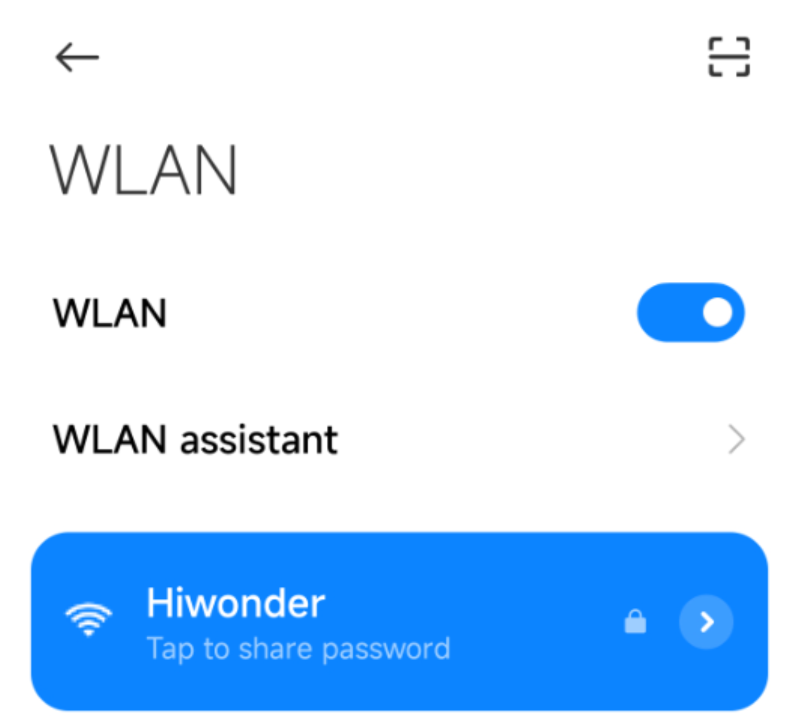
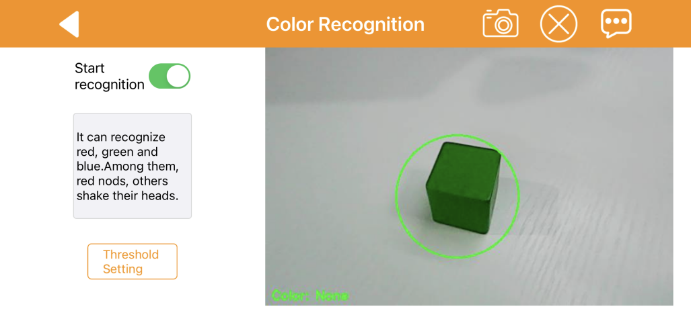
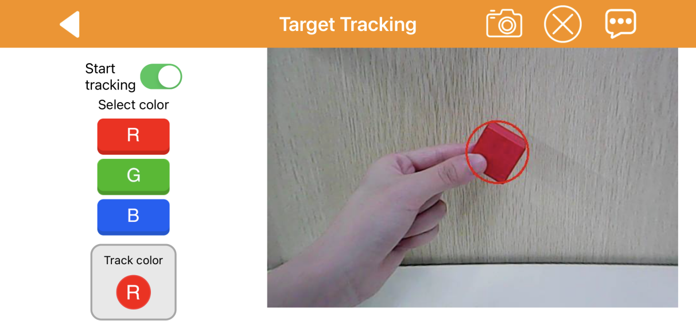
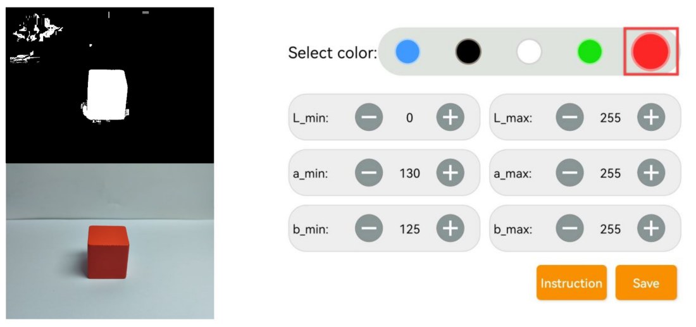
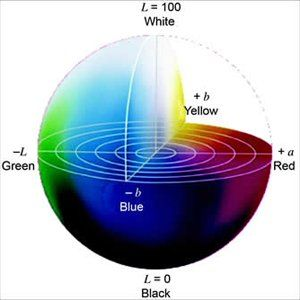

# 上手试玩

:::{Note}
本节课为通用课程，演示一致适用于其他树莓派系列产品
:::

## 1. 手机APP的安装与连接

用户可以使用手机APP"**WonderPi**"来控制ArmPi mini机械臂。本节课会讲解如何安装APP并用其连接机械臂。

### 1.1 APP安装

:::{Note}
1.  请对APP开放所有权限，以免影响APP的正常使用。
2.  打开APP前，需开启手机的GPS定位和Wi-Fi功能。
:::

**[安卓系统](https://play.google.com/store/apps/details?id=com.Wonder.Pi)**： 需要注意，请务必在手机设置内为APP开启所有权限，否则可能会影响正常功能实现！

**[iOS系统](https://apps.apple.com/cn/app/wonderpi/id1477946178)**

### 1.2 设备开机

打开树莓派扩展板电源开关，启动ArmPi mini机械臂。如需了解具体操作步骤，可查看目录"**第1章 学前先看\第3课 设备充电及首次开机**"下的文档。

### 1.3 APP连接

:::{Note}
ArmPi mini机械臂启动成功后会进入AP直连模式并生成一个以"HW"为开头的热点。
:::

1)  打开手机APP"**WonderPi**"，依次点击"**初级套件**"、"**ArmPi Mini**"。

2)  点击界面右下角的"**+**"按钮，选择"**直连模式**"。

3)  点击"**去连接设备热点**"按键，前往设置界面，连接机械臂生成的热点。

:::{Note}
iOS系统下，需等待手机状态栏显示Wi-Fi图标后再返回APP，否则可能会搜索不到设备。若出现搜索不到设备的情况，可点击APP界面右上方的刷新图标。
:::

4)  连接热点后，返回手机APP，APP将自动连接设备。稍等片刻，当搜索到下图所示图标时，即为连接成功。

:::{Note}
若出现"网络不可用，是否继续连接"的提示弹窗，单击"保持连接"按键即可。
:::

5)  点击上图的机械臂图标即可进入玩法模式选择界面，如下图所示：

如需了解各个玩法模式的具体使用方法，可查看目录"**第1章 学前先看\第3课 设备充电及首次开机**"下的文档。

## 2. 手机APP试玩

用户可以使用手机APP"**WonderPi**"来控制ArmPi mini机械臂。本节课会说明APP中各个玩法模式的具体使用方法。

### 2.1 准备工作

1.  完成ArmPi mini机械臂的位置校准，以免影响玩法的实现效果。

如需了解具体操作步骤，可查看目录"**第1章 学前先看\第6课 位置校准**"下的文档。

2.  安装手机APP"**WonderPi**"，并用其连接机械臂。

如需了解具体操作步骤，可查看目录"**第2章 上手试玩\第1课 手机APP的安装与连接**"下的文档。

### 2.2 开始试玩

手机APP提供了5种玩法模式，分别是机体遥控、颜色识别、颜色追踪、目标追踪和智能码垛。

下表是对各个玩法模式的简单说明：

| **图标** | **玩法模式** | **说明** |
|:--:|:--:|:--:|
|  | 机体遥控 | 控制机械臂舵机的转动。 |
|  | 颜色识别 | 可识别颜色有红、绿、蓝三种颜色。当识别到目标颜色，机械臂会执行对应的反馈动作。 |
|  | 颜色分拣 | 可识别颜色有红、绿、蓝三种颜色。当识别到目标色块，将色块放置于机械臂的机械爪中间，机械臂会夹取色块，并将其放置到对应位置。 |
|  | 目标追踪 | 可选择的识别颜色有红、绿、蓝三种颜色。当识别到目标颜色，机械臂会随着识别目标的移动而转动。 |
|  | 智能码垛 | 当识别到检测区域内的目标色块，机械臂会夹取色块，并将其放置到码垛区域进行堆叠。 |

下表是玩法模式选择界面中导航栏的功能说明：

| **图标** | **功能说明** |
|:--:|:--:|
|  | 返回连接界面。 |
|  | 调节颜色阈值，如需了解具体调节方法，可查看目录"**4.开机试玩-\>第7课 颜色阈值调试**"下的文档。 |
|  | 显示幻尔科技的信息窗口。 |

- #### 2.2.1 机体遥控

:::{Note}
进入"机体遥控"玩法界面后，机械臂会笔直立起。因此，在进入此玩法界面前，请确保机械臂附近无遮挡物。
:::

点击玩法模式选择界面的"**机体遥控**"按键，进入玩法界面。该界面分为两部分：

1.  界面左侧是舵机控制区域；

2.  界面右侧是摄像头回传画面显示区域。

- **导航栏功能说明**

下表是导航栏按键的功能说明，此说明同样适用于其他玩法界面的导航栏，因此后续不再对此进行讲解说明。

<table class="docutils-nobg" border="1">
<colgroup>
<col style="width: 21%" />
<col style="width: 78%" />
</colgroup>
<tbody>
<tr>
<td style="text-align: center;"><strong>图标</strong></td>
<td style="text-align: center;"><strong>功能说明</strong></td>
</tr>
<tr>
<td style="text-align: center;"></td>
<td style="text-align: left;">返回上一界面。</td>
</tr>
<tr>
<td style="text-align: center;"></td>
<td style="text-align: left;">
将摄像头当前回传画面保存至相册。

点击机械臂连接界面的图标，即可进入相册进行查看。
</td>
</tr>
<tr>
<td style="text-align: center;"></td>
<td style="text-align: left;">隐藏导航栏。</td>
</tr>
<tr>
<td style="text-align: center;"></td>
<td style="text-align: left;">显示幻尔科技的信息窗口。</td>
</tr>
</tbody>
</table>

- **玩法界面功能说明**

<table class="docutils-nobg" border="1">
<colgroup>
<col style="width: 35%" />
<col style="width: 64%" />
</colgroup>
<tbody>
<tr>
<td style="text-align: center;"><strong>图标</strong></td>
<td style="text-align: center;"><strong>对应功能</strong></td>
</tr>
<tr>
<td style="text-align: center;"></td>
<td style="text-align: left;">
将浮标朝"<strong>闭合</strong>"或"<strong>松开</strong>"端拖动，即可控制机械爪闭合或张开。

单击两侧按键和，即可微调舵机转动幅度。
</td>
</tr>
<tr>
<td style="text-align: center;">

</td>
<td style="text-align: left;">
将浮标朝"<strong>向后</strong>"或"<strong>向前</strong>"端拖动，即可控制对应ID编号的舵机向后或向前转动。

单击两侧按键和，即可微调舵机转动幅度。
</td>
</tr>
<tr>
<td style="text-align: center;"></td>
<td style="text-align: left;">
将浮标朝"<strong>左转</strong>"或"<strong>右转</strong>"端拖动，即可控制6号舵机左转或右转。

单击两侧按键和，即可微调舵机转动幅度。
</td>
</tr>
<tr>
<td style="text-align: center;"></td>
<td style="text-align: left;">显示摄像头回传的实时画面。</td>
</tr>
</tbody>
</table>

- #### 2.2.2 颜色识别

:::{Note}
1.  请在光照条件合适的环境下进行玩法体验，光照过暗或过亮都容易影响到识别效果。
2.  开启玩法后，请确保摄像头的视野范围内不存在其他包含目标识别颜色的物体，以免影响玩法的实现效果。
:::

点击玩法模式选择界面的"**颜色识别**"按键，进入玩法界面。该界面分为两部分：

1.  界面左侧是玩法开关与颜色阈值设置区域；

2.  界面右侧是摄像头回传画面显示区域。

- **界面功能说明**

| **图标** | **功能说明** |
|:--:|:--:|
|  | 开启/关闭玩法。 |
|  | 调节颜色阈值，如需了解具体调节方法，可查看目录"**第2章 上手试玩\第3课 颜色阈值调节**"下的文档。 |
|  | 显示摄像头回传的实时画面，画面左下角会显示当前识别到的颜色。 |

- **操作说明与实现效果**

1.  点击"**开始识别**"按钮，开启玩法。依次将红色、蓝色、绿色的物体单独放置于摄像头的视野范围内。

2.  当识别到红色物体，机械臂会执行"**点头**"动作。当识别到蓝色或绿色物体，机械臂执行"**摇头**"动作。

- #### 2.2.3 颜色分拣

:::{Note}
1.  请在光照条件合适的环境下进行玩法体验，光照过暗或过亮都容易影响到识别效果。

2.  开启玩法后，请确保摄像头的视野范围内不存在其他包含目标识别颜色的物体，以免影响玩法的实现效果。
:::

3.  开启玩法后，请确保摄像头的视野范围内不存在其他包含目标识别颜色的物体，以免影响玩法的实现效果。

点击玩法模式选择界面的"**颜色分拣**"按键，进入玩法界面。该界面分为两部分：

1.  界面左侧是玩法开关区域；

2.  界面右侧是摄像头回传画面显示区域。

- **界面功能说明**

| **图标** | **功能说明** |
|:--:|:--:|
|  | 开启/关闭玩法。 |
|  | 调节颜色阈值，如需了解具体调节方法，可查看目录"**第2章 上手试玩\第3课 颜色阈值调节**"下的文档。 |
|  | 显示摄像头回传的实时画面，画面左下角会显示当前识别到的颜色。 |

- **操作说明与实现效果**

1.  点击"**开始分拣**"按钮，开启玩法。将色块放置在摄像头的视野范围内。

2.  当识别到色块，机械爪会自动张开。

3.  将色块置于机械爪中间，机械爪会自动闭合以抓取色块。随后，机械臂会将色块放置到对应位置。

- #### 2.2.4 目标追踪

:::{Note}
1.  请在光照条件合适的环境下进行玩法体验，光照过暗或过亮都容易影响到识别效果。
2.  开启玩法后，请确保摄像头的视野范围内不存在其他包含目标识别颜色的物体，以免影响玩法的实现效果。
:::

点击玩法模式选择界面的"**颜色分拣**"按键，进入玩法界面。该界面分为两部分：

1.  界面左侧是玩法开关与追踪颜色选择区域；

2.  界面右侧是摄像头回传画面显示区域。

- **界面功能说明**

<table class="docutils-nobg" border="1">
<colgroup>
<col style="width: 35%" />
<col style="width: 64%" />
</colgroup>
<tbody>
<tr>
<td style="text-align: center;"><strong>图标</strong></td>
<td style="text-align: center;"><strong>功能说明</strong></td>
</tr>
<tr>
<td style="text-align: center;"></td>
<td style="text-align: left;">开启/关闭玩法。</td>
</tr>
<tr>
<td style="text-align: center;"></td>
<td style="text-align: left;">
选择目标追踪颜色。

"R"为红色（Red），"G"为绿色（Green），"B"为蓝色（Blue）。
</td>
</tr>
<tr>
<td style="text-align: center;"></td>
<td style="text-align: left;">显示当前追踪的颜色。</td>
</tr>
<tr>
<td style="text-align: center;"></td>
<td style="text-align: left;">显示摄像头回传的实时画面。</td>
</tr>
</tbody>
</table>

- **操作说明与实现效果**

1.  在颜色选择区域选择所要追踪的颜色，此处以红色为例，点击"**R**"按键即可。

2.  点击"**开始追踪**"按钮，开启玩法。将红色物体放置在摄像头的视野范围内。

3.  当识别到物体，机械臂会随着物体的移动而转动。

2.5 智能码垛

:::{Note}
1.  请在光照条件合适的环境下进行玩法体验，光照过暗或过亮都容易影响到识别效果。

2.  开启玩法后，请确保摄像头的视野范围内不存在其他包含目标识别颜色的物体，以免影响玩法的实现效果。
:::

点击玩法模式选择界面的"**智能码垛**"按键，进入玩法界面。该界面分为两部分：

1.  界面左侧是玩法开关与颜色阈值设置区域；

2.  界面中间是摄像头回传画面显示区域。

- **界面功能说明**

| **图标** | **功能说明** |
|:--:|:--:|
|  | 开启/关闭玩法。 |
|  | 调节颜色阈值，如需了解具体调节方法，可查看目录"**第2章 上手试玩\第3课 颜色阈值调节**"下的文档。 |
|  | 显示摄像头回传的实时画面，画面左下角会显示当前识别到的颜色。 |

- **操作说明与实现效果**

1.  点击"**开始码垛**"按钮，开启玩法。将色块放置在检测区域内。

2.  当识别到色块，机械臂会夹取色块，并将其放置到码垛区域。

3.  码垛区域最多可堆叠三个方块，当达到上限，请手动移除码垛区域的方块。

## 3. 颜色阈值调试

在不同光源下，物体颜色的呈现效果是不同的，而这一现象会对涉及颜色识别的功能玩法产生一定程度的影响。针对这一问题，本节课会学习如何使用手机APP"**WonderPi**"来调节颜色阈值。

### 3.1 准备工作

安装手机APP"**WonderPi**"，并用其连接ArmPi mini机械臂。如需了解具体操作步骤，可查看目录"**第2章 上手试玩\第1课 手机APP的安装与连接**"下的文档。

### 3.2 界面介绍

进入玩法模式选择界面后，点击下图所示按键，即可进入颜色阈值调节界面。

下表是颜色阈值调节界面的功能说明：

<table class="docutils-nobg" border="1">
<colgroup>
<col style="width: 35%" />
<col style="width: 64%" />
</colgroup>
<tbody>
<tr>
<td style="text-align: center;"><strong>图标</strong></td>
<td style="text-align: center;"><strong>功能说明</strong></td>
</tr>
<tr>
<td style="text-align: center;"></td>
<td style="text-align: left;">
摄像头回传画面的处理后图像。

图像中，颜色物体区域表示为白色，其余部分表现为黑色。
</td>
</tr>
<tr>
<td style="text-align: center;"></td>
<td style="text-align: left;">摄像头回传画面的原始图像。</td>
</tr>
<tr>
<td style="text-align: center;"></td>
<td style="text-align: left;">选择当前调节的颜色。</td>
</tr>
<tr>
<td style="text-align: center;"></td>
<td style="text-align: left;">
调节回传画面的L分量范围，"L_min"是范围下限，"L_max"是范围上限。

点击按键可减小对应数值，点击按键可增大数值。
</td>
</tr>
<tr>
<td style="text-align: center;"></td>
<td style="text-align: left;">
调节回传画面的A分量范围，"a_min"是范围下限，"a_max"是范围上限。

点击按键可减小对应数值，点击按键可增大数值。
</td>
</tr>
<tr>
<td style="text-align: center;"></td>
<td style="text-align: left;">
调节回传画面的B分量范围，"b_min"是范围下限，"b_max"是范围上限。

点击按键可减小对应数值，点击按键可增大数值。
</td>
</tr>
<tr>
<td style="text-align: center;"></td>
<td style="text-align: left;">打开操作说明窗口。</td>
</tr>
<tr>
<td style="text-align: center;"></td>
<td style="text-align: left;">保存调节的阈值。</td>
</tr>
<tr>
<td style="text-align: center;"></td>
<td style="text-align: left;">返回玩法模式选择界面。</td>
</tr>
<tr>
<td style="text-align: center;"></td>
<td style="text-align: left;">隐藏导航栏。</td>
</tr>
<tr>
<td style="text-align: center;"></td>
<td style="text-align: left;">显示幻尔科技的信息窗口。</td>
</tr>
</tbody>
</table>

### 3.3 调节颜色阈值

1.  进入颜色阈值调节界面，选择需要调节阈值的颜色，此处以红色为例。

2.  将红色物体放置在摄像头的视野范围内，将L、A、B分量的最小值都调为"**0**"，最大值都调为"**255**"。

3.  点击"**操作说明**"按键，查看颜色阈值的调节方法。

**注意：如需关闭操作说明窗口，点击"好的"即可。**

4.  由LAB颜色空间分布图可知，红色靠近"**+a**"，即需要优先调整A分量。

5.  "**a_max**"的数值保持不变，增大"**a_min**"的数值，直至处理后图像中的红色物体区域显示为白色，其余部分显示为黑色。

6.  根据所处环境来调整L分量和B分量。若红色物体在环境下颜色偏浅，增大亮度的最小值(**L_min**)；在环境下颜色偏深，则减小亮度的最大值(**L_max**)。若红色物体在环境下偏暖色调，增大色度的最小值(**b_min**)；在环境下偏冷色调，减小色度的最大值(**b_max**)。

7.  完成阈值调节后，点击"**保存**"按键，保存调节好的阈值范围。

