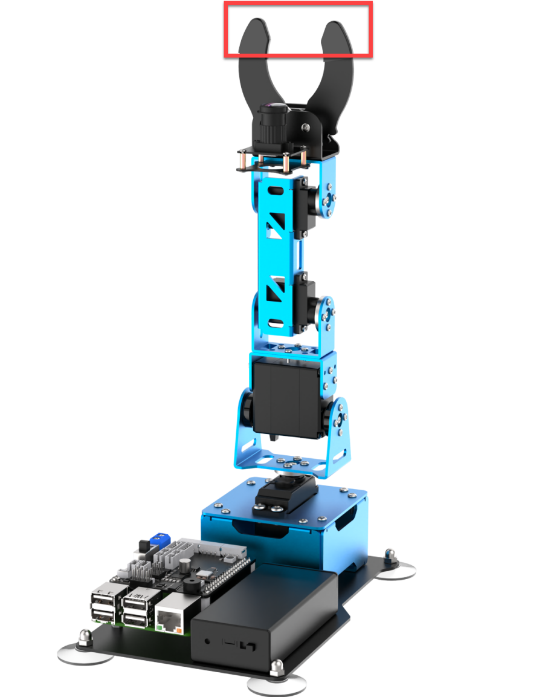
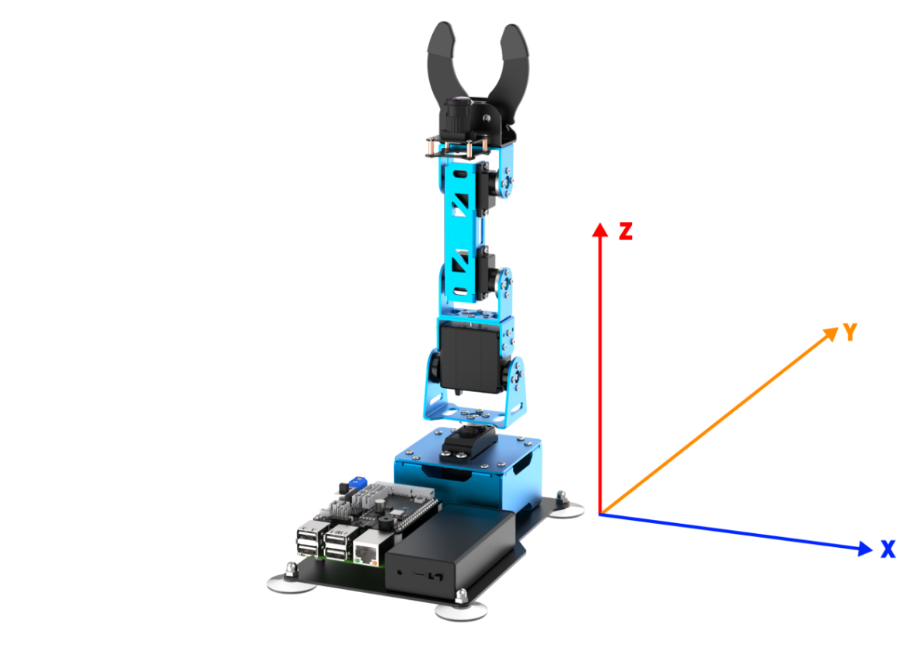
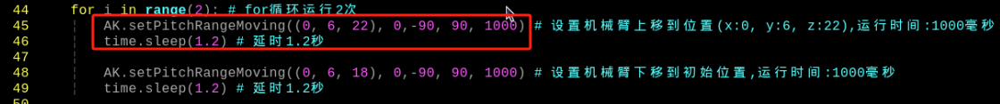
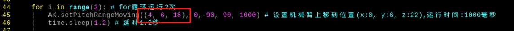
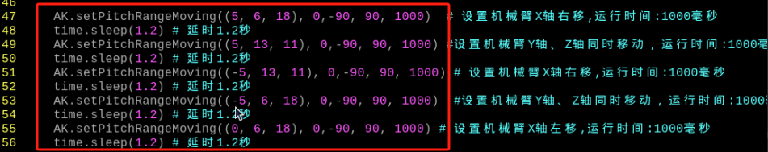
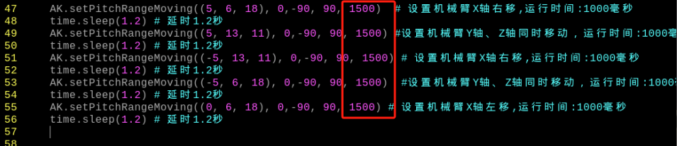

#  4.Basic Motion Lesson

## 1. What is Inverse Kinematics?

### 1.1 Robot Kinematics

The robot kinematics can be divided into forward kinematics and inverse kinematics. Forward kinematics refers to the position information of end effector can be obtained when then joint angle and linkages parameters are known. For inverse kinematics, given the robot’s end-effector positions, the joint position can be calculated. The end-effector refers to the top part of the gripper framed in the below red box.）



In practical, the desired position where the end effector will reach to can not be known if using forward kinematics to control robot arm. Therefore, inverse kinematics is usually used to control robot arm because it can calculate the joint angle, given the robot’s end-effector positions.

### 1.2 Existence and Multiple Solution Problems in Inverse Kinematics

Generally, the solution of forward kinematics is unique and easy to obtain, while inverse kinematics often has multiple solutions and is more complex to analyze. Due to the complexity and diversity of the inverse kinematics problem of robots, it is impossible to establish a universal analytical algorithm. The inverse kinematics problem actually includes the existence and uniqueness of the solution.
    The region where the inverse solution exists is usually called the workspace of the robot. The workspace is the set of target points that the end effector of the robotic arm can reach.
Therefore, the existence of the inverse solution of robot kinematics depends on the fact that for a given position of the robotic arm's end effector, there is at least one set of joint variables that can reach it. If the given end effector position is outside the workspace of the robot, the inverse solution does not exist.
    For the solution of inverse kinematics, not only the position but also the orientation of the end effector must meet the requirements to be considered as the solution of inverse kinematics. 
If inverse kinematics only requires a position, it is easy to have multiple solutions. In this case, we first need to obtain all these solutions, and then we need to select one of them based on certain principles, such as setting an expected value and choosing the solution closer to the expected value.

### 1.3 Solution to Inverse Kinematics 

Geometric and algebraic solutions are usually used in inverse kinematics.
The geometric solution is used here. Given the linkage length (the distance between two servos), set the end-effector coordinate (X, Y and Z) and the pitch angel, and then calculate the joint angle according to the trigonometric function.

The code path of the detailed calculation process: [ArmPi_mini\ArmIK\ArmMoveIK.py]()

## 2. Establish Robotic Arm Coordinate System

### 2.1 Coordinate System Introduction

Most of the descriptions of spatial position, speed and acceleration are in Cartesian coordinate system, which is well known as a coordinate system composed of three mutually perpendicular coordinate axes.When we say how many angles to rotate around a certain axis, the right-hand rule is used to determine the positive direction, as shown below:


### 2.2 Establish Space Coordinate System

A coordinate system must be established to describe the motion of an object. ArmPi mini uses x, y and z coordinate system and take the center of the base as origin (0,0,0), as the figure shown below: 



:::{Note}
 When controlling robotic arm, z-axis value must be greater than 0.
:::

After the coordinate system is established, robot arm can be controlled to reach any position in the workspace by specifying the coordinate of the end effector position and using inverse kinematics to calculate the joint angle. The X, Y and Z axes can be controlled at individually or together.

| Coordinate axis |                      Control direction                       |
| :-------------: | :----------------------------------------------------------: |
|        x        | Control the end effector to move left or right. Moving to the right is the positive direction of x axis. |
|        y        | Control the end effector to move forward or backward. Moving forward is the positive direction of y axis. |
|        z        | Control the end effector to move up and down. Moving up is the positive direction of z axis. |

For example, when robot arm moves to the right, x-axis value increases; when robot arm moves forward, y-axis value increase; when robot arm moves up, z-axis value increases.

## 3. Move Up and Down

### 3.1 Program Description

In this lesson, you can learn how to control the end effector to move up and down by setting the coordinate of end effector.
Inverse kinematics is mainly used to calculate the joint angle according to the coordinate of the set target position. Then the joint angle is converted into the pulse width of the servo to realize that the end effector is controlled to move to the target position.

### 3.2 Start and Close the Game

:::{Note}
The input command should be case sensitive, and “Tab” can be used to complement keywords.
:::

(1) Turn on ArmPi mini, and connect it to Raspberry Pi system desktop via VNC viewer.

(2) Click  in the upper left corner (as the figure shown below), or press “Ctrl+Alt+T” to open LX terminal.

(3) Enter command and press “Enter” to enter the directory of game programs.

```commandline
cd ArmPi_mini/armpi_mini_demo
```

(4) Enter command and press “Enter” to start game.

```commandline
python3 arm_move_IK_demo.py
```
(5) If want to exit the game, you can press “Ctrl+C”. If fail to close, please try multiple times.

### 3.3 Project Outcome

After starting the game, the end effector of robot arm will move up first, and then move down.

### 3.4 **Function Extension**

3.4.1  Modify Movement Direction

The end effector can also be controlled to move along x and y axes. Here take x axis as example. The specific operation steps are as follow:

(1) Click  icon and press “Ctrl+Alt+T” to open the LX terminal.

(2) Enter command and press “Enter” to enter the directory of game programs.

```commandline
cd ArmPi_mini/armpi_mini_demo
```

(3) Enter command and press “Enter” to open the program file.

```commandline
vim arm_move_IK_demo.py
```

(4) Find the following code:



(5) Press “i” key on the keyboard to enter the editing mode.


(6) Change “(0, 6, 22)” to “(4, 6 , 18)”, as the figure shown below:



(7) After modification, press “Esc” and enter “:wq”, and then press “Enter”to save and close the file.

```py
:wq
```

(8) Enter command and press “Enter” to start game and check the game effect after modification.

```commandline
python3 arm_move_IK_demo.py
```

### 3.5 Program Analysis

The source code of the program is located in:[/home/pi/ArmPi_mini/armpi_mini_demo/arm_move_IK_demo.py]()

**3.5.1 Import Library**

{lineno-start=3}

```py
import sys
import time
from kinematics.arm_move_ik import *
from common.ros_robot_controller_sdk import Board
```

`sys` is the most commonly used library interacting strongly with the Python interpreter; `time` is the library for processing time; `ArmIK` is the library for processing inverse kinematics.
If want to call a function in library, you can use this format “library name+function name (parameter, parameter)” to use the code. For example,

{lineno-start=46}

```
        time.sleep(1.2) # 延时1.2秒(delay for 1.2s)
```

The code above is used to call sleep() in “time” library and this function is for delaying. 
There are some built-in libraries in Python, so they can be called directly. For example, “time”, “cv2” and “math”. In addition, you can also customize a new library like “ArmIK.ArmMoveIK” inverse kinematics library.

**3.5.2 Instantiate Function Library**

The name of function library is too long to memorize. For calling function easily, the library can be instantiated. For example,

{lineno-start=28}

```py
AK = ArmIK()
```

After instantiating, you can directly call the function when inputting the function like `AK.function name (parameter, parameter)`.

**3.5.3 Control Robot Arm**

{lineno-start=41}

```
    AK.setPitchRangeMoving((0, 6, 18), 0,-90, 90, 1500) # 设置机械臂初始位置(x:0, y:6, z:18),运行时间:1500毫秒(set the initial position of the robotic arm to (x:0, y:6, z:18) and the runtime to 1500ms)
    time.sleep(1.5) # 延时1.5秒(delay for 1.5s)
    
    for i in range(2): # for循环运行2次('for' runs in loop for 2 times)
        AK.setPitchRangeMoving((0, 6, 22), 0,-90, 90, 1000) # 设置机械臂上移到位置(x:0, y:6, z:22),运行时间:1000毫秒(set the robotic arm to move upwards to (x:0, y:6, z:22) and the runtime to 1000ms)
        time.sleep(1.2) # 延时1.2秒(delay for 1.2s)
        
        AK.setPitchRangeMoving((0, 6, 18), 0,-90, 90, 1000) # 设置机械臂下移到初始位置,运行时间:1000毫秒(set the robotic arm to move downwards to the initial position and the runtime to 1000ms)
        time.sleep(1.2) # 延时1.2秒(delay for 1.2s)
```

The function `AK.setPitchRangeMoving()` in inverse kinematics library is used to control robot arm to move. Take `AK.setPitchRangeMoving((0, 6, 18), 0,-90, 90, 1500)` for example.

The first parameter`(0, 6, 18)` is the end-effector coordinate. The three parameters represent the coordinate of x, y and z axes.

The second parameter `0` is the pitch angle.

The third parameter `-90` is the minimum range of the pitch angle.

The fourth parameter `90` is the maximum range of the pitch angle.

The fifth parameter `1500` is the running time and the unit us millisecond.

## 4. Move on XYZ Axis

### 4.1 Program Description

In this lesson, you can learn how to control the end effector to move on XYZ axis by setting the coordinate of end effector.
Inverse kinematics is mainly used to calculate the joint angle according to the coordinate of the set target position. Then the joint angle is converted into the pulse width of the servo to realize that the end effector is controlled to move to the target position.

### 4.2 Start and Close the Game

:::{Note}
The input command should be case sensitive, and “Tab” can be used to complement keywords.
:::

(1) Turn on ArmPi mini, and connect it to Raspberry Pi system desktop via VNC viewer.

(2) Clickin the upper left corner (as the figure shown below), or press “Ctrl+Alt+T” to open LX terminal.

(3) Enter command and press “Enter” to enter the directory of game programs.

```commandline
cd ArmPi_mini/armpi_mini_demo
```

(4) Enter command and press “Enter” to start game.

```commandline
python3 arm_move_IK_triaxial.py
```

(5) If want to exit the game, you can press “Ctrl+C”. If fail to close, please try multiple times.

### 4.3 Project Outcome

After starting game, robot arm will draw square.

### 4.4 Function Extension

**4.4.1 Modify Movement Speed**

The movement speed of the end effector can be modified. The specific operation steps are as follow:

(1) Clickicon and press “Ctrl+Alt+T” to open the LX terminal.

(2) Enter command and press “Enter” to enter the directory of game programs.

```commandline
cd ArmPi_mini/armpi_mini_demo
```

(3) Enter command and press “Enter” to open the program file.

```commandline
vim arm_move_IK_triaxial.py
```

(4) Find the following code:



(5) Press “i” key on the keyboard to enter the editing mode.


(6) Change “1000” to “1500”, as the figure shown below:



(7) After modification, press “Esc” and enter “:wq”, and then press “Enter”to save and close the file.

```commandline
:wq
```

(8) Enter command and press “Enter” to start game and check the game effect after modification.

```commandline
python3 arm_move_IK_triaxial.py
```

### 4.5 Program Analysis

The path of the program source code：[/home/pi/ArmPi_mini/armpi_mini_demo/arm_move_IK_triaxial.py]()

**4.5.1 Import Library**

{lineno-start=3}

```
import sys
import time
from kinematics.arm_move_ik import *
from common.ros_robot_controller_sdk import Board
```

`sys` is the most commonly used library interacting strongly with the Python interpreter; “time” is the library for processing time; `ArmIK` is the library for processing inverse kinematics.
If want to call a function in library, you can use this format “library name+function name (parameter, parameter)” to use the code. For example,

{lineno-start=43}

```
    time.sleep(1.5) # 延时1.5秒(delay for 1.5s)
```

The code above is used to call `sleep()` in `time` library and this function is for delaying. 
There are some built-in libraries in Python, so they can be called directly. For example, `time`, `cv2` and `math`. In addition, you can also customize a new library like `ArmIK.ArmMoveIK` inverse kinematics library.

**4.5.2 Instantiate Function Library**

The name of function library is too long to memorize. For calling function easily, the library can be instantiated. For example,

{lineno-start=27}

```
# 实例化逆运动学库(Instantiate inverse kinematics library)
AK = ArmIK()
```

The code above is used to call `sleep()` in “time” library and this function is for delaying. 
There are some built-in libraries in Python, so they can be called directly. For example, `time`, `cv2` and `math`. In addition, you can also customize a new library like `ArmIK.ArmMoveIK` inverse kinematics library.

**4.5.3  Control Robot Arm**

{lineno-start=41}

```
    # 设置机械臂初始位置(x:0, y:6, z:18),运行时间:1500毫秒(set the initial position of the robotic arm to (x:0, y:6, z:18) and the runtime to 1500ms)
    AK.setPitchRangeMoving((0, 6, 18), 0,-90, 90, 1500) 
    time.sleep(1.5) # 延时1.5秒(delay for 1.5s)
    


    AK.setPitchRangeMoving((5, 6, 18), 0,-90, 90, 1000)  # 设置机械臂X轴右移,运行时间:1000毫秒(set the robotic arm to move to the right along the X-axis with a runtime of 1000ms)
    time.sleep(1.2) # 延时1.2秒(delay for 1.2s)
    AK.setPitchRangeMoving((5, 13, 11), 0,-90, 90, 1000) #设置机械臂Y轴、Z轴同时移动，运行时间:1000毫秒(Set the robotic arm to move simultaneously along the Y and Z axes with a runtime of 1000ms.)
    time.sleep(1.2) # 延时1.2秒(delay for 1.2s)
    AK.setPitchRangeMoving((-5, 13, 11), 0,-90, 90, 1000) # 设置机械臂X轴右移,运行时间:1000毫秒(set the robotic arm to move to the right along the X-axis with a runtime of 1000ms)
    time.sleep(1.2) # 延时1.2秒(delay for 1.2s)
    AK.setPitchRangeMoving((-5, 6, 18), 0,-90, 90, 1000)  #设置机械臂Y轴、Z轴同时移动，运行时间:1000毫秒(Set the robotic arm to move simultaneously along the Y and Z axes with a runtime of 1000ms.)
    time.sleep(1.2) # 延时1.2秒(delay for 1.2s)
    AK.setPitchRangeMoving((0, 6, 18), 0,-90, 90, 1000) # 设置机械臂X轴左移,运行时间:1000毫秒(set the robotic arm to move to the left along the X-axis with a runtime of 1000ms)
    time.sleep(1.2) # 延时1.2秒(delay for 1.2s)
```

The function `AK.setPitchRangeMoving()` in inverse kinematics library is used to control robot arm to move. Take `AK.setPitchRangeMoving((0, 6, 18), 0,-90, 90, 1500)` for example.

The first parameter`(0, 6, 18)` is the end-effector coordinate. The three parameters represent the coordinate of x, y and z axes.

The second parameter `0` is the pitch angle.

The third parameter `-90` is the minimum range of the pitch angle.

The fourth parameter`90` is the maximum range of the pitch angle.

The fifth parameter `1500` is the running time and the unit us millisecond.


