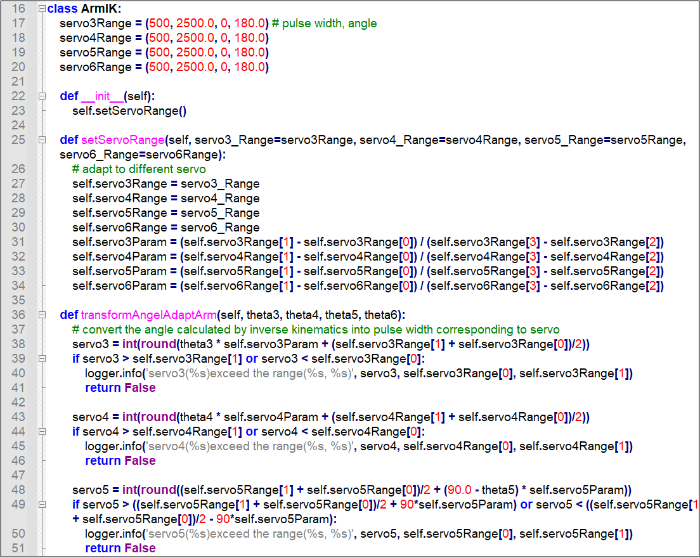
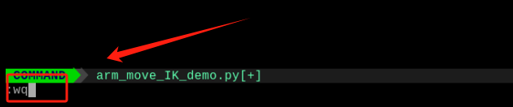
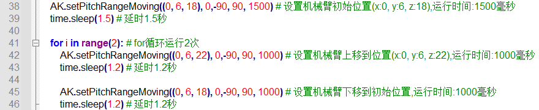
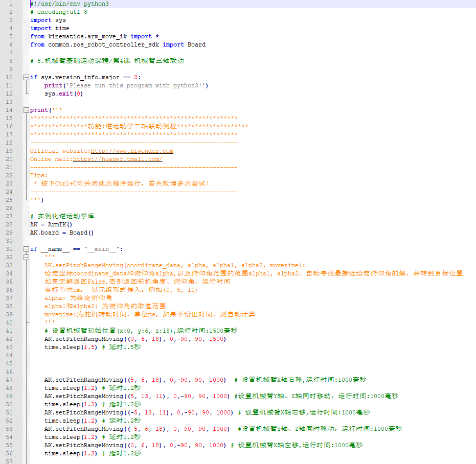
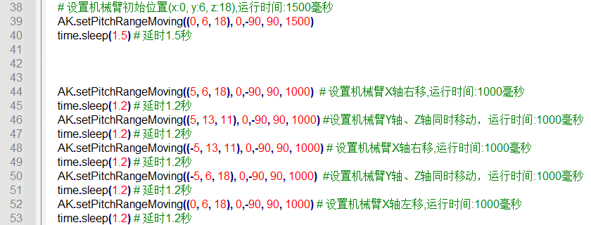

# 机械臂逆运动学基础课程

## 1. 什么是逆运动学

### 1.2 机器人运动学

机器人运动学分为正向运动学和逆向运动学，正向运动学即给定机械臂各关节角度，计算机器人末端位置；逆向运动学即已知机器人末端的位置，计算机械臂对应位置的全部关节角度。（**末端位置指机械爪的顶部，图中框出的位置**）


在实际应用中，使用正运动学控制机械臂，并不能直接知道机械臂末端要到达的位置。因此，我们通常使用逆运动学控制，给定机械臂末端位置计算出关节角度。

### 1.3 逆运动学解的存在性和多解问题

一般正向运动学的解是唯一和容易获得的，而逆向运动学往往有多个解而且分析更为复杂。由于机器人逆运动学问题的复杂性和多样性，无法建立通用的解析算法。逆运动学问题实际包括解的存在性、唯一性。

通常把逆解存在的区域称为机器人的工作空间。工作空间就是机械臂末端位置可以到达的目标点的集合。

所以，机器人运动学逆解的存在性就在于：对于给定的机械臂末端位置，至少存在一组关节变量可以到达，如果给定机器人末端位置在工作空间外，则逆解不存在。

对于逆运动学的解，不仅要求末端位置在工作空间内，姿态也达到要求才能算作逆运动学的解。

如果逆运动学只对位置有要求，容易出现有多个解的情况。这时，我们首先需要将所有这些解都得到，然后还需要根据一定的原则来选择其中的解，比如设置一个期望值，选择更靠近期望值的解。

### 1.4 逆运动学的解法

逆运动学常用的有几何解法和代数解法。

我们使用的是几何解法，已知机械臂连杆的长度（即舵机与舵机间的距离），设置末端位置的坐标X，Y，Z和俯仰角，再根据三角函数计算关节角度。

详细计算过程见代码路径：**ArmPi_mini\ArmIK\ArmMoveIK.py**



## 2. 建立机械臂坐标系

### 2.2 坐标系介绍

描述空间位置、速度和加速度，大部分都是用笛卡尔坐标系，也就是大家熟知由三个互相垂直的坐标轴所组成的坐标系。当我们说绕某一个轴旋转多少角度时，正方向的确定使用右手定则，如下图：


### 2.3 建立空间坐标系

要描述一个物体的运动，就必须先建立一个坐标系，ArmPi mini机械臂使用的是X、Y、Z三轴坐标系（单位：mm），以机械臂底座中心点为坐标系的原点(0,0,0)，如下图所示：


:::{Note}
机械臂控制时，Z轴坐标必须大于0。
:::

机械臂坐标系建立完成，就可以通过给定末端位置坐标，利用逆运动学计算关节角度，来控制机械臂末端到达工作空间任意一个位置。X，Y，Z轴可以单独控制，也可以一起控制。

| **坐标轴** |              **控制方向**               |
|:----------:|:---------------------------------------:|
|     x      | 控制机械臂末端左右移动，向右为X轴正方向 |
|     y      | 控制机械臂末端前后移动，向前为Y轴正方向 |
|     z      | 控制机械臂末端上下移动，向上为Z轴正方向 |

例如：机械臂向右移动，x的值增大；机械臂向前移动，y的值增大；机械臂向上移动，z的值增大。

## 3. 控制机械臂上下移动

### 3.1 实验原理

本节课可以通过设置机械臂末端位置坐标，控制机械臂末端上下移动。

主要使用逆运动学，根据设置的目标位置坐标，计算出关节角度；再将关节角度换算成舵机脉宽，就可以实现机械臂末端移动到目标位置。

### 3.2 实验步骤

:::{Note}
指令的输入需严格区分大小写，另外可按键盘"Tab"键进行关键词补齐。
:::

1)  启动机械臂，参考"**第1章 学前先看\第4课 远程桌面工具安装与连接**"通过VNC Viewer远程连接到树莓派系统桌面。

2)  单击系统桌面左上角的图标，或使用快捷键"**Ctrl+Alt+T**"，打开LX终端。

3)  输入指令，并按下回车，切换至玩法程序所在目录。

```commandline
cd ArmPi_mini/armpi_mini_demo
```

4)  输入指令，并按下回车，开启玩法。

```commandline
python3 arm_move_IK_demo.py
```
5)  如需关闭此玩法，在终端界面中按下"**Ctrl+C**"即可。若关闭失败，可多次尝试。

### 3.3 功能实现

玩法开启后，机械臂末端会向上移动再向下移动。

### 3.4 修改移动方向

在玩法体验的过程中，可以改变机械臂末端在X轴或Y轴移动。**本节以X轴为例，操作步骤如下：**

1)  单击系统桌面左上角的图标，或使用快捷键"**Ctrl+Alt+T**"，打开LX终端。

2)  输入指令，并按下回车，切换至玩法程序所在目录。

```commandline
cd ArmPi_mini/armpi_mini_demo
``` 

3)  输入指令，并按下回车，打开程序文件。

```commandline
vim arm_move_IK_demo.py
```

4)  找到下图所示代码：


5)  按下键盘上的"**I**"键，进入编辑模式。


6)  将"**(0, 6, 22)**"修改为"**(4, 6 , 18)**"，如下图所示：


7)  修改完成后，按下键盘的"**Esc**"键，输入指令，按下回车，保存并退出文件。



8)  输入指令，并按下回车，开启玩法。即可查看修改后的玩法效果
    
```commandline
python3 arm_move_IK_demo.py
```

### 3.5 代码分析

该程序的源代码位于： **/home/pi/ArmPi_mini/armpi_mini_demo/arm_move_IK_demo.py**


- #### 导入相关库


"sys"是最常用的和Python解释器交互的库；"time"是处理时间的库；"ArmIK"是处理逆运动学计算的库。

如需调用功能库里的函数，可以使用代码"**功能库名.函数名（参数，参数...）**"，如：


上图所示代码的作用是调用"time"库中的sleep()函数，此函数用于延时。

Python中有一些内置的库，用户可以直接导入调用，如time、cv2、math等。此外，用户也可以自定义一个库，如本节课所用程序中的"**ArmIK.ArmMoveIK**"逆运动学库。

- #### 实例化函数库

我们有些函数库的名称太长，并且不容易记忆，为了方便调用函数，我们经常会对函数库进行实例化，如：


进行实例化后，在使用ArmIK库中的函数，就可以像这样"**AK.函数名(参数,参数...)**"直接调用了，非常方便。

- #### 控制机械臂



使用AK.setPitchRangeMoving()函数控制机械臂移动，该函数是逆运动学库中的函数，以代码"**AK.setPitchRangeMoving((0, 6, 18), 0,-90, 90, 1500)**"为例：

第一个参数"**(0, 6, 18)**"是机械臂末端在坐标系中的坐标，括号内三个参数分别是X轴、Y轴和Z轴坐标。

第二个参数"**0**"是俯仰角。

第三个参数"-**90**"是俯仰角范围最小值。

第四个参数"**90**"是俯仰角范围最大值。

第五个参数"**1500**"是运行时间，单位是毫秒。

## 4. 机械臂三轴联动

### 4.1 实验原理

本节课可以通过设置机械臂末端位置坐标，控制机械臂末端在坐标系内移动。

主要使用逆运动学，根据设置的目标位置坐标，计算出关节角度。再将关节角度换算成舵机脉宽。就可以实现机械臂末端移动到目标位置。

### 4.2 实验步骤

:::{Note}
指令的输入需严格区分大小写，另外可按键盘"Tab"键进行关键词补齐。
:::

1)  启动机械臂，参考"**第1章 学前先看\第4课 远程桌面工具安装与连接**"通过VNC Viewer远程连接到树莓派系统桌面。

2)  单击系统桌面左上角的图标，或使用快捷键"**Ctrl+Alt+T**"，打开LX终端。

3)  输入指令，并按下回车，切换至玩法程序所在目录。

```commandline
cd ArmPi_mini/armpi_mini_demo
```


4)  输入指令，并按下回车，开启玩法。

```commandline
python3 arm_move_IK_triaxial.py
```


5)  如需关闭此玩法，只需要在LX终端界面中按下"**Ctrl+C**"。若关闭失败，可多次按下。

### 4.3 功能实现

玩法开启后，机械臂末端会画出正方形的轨迹。

### 4.4 修改移动速度

在玩法体验的过程中，可以改变机械臂末端移动的速度。**操作步骤如下：**

1)  单击系统桌面左上角的图标，或使用快捷键"**Ctrl+Alt+T**"，打开LX终端。

2)  输入指令，并按下回车，切换至玩法程序所在目录。

```commandline
cd ArmPi_mini/armpi_mini_demo
```


3)  输入指令，并按下回车，打开程序文件。

```commandline
vim arm_move_IK_triaxial.py
```


4)  找到下图所示代码：


5)  按下键盘上的"**I**"键，进入编辑模式。


6)  将"**1000**"修改为"**1500**"，如下图所示：


7)  修改完成后，按下键盘的"**Esc**"键，输入指令，按下回车，保存并退出文件。

:::{Note}
:wq
:::


8)  输入指令，并按下回车，开启玩法。即可查看修改后的玩法效果。

:::{Note}
python3 arm_move_IK_triaxial.py
:::


### 4.5 代码分析

该程序的源代码位于：

**/home/pi/ArmPi_mini/armpi_mini_demo/arm_move_IK_triaxial.py**



- #### 导入相关库


"sys"是最常用的和Python解释器交互的库；"time"是处理时间的库；"ArmIK"是处理逆运动学计算的库。

如需调用功能库里的函数，可以使用代码"**功能库名.函数名（参数，参数...）**"，如：


就是调用"**time**"库中的"**sleep**"函数。sleep()的作用是延时。

上图所示代码的作用是调用"time"库中的sleep()函数，此函数用于延时。

Python中有一些内置的库，用户可以直接导入调用，如time、cv2、math等。此外，用户也可以自定义一个库，如本节课所用程序中的"**kinematics.arm_move_ik**"逆运动学库。

- #### 实例化函数库

我们有些函数库的名称太长，并且不容易记忆，为了方便调用函数，我们经常会对函数库进行实例化，如：


进行实例化后，在使用ArmIK库中的函数，就可以像这样"**AK.函数名(参数,参数...)**"直接调用了，非常方便。

- #### 控制机械臂



使用AK.setPitchRangeMoving()函数控制机械臂移动，该函数是逆运动学库中的函数，以代码"**AK.setPitchRangeMoving((0, 6, 18), 0,-90, 90, 1500)**"为例：

第一个参数"**(0, 6, 18)**"是机械臂末端在坐标系中的坐标，括号内三个参数分别是X轴、Y轴和Z轴坐标。

第二个参数"**0**"是俯仰角。

第三个参数"-**90**"是俯仰角范围最小值。

第四个参数"**90**"是俯仰角范围最大值。

第五个参数"**1500**"是运行时间，单位是毫秒。


