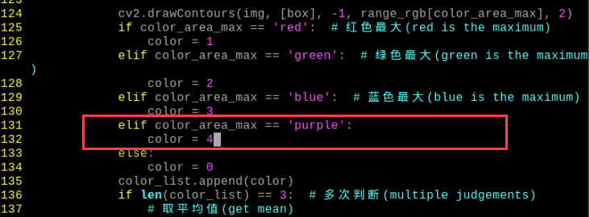
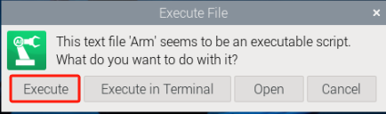

# 5.AI Vision Learning

## 1. Single Color Recognition

In this section, the camera detects colors. When a red ball is recognized, the buzzer will emit a beep, and the red ball will be highlighted in the transmitted image with "Color: red" displayed.

### 1.1 Program Description

The implementation of color recognition consists of two parts: color detection and execution feedback after recognition.

First, for the color detection part, Gaussian filtering is applied to the image to reduce noise. The Lab color space is then used to convert the color of the object (you can learn more about the Lab color space in the OpenCV Vision Basic Courseection of the tutorial materials). 

Next, the object's color within the circle is recognized using color thresholding, followed by masking (masking involves using selected images, shapes, or objects to globally or locally obscure the image being processed). 

After performing morphological operations such as opening and closing on the object image, the object with the largest contour is circled. 
Opening: The image undergoes erosion followed by dilation. This operation removes small objects, smooths shape boundaries, and preserves the area. It can eliminate small noise particles and separate connected objects.  

Closing: The image undergoes dilation followed by erosion. This operation fills small holes within objects, connects nearby objects, closes broken contour lines, and smooths boundaries while preserving the area.
After recognition, the servo and buzzer are set up to provide feedback based on the detected color. For example, when red is detected, the buzzer will emit a sound.
For detailed feedback behavior, please refer to section 3. Function Implementation of this document.

<p id="anchor_1_2"></p>

### 1.2 Start and Close the Game

:::{Note}
The input command is case-sensitive, and keywords can be auto-completed using the Tab key.
:::

(1) The input command is case-sensitive, and keywords can be auto-completed using the Tab key.


(2) Click the icon  in the top left corner of the system desktop or press the shortcut " Ctrl+Alt+T" to open the LX terminal.

(3) Execute the command to navigate to the directory where the program is located, then press Enter: 

```commandline
cd ArmPi_mini/functions
```

(4) Enter the command and press Enter to start the program:

```commandline
python3 color_recognition.py
```

(5) To close the program, simply press "Ctrl+C" in the LX terminal. If it does not close, press it multiple times.

### 1.3 Program Outcome

After starting the game, the camera will be used to detect colors. When a red ball is recognized, the buzzer will emit a beep sound, and the ball will be circled in the transmitted image, with "Color: red" printed.

:::{Note}

* During the recognition process, ensure the environment is well-lit to avoid inaccurate recognition due to poor lighting conditions.
* Ensure that no objects with similar or matching colors to the target are present in the background within the camera’s visual range, as this may cause misrecognition.
  :::

### 1.4 Function Extensions

<p id="anchor_1_4_1"></p>

**1.4.1 Changing the Default Recognized Color**

The color recognition program is pre-configured to recognize three colors: red, green, and blue. By default, the program identifies red, triggering the buzzer to emit a beep and drawing a circle around the red ball in the transmitted image, displaying “Color: red.”

**To change the recognized color to green, follow these steps:**

(1) Enter the following command and press Enter to navigate to the source code directory:

```commandline
cd ArmPi_mini/functions/
```

(2) Then, enter the following command and press Enter to open the program file:

```commandline
sudo vim color_recognition.py
```

(3) Press the “i” key on the keyboard to enter edit mode.


(4) Replace “red” (highlighted in red in the image) with “green,” as shown in the image below:


(5) Modify the color parameters as shown in the following figure:


(6) To save your changes, press the “Esc” key, then type “:wq” (note the colon before "wq") and press Enter to save and exit.

(7) Enter the following command and press Enter to start the color recognition functionality: 

```commandline
python3 color_recognition.py
```

<p id="anchor_1_4_2"></p>

**1.4.2 Add new recognition color**

In addition to the built-in color, you can add new recognition color. For example, add yellow as a new recognition color. The specific operation steps are as follow.

(1) Double clickand select “Execute” in the pop-up window.


(2) Then select “Camera Tool” and “Connect” in sequence.


(3) Click “Add” and name the new color. Take “purple” as example. Then click “OK”.


(4) Select “purple” in the drop-down list of the color selection.


(5) Point camera at the purple object, and drag L, A and B slider to adjust value until the recognized color turns white and other area colors turns block in the left side. 


(6) Finally, click “Save”.


(7) Check whether the modified value is written into program. Enter command and press “Enter” to access to the program directory.

```commandline
cd ArmPi_mini/yaml/
```

(8) Enter command and press “Enter” to open program file.

```commandline
sudo vim lab_config.yaml
```

(9) After opening the color threshold program, you can check the threshold parameter of purple.


(10) Find the following code.


(11) Enter “ ‘purple’: (255, 255, 114)” and “ ‘purple’ ”. The “(255, 255, 114)” is the RGB value of the purple. The sequence of RGB needs to be swapped to BGR. Therefore, the value of purple does not change. Please use RGB color reader to check it.


(12) Find the following code.


(13) Enter the content of the following red frame to set the RGB light on the expansion board to purple, as the figure shown below.



(14) Save the modified content. Press “Esc” and enter “:wq”, and then press “Enter” to save and close the file.

(15) Then refer to the steps in “[1.2 Start and Close the Game]()” to start game. Position a purple object in camera frame, and then robot arm will shake its head. If want to control the robot to nod when recognizing purple, you can refer “[1.4.1 Change Default Recognition Color]()” to change the default color to purple. 

(16) If you want to add other recognition colors, please refer to the operation steps above.

### 1.5 Program Analysis

The source code of this program is saved in:[/home/pi/ArmPi_mini/functions/Color_recognition.py]()

**1.5.1 Import Function Library**

{lineno-start=1}

```
#!/usr/bin/python3
# coding=utf8
import sys
import cv2
import time
import math
import threading
import common.yaml_handle as yaml_handle
```

(1) Import Libraries for OpenCV, Time, Math, and Threading
To use functions from a library, we can call them with the syntax:

{lineno-start=179}

```
            time.sleep(0.01)
```

For example, to call the `sleep` function from the `time` library, we use: 

In Python, several libraries like `time`, `cv2`, and `math` are built-in and can be directly imported and used. You can also create your own libraries, like the "yaml_handle" file-reading library mentioned above.

**1.5.2 Main Function Analysis**

In a Python program, `__name__ == '__main__'` indicates the main function of the program, where the program starts by reading an image.

{lineno-start=156}

```
if __name__ == '__main__':
    from kinematics.arm_move_ik import *
    from common.ros_robot_controller_sdk import Board
```

**(1) Image Processing**

Function run() for Image Processing]

{lineno-start=82}

```
def run(img):
    global interval_time
    global __isRunning, color_list
    global detect_color, draw_color
    
    if not __isRunning:  # 检测是否开启玩法，没有开启则返回原图像(detect if the game is started, if no, return to original image)
        return img
    else:
        img_copy = img.copy()
        img_h, img_w = img.shape[:2]
        
        frame_resize = cv2.resize(img_copy, size, interpolation=cv2.INTER_NEAREST)
        frame_gb = cv2.GaussianBlur(frame_resize, (3, 3), 3)
        
        frame_lab = cv2.cvtColor(frame_gb, cv2.COLOR_BGR2LAB)  # 将图像转换到LAB空间(convert the image to LAB space)
```

**(2) Resizing the Image. The image size is resized to facilitate processing.**

{lineno-start=93}

```
        frame_resize = cv2.resize(img_copy, size, interpolation=cv2.INTER_NEAREST)
```

The first parameter `"img"` is the input image.

The second parameter `(320, 240)` specifies the output image size, which can be customized.

The third parameter `interpolation=cv2.INTER_NEAREST` defines the interpolation method.  

`INTER_NEAREST`: Nearest-neighbor interpolation.  

`INTER_LINEAR`: Bilinear interpolation (default if not specified).  

`INTER_CUBIC`: Bicubic interpolation over a 4x4 pixel neighborhood.  

`INTER_LANCZOS4`: Lanczos interpolation over an 8x8 pixel neighborhood.

**(3) Gaussian Filtering**

To remove noise from the image, Gaussian filtering is applied. This filter smooths the image to improve feature visibility.

{lineno-start=94}

```
        frame_gb = cv2.GaussianBlur(frame_resize, (3, 3), 3)
```

The first argument `frame_resize` is the input image.

The second argument `(3, 3)` specifies the size of the Gaussian kernel.

The third argument `3` is the standard deviation of the Gaussian kernel in the X direction.

{lineno-start=96}

````
        frame_lab = cv2.cvtColor(frame_gb, cv2.COLOR_BGR2LAB)  # 将图像转换到LAB空间(convert the image to LAB space)
````

The first parameter `"frame_gb"` is the image to be converted.

The second parameter `cv2.COLOR_BGR2LAB` converts the image from BGR format to LAB format. To convert to RGB, use `cv2.COLOR_BGR2RGB`.

**(4) Convert the Image to a Binary Image**

The image is simplified by converting it to a binary image, containing only 0s and 1s, which reduces the data size and makes it easier to process. The `cv2.inRange()` function is used for thresholding.

{lineno-start=103}

```
                frame_mask = cv2.inRange(frame_lab,
                                             (lab_data[i]['min'][0],
                                              lab_data[i]['min'][1],
                                              lab_data[i]['min'][2]),
                                             (lab_data[i]['max'][0],
                                              lab_data[i]['max'][1],
                                              lab_data[i]['max'][2]))  #对原图像和掩模进行位运算(perform bitwise operation on the original image and the mask)
```

The first parameter `"frame_lab"` is the input image.

The second parameter `(lab_data[i]['min'][0], lab_data[i]['min'][1], lab_data[i]['min'][2])` specifies the lower color threshold.

The third parameter `(lab_data[i]['max'][0], lab_data[i]['max'][1], lab_data[i]['max'][2])` specifies the upper color threshold.

**(5) Apply Morphological Operations (Opening and Closing)**

To reduce interference and smooth the image, morphological operations are applied. Opening is erosion followed by dilation, and closing is dilation followed by erosion. The `cv2.morphologyEx()` function is used.

{lineno-start=110}

```
                opened = cv2.morphologyEx(frame_mask, cv2.MORPH_OPEN, np.ones((3, 3), np.uint8))  # 开运算(opening operation)
                closed = cv2.morphologyEx(opened, cv2.MORPH_CLOSE, np.ones((3, 3), np.uint8))  # 闭运算(closing operation)
```

The first parameter `"frame_mask"` is the input image.

The second parameter `cv2.MORPH_OPEN` specifies the morphological operation (options include `cv2.MORPH_ERODE`, `cv2.MORPH_DILATE`, `cv2.MORPH_OPEN`, `cv2.MORPH_CLOSE`).

The third parameter `np.ones((6, 6))` specifies the convolution kernel.

The fourth parameter `np.uint8` defines the number of iterations to apply.

**(6) Find the Largest Contour**

After completing the image processing, the largest contour is found using the `cv2.findContours()` function.

{lineno-start=112}

```
                contours = cv2.findContours(closed, cv2.RETR_EXTERNAL, cv2.CHAIN_APPROX_NONE)[-2]  # 找出轮廓(find contours)
```

The first parameter `"closed"` is the input image.

The second parameter `cv2.RETR_EXTERNAL` specifies the contour retrieval mode.

The third parameter `cv2.CHAIN_APPROX_NONE)[-2]` specifies the contour approximation method.

The largest contour is selected, and a minimum area threshold is set to ensure the target contour is valid only if its area exceeds this value.

{lineno-start=114}

```
                if areaMaxContour is not None:
                    if area_max > max_area:  # 找最大面积(find the maximum area)
                        max_area = area_max
                        color_area_max = i
                        areaMaxContour_max = areaMaxContour
        if max_area > 2500:  # 有找到最大面积(the maximum area has been found)
            rect = cv2.minAreaRect(areaMaxContour_max)
            box = np.intp(cv2.boxPoints(rect))
```

**(7) Find the Largest Contour**

{lineno-start=119}

```
        if max_area > 2500:  # 有找到最大面积(the maximum area has been found)
            rect = cv2.minAreaRect(areaMaxContour_max)
            box = np.intp(cv2.boxPoints(rect))
            
            cv2.drawContours(img, [box], -1, range_rgb[color_area_max], 2)
            if color_area_max == 'red':  # 红色最大(red is the maximum)
                color = 1
            elif color_area_max == 'green':  # 绿色最大(green is the maximum)
                color = 2
            elif color_area_max == 'blue':  # 蓝色最大(blue is the maximum)
                color = 3
            else:
                color = 0
            color_list.append(color)
            if len(color_list) == 3:  # 多次判断(multiple judgements)
                # 取平均值(get mean)
                color = int(round(np.mean(np.array(color_list))))
                color_list = []
                
                if color == 1:
                    if time.time() > interval_time:
                        interval_time = time.time() + 3
                        board.set_buzzer(1900, 0.1, 0.9, 1)# 设置蜂鸣器响0.1秒(set the buzzer to sound for 0.1s)
                        time.sleep(0.9)
                        board.set_buzzer(1900, 0.1, 0.9, 1)# 设置蜂鸣器响0.1秒(set the buzzer to sound for 0.1s)
                    detect_color = 'red'
                    draw_color = range_rgb["red"]
                else:
                    detect_color = 'None'
                    draw_color = range_rgb["black"]
        else:
            draw_color = (0, 0, 0)
            detect_color = "None"
        cv2.putText(img, "Color: " + detect_color, (10, img.shape[0] - 10), cv2.FONT_HERSHEY_SIMPLEX, 0.65, draw_color, 2) # 把检测到的颜色打印在画面上(print the detected color on the image)
```

**(8) Display the Transmitted Image**

{lineno-start=173}

```
            frame_resize = cv2.resize(Frame, (320, 240))
            cv2.imshow('frame', frame_resize)
            key = cv2.waitKey(1)
            if key == 27:
                break
```

The function `cv2.imshow()` is used to display an image in a window. The first parameter `"frame"` is the name of the window, and the second parameter `"frame_resize"` is the content to be displayed. 
It is important to include `cv2.waitKey()` after `cv2.imshow()`, as the image will not be displayed without it. 
The function `cv2.waitKey()` waits for a key press, and the parameter `1` specifies the delay time in milliseconds.

## 2. Color Recognition

### 2.1 Program Description

The robotic arm can be controlled to nod and shake its head after recognizing color through the camera. This process has two parts including color recognition and recognition feedback.

The first part is color recognition. Perform Gaussian filter first to reduce noises of image. Convert the object color through Lab color space. You can refer to the content in folder “[OpenCV Basic Lesson/ 3.Color Space Learning]()” to learn about Lab color space.

Recognize the color of the object in circle through color threshold. Then perform masking on image. (Mask is to hide the whole or part of the processing image with the designated image, figure or object.) 

Next, process the image of the object with opening and closing operations. Find and circle the maximum contour, and then recognize the object in circle by the color threshold.
The opening operation erodes an image and then dilates the eroded image. Opening is useful for removing small objects and thin lines from an image while preserving the shape and size of larger objects in the image. It can remove small particles of noise and break the adhesion between objects.

The closing operation dilates an image and then erodes the dilated image. Closing is useful for filling small holes in an image while preserving the shape and size of large holes and objects in the image.

After the color is recognized, set servo, buzzer and RGB light. Then robot arm will give different feedback according to the different recognized color. For example, if red is recognized, robot arm will nod, buzzer will make sound and RGB will emit red light.
About the specific feedback effect, please refer to this part “[2.3 Project Outcome]()”.

<p id="anchor_2_2"></p>

### 2.2 Start and Close the Game

:::{Note}
The input command should be case sensitive.
:::

(1) Power on the robot and use VNC Viewer to connect to the remote desktop.


(2)  Enter the command to navigate to the directory where the demo program is located.

```commandline
cd ArmPi_mini/functions
```

(3) Enter the command of running the program , and press “Enter” to start the game.

```commandline
python3 color_detect.py
```

(4) To close the program, press “Ctrl+C” in the LX terminal interface. If the program cannot be closed successfully, repeat this operation until it exits.

### 2.3 Project Outcome

Firstly, start game. After recognition, robot arm will give corresponding feedback according to the recognized color. The effect is shown in the following list.

| **Object color** | Buzzer            | **RGB light** | **Action** | **Printed content** |
| ---------------- | ----------------- | ------------- | ---------- | ------------------- |
| Red              | Make a “Di” sound | Red           | Nod        | red                 |
| Green            | Make a “Di” sound | Green         | Shake head | green               |
| Blue             | Make a “Di” sound | Blue          | Shake head | blue                |

### 2.4 Function Extension

<span id="anchor_2_4_1" class="anchor"></span>

**2.4.1 Change default recognition color**

There are three built-in recognition colors in program including red, green and blue. When recognizing red, the robot arm will nod.

Here take changing the default recognition color to green for example. The specific operation steps are as follow.

(1) Enter command and press “Enter” to enter the source code directory.

```commandline
cd ArmPi_mini/functions/
```

(2) Then enter command and and press “Enter” to open the program file.

```commandline
sudo vim color_detect.py
```

(3) Find the following code:


:::{Note}
After entering the line number of the code, press “Shift+G” to go to the corresponding position. (The line number of the code shown in the figure is for reference only, please refer to the actual situation.)
:::

(4) Press “i” to enter the editing mode.


(5)  Change “red” to “green” in “detect_color == 'red'”, as the figure shown below.


(6) Then save the modified content. Press “Esc” and enter “:wq”, and press “Enter” to save and close the program file.

```commandline
:wq
```


(7) Enter command again, and press “Enter” to start game.

```commandline
python3 color_detect.py
```


**2.4.2 Add new recognition color**

In addition to the built-in color, you can add new recognition color. For example, add yellow as a new recognition color. The specific operation steps are as follow.

(1) Double click and select “Execute” in the pop-up window.


(2) Then select “Camera Tool” and “Connect” in sequence.


(3) Click “Add” and name the new color. Take “purple” as example. Then click “OK”.


(4) Select “purple” in the drop-down list of the color selection.


(5) Point camera at the purple object, and drag L, A and B slider to adjust value until the recognized color turns white and other area colors turns block in the left side. 


(6) Finally, click “Save”.


(7) Check whether the modified value is written into program. Enter command and press “Enter” to access to the program directory.

```commandline
cd ArmPi_mini/yaml/
```

(8) Enter command and press “Enter” to open program file.

```commandline
sudo vim lab_config.yaml
```

(9) After opening the color threshold program, you can check the threshold parameter of purple.


(10) Refer to the steps 1-2 in “4.1 Change default recognition color” to open the program file, and press “i” to enter the editing mode.


(12) Enter ` ‘purple’: (128, 0, 128)` and ` ‘purple’ `. The `(128, 0, 128)` is the RGB value of the purple. The sequence of RGB needs to be swapped to BGR. Therefore, the value of purple does not change. Please use RGB color reader to check it.


(13) Find the following code.


(14) Enter the content of the following red frame to set the RGB light on the expansion board to purple, as the figure shown below.


(15) Find the following code.


(16) Enter the content of the following red frame, as the figure shown below.


(17) Find the following code.


(18) Enter the content of the following red frame, as the figure shown below.


(19) Save the modified content. Press “Esc” and enter “:wq”, and then press “Enter” to save and close the file.

```commandline
:wq
```

(20) Then refer to the steps in “[2.2 Operation Steps]()” to start game. Position a purple object in camera frame, and then robot arm will shake its head. If want to control the robot to nod when recognizing purple, you can refer “[2.4.1 Change Default Recognition Color]()” to change the default color to purple. 

(21) If you want to add other recognition colors, please refer to the operation steps above.

### 2.5 Program Analysis

The source code of program is located in：[/home/pi/ArmPi_mini/functions/color_detect.py]()

**2.5.1 Import Function Library**

{lineno-start=1}

```
#!/usr/bin/python3
# coding=utf8
import sys
import cv2
import time
import math
import threading
import numpy as np
import common.misc as Misc
import common.yaml_handle as yaml_handle
```

{lineno-start=276}

```
if __name__ == '__main__':
    from kinematics.arm_move_ik import *
    from common.ros_robot_controller_sdk import Board
    board = Board()
    # 实例化逆运动学库(instantiate the inverse kinematics library)
    AK = ArmIK()
    AK.board = board
```

Import the libraries related to OpenCV, time, math, threads and inverse kinematics. If want to call a function in library, you can use`library name+function name (parameter, parameter)`. For example,

{lineno-start=178}

```
                time.sleep(1.5)  
```

Call `sleep` function in “time” library. The function “sleep ()” is used to delay.

There are some built-in libraries in Python, so they can be called directly. For example, `time`, `cv2` and `math`. You can also write a new library like `common.yaml_handle` and “common.yaml_handle”.

**2.5.2 Instantiate Function Library**

The name of function library is too long to memorize. For calling function easily, the library can be instantiated. For example,

{lineno-start=280}

```
    # 实例化逆运动学库(instantiate the inverse kinematics library)
    AK = ArmIK()
```

After instantiating, you can directly input and call the function “AK.function name (parameter, parameter)”.

**2.5.3 Main Function Analysis**

The python program `__name__ ==  ’__main__:’` is the main function of program. Firstly, the function init() is called to initialize. The initialization in this program includes: return the robot arm to the initial position, read the color threshold file. Generally there are also configurations for ports, peripherals, timing interrupts, etc., which are all done in the process of initialization.

{lineno-start=276}

```
if __name__ == '__main__':
    from kinematics.arm_move_ik import *
    from common.ros_robot_controller_sdk import Board
    board = Board()
    # 实例化逆运动学库(instantiate the inverse kinematics library)
    AK = ArmIK()
    AK.board = board
    
    init()
    start()
```

**(1) Read the Captured Image** 

{lineno-start=157}

```
    cap = cv2.VideoCapture('http://127.0.0.1:8080?action=stream')
```

Capture the camera image and save it to `cap`.

The function `cap.read` is to read the captured image. True: the `ret` value of image is read. False: The value of image 'ret' was not read.

`img` is a frame of the camera that was read.

**(2) Enter Image Processing**

When the captured image is read, “ret” value is True.

{lineno-start=290}

```
        if ret:
            frame = img.copy()
            Frame = run(frame)  
```

The function img.copy() is used to copy the content of “img” to “frame”.
The function run() is used to process image. In “5.4 Image Processing Analysis” to check the detailed content.

**(3) Window Displays Image**

{lineno-start=293}

```
            frame_resize = cv2.resize(Frame, (320, 240))
            cv2.imshow('frame', frame_resize)
            key = cv2.waitKey(1)
            if key == 27:
                break
```

The function `cv2.resize()` is used to scale the processed image to the appropriate size.

The function `cv2.imshow()` is used to displa y the image in window. `frame` is the window name. `frame_resize`is the displayed content and must be followed by cv2.waitKey(). Otherwise, the content can not be displayed.

The function `cv2.waitKey()` is used to wait for inputting key and the parameter `1` refers to the delay time.

<span id="anchor_2_5_4"></span>

**2.5.4 Image Processing Analysis**

{lineno-start=190}

```
# 图像处理(image processing)
def run(img):
    global roi
    global center_list
    global __isRunning
    global start_pick_up
    global last_x, last_y
    global detect_color, draw_color, color_list
    
    if not __isRunning:
        return img
    else:
        img_copy = img.copy()
        img_h, img_w = img.shape[:2]

        frame_resize = cv2.resize(img_copy, size, interpolation=cv2.INTER_NEAREST)
        frame_gb = cv2.GaussianBlur(frame_resize, (3, 3), 3)
        
        frame_lab = cv2.cvtColor(frame_gb, cv2.COLOR_BGR2LAB)  # 将图像转换到LAB空间(convert the image to LAB space)

        color_area_max = None
        max_area = 0
        areaMaxContour_max = 0
        if not start_pick_up:
            for i in lab_data:
                if i in __target_color:
                    frame_mask = cv2.inRange(frame_lab,
                                                 (lab_data[i]['min'][0],
                                                  lab_data[i]['min'][1],
                                                  lab_data[i]['min'][2]),
                                                 (lab_data[i]['max'][0],
                                                  lab_data[i]['max'][1],
                                                  lab_data[i]['max'][2]))  #对原图像和掩模进行位运算(perform bitwise operation on the original image and the mask)
                    opened = cv2.morphologyEx(frame_mask, cv2.MORPH_OPEN, np.ones((3, 3), np.uint8))  # 开运算(opening operation)
                    closed = cv2.morphologyEx(opened, cv2.MORPH_CLOSE, np.ones((3, 3), np.uint8))  # 闭运算(closing operation)
                    contours = cv2.findContours(closed, cv2.RETR_EXTERNAL, cv2.CHAIN_APPROX_NONE)[-2]  # 找出轮廓(find contours)
                    areaMaxContour, area_max = getAreaMaxContour(contours)  # 找出最大轮廓(find the largest contour)
                    if areaMaxContour is not None:
                        if area_max > max_area:  # 找最大面积(find the maximum area)
                            max_area = area_max
                            color_area_max = i
                            areaMaxContour_max = areaMaxContour
            if max_area > 500:  # 有找到最大面积(the maximum area has been found)
                (center_x, center_y), radius = cv2.minEnclosingCircle(areaMaxContour_max)  # 获取最小外接圆(get the minimum circumscribed circle)
                center_x = int(Misc.map(center_x, 0, size[0], 0, img_w))
                center_y = int(Misc.map(center_y, 0, size[1], 0, img_h))
                radius = int(Misc.map(radius, 0, size[0], 0, img_w))
                cv2.circle(img, (int(center_x), int(center_y)), int(radius), range_rgb[color_area_max], 2)
```

**(1) Image Resizing Process**

It is easy to zoom in and out the image.

{lineno-start=205}

```
        frame_resize = cv2.resize(img_copy, size, interpolation=cv2.INTER_NEAREST)
```

The first parameter `img_copy` is the input image.

The second parameter `size` is the size of the output image.

The third parameter `interpolation=cv2.INTER_NEAREST` is interpolation method. `INTER_NEAREST` is the earest Neighbour Interpolation. INTER_LINEAR is the Bilinear Interpolation. If the last parameter is not modified, this method “INTER_LINEAR” will be used by default. 

INTER_CUBIC: Bicubic interpolation within a 4x4 pixel neighborhood. INTER_LANCZOS4: Lanczos interpolation within an 8x8 pixel neighborhood.

**(2) Gaussian filter**

Noise is always present in image to influence the image quality to weaken the features. Select the filter methods according to the different noises and the command method includes Gaussian filter, Median filtering, Mean filter, etc.

Gaussian filter is a linear filter hat also smooths an image and reduces noise, which is widely used in processing image to eliminate noise.

{lineno-start=206}

```
        frame_gb = cv2.GaussianBlur(frame_resize, (3, 3), 3)
```

The first parameter `frame_resize` is the input image.

The second parameter `(3, 3)` is the kernel size.

The third parameter`3` is the Gaussian kernel sigma value on x direction.

**(3) Covert to Color Space**

Use function `cv2.cvtColor()` to convert image to LAB space.

{lineno-start=208}

```
        frame_lab = cv2.cvtColor(frame_gb, cv2.COLOR_BGR2LAB)  # 将图像转换到LAB空间(convert the image to LAB space)
```

The first parameter `frame_gb` is the input image.

The second parameter `cv2.COLOR_BGR2LAB` is the conversion format. `cv2.COLOR_BGR2LAB` can be used to convert used to change the BGR color space to LAB color space. When code is cv2.COLOR_BGR2RGB , BGR is converted to RGB.

**(4) Thresholding Processing**

Thresholding can be used to create binary images, only 0 and 1. The image can be small size for better processing.

Use inRange() function in cv2 library is used to process image with thresholding method. 

{lineno-start=216}

```
                    frame_mask = cv2.inRange(frame_lab,
                                                 (lab_data[i]['min'][0],
                                                  lab_data[i]['min'][1],
                                                  lab_data[i]['min'][2]),
                                                 (lab_data[i]['max'][0],
                                                  lab_data[i]['max'][1],
                                                  lab_data[i]['max'][2]))  #对原图像和掩模进行位运算(perform bitwise operation on the original image and the mask)
```

The first parameter `frame_lab` is the input image.

The second parameter `(lab_data[i]['min'][0],lab_data[i]['min'][1],lab_data[i]['min'][2])` is the lower limit of color threshold.

The third parameter `(lab_data[i]['max'][0],lab_data[i]['max'][1],lab_data[i]['max'][2])` is the upper limit of color threshold.

**(5) Opening and Closing**

To lower interference and make image smoother, opening and closing operations need to be used in image processing. The opening operation erodes an image and then dilates the eroded image. The closing operation dilates an image and then erodes the dilated image. The function `cv2.morphologyEx()` is the morphology function.

{lineno-start=223}

```
                    opened = cv2.morphologyEx(frame_mask, cv2.MORPH_OPEN, np.ones((3, 3), np.uint8))  # 开运算(opening operation)
                    closed = cv2.morphologyEx(opened, cv2.MORPH_CLOSE, np.ones((3, 3), np.uint8))  # 闭运算(closing operation)
```

The first parameter `frame_make` is the input image.

The second parameter `cv2.MORPH_OPEN` is the type of morphological operation. `cv2.MORPH_ERODE (Erosion)`, `cv2.MORPH_DILATE(Dilation)`, `cv2.MORPH_OPEN (Opening)`, `cv2.MORPH_CLOSE (Closing)`.

The third parameter `np.ones((3, 3)` is the convolution kernel.

The fourth parameter `np.uint8` is the application times.

**(6) Find the Largest Contour** 

Use function cv2.minEnclosingCircle in cv2 library to obtain the minimum enclosing circle of the target contour, and the origin coordinate and the radium of the minimum enclosing circle.

{lineno-start=226}

```
                    contours = cv2.findContours(closed, cv2.RETR_EXTERNAL, cv2.CHAIN_APPROX_NONE)[-2]  # 找出轮廓(find contours)
```

The first parameter `closed` is the input image.

The second parameter `cv2.RETR_EXTERNAL` is the contour retrieval method.

The third parameter `cv2.CHAIN_APPROX_NONE)[-2]` is the contour approximation method.

Find the largest contour in obtained contours. To avoid interference, set a minimum value and the target contour is effective when the area is greater than the set value.

{lineno-start=227}

```
                    if areaMaxContour is not None:
                        if area_max > max_area:  # 找最大面积(find the maximum area)
                            max_area = area_max
                            color_area_max = i
                            areaMaxContour_max = areaMaxContour
```

**(7) Obtain Position Information**

Use function cv2.minEnclosingCircle in cv2 library to obtain the minimum enclosing circle of the target contour, and the origin coordinate and the radium of the minimum enclosing circle.

{lineno-start=232}

```
            if max_area > 500:  # 有找到最大面积(the maximum area has been found)
                (center_x, center_y), radius = cv2.minEnclosingCircle(areaMaxContour_max)  # 获取最小外接圆(get the minimum circumscribed circle)
                center_x = int(Misc.map(center_x, 0, size[0], 0, img_w))
                center_y = int(Misc.map(center_y, 0, size[1], 0, img_h))
                radius = int(Misc.map(radius, 0, size[0], 0, img_w))
                cv2.circle(img, (int(center_x), int(center_y)), int(radius), range_rgb[color_area_max], 2)
```

**(8) Determine Maximum Color** 

Use judgement statement to get the maximum color in a image.

{lineno-start=239}

```
                if not start_pick_up:
                    if color_area_max == 'red':  # 红色最大(red is the maximum)
                        color = 1
                    elif color_area_max == 'green':  # 绿色最大(green is the maximum)
                        color = 2
                    elif color_area_max == 'blue':  # 蓝色最大(blue is the maximum)
                        color = 3
                    else:
                        color = 0
                    color_list.append(color)
                    if len(color_list) == 3:  # 多次判断(multiple judgements)
                        # 取平均值(get mean)
                        color = int(round(np.mean(np.array(color_list))))
                        color_list = []
                        start_pick_up = True
                        if color == 1:
                            detect_color = 'red'
                            draw_color = range_rgb["red"]
                        elif color == 2:
                            detect_color = 'green'
                            draw_color = range_rgb["green"]
                        elif color == 3:
                            detect_color = 'blue'
                            draw_color = range_rgb["blue"]
                        else:
                            detect_color = 'None'
                            draw_color = range_rgb["black"]
            else:
                if not start_pick_up:
                    draw_color = (0, 0, 0)
                    detect_color = "None"
```

**2.5.5 Execute Feedback**

The robot arm movement function move() is executed as a child thread. When color is recognized, the move() function is executed. It mainly determine the image processing result, and then execute the feedback including RGB light, buzzer, a single servo and multiple servos control.

{lineno-start=129}

```
# 机械臂移动函数(function for the robotic arm's movement)
def move():
    global _stop
    global __isRunning
    global detect_color
    global start_pick_up
    

    while True:
        if __isRunning:
            if detect_color != 'None' and start_pick_up:  # 如果检测到方块没有移动一段时间后，开始夹取(if the block is detected no moving for a period, the robotic arm starts to grip)
                set_rgb(detect_color)
                board.set_buzzer(1900, 0.1, 0.9, 1)# 设置蜂鸣器响0.1秒(set the buzzer to sound for 0.1s)
                
                if detect_color == 'red' : # 识别到红色，机械臂点头(if red is detected, the robotic arm nods its head)
                    for i in range(0,3):
                        board.pwm_servo_set_position(0.2, [[3, 800]])
                        time.sleep(0.2)
                        board.pwm_servo_set_position(0.2, [[3, 600]])
                        time.sleep(0.2)
                        if not __isRunning:
                            continue

                    AK.setPitchRangeMoving((0, 6, 18), 0,-90, 90, 500)  # 回到初始位置(return to initial position)
                    time.sleep(0.5)  
                    detect_color = 'None'
                    start_pick_up = False
                    set_rgb(detect_color)
                    
                else: # 否则识别到其他颜色，绿色和蓝色，机械臂摇头(if green and blue are detected, it shakes its head)
                    for i in range(0,3):
                        board.pwm_servo_set_position(0.4, [[6, 1300]])
                        time.sleep(0.3)
                        board.pwm_servo_set_position(0.4, [[6, 1700]])
                        time.sleep(0.3)
                        if not __isRunning:
                            continue

                    AK.setPitchRangeMoving((0, 6, 18), 0,-90, 90, 500)  # 回到初始位置(return to initial position)
                    time.sleep(0.5)
                    detect_color = 'None'
                    start_pick_up = False
                    set_rgb(detect_color)
            else:
                time.sleep(0.01)
        else:
            if _stop:
                _stop = False
                initMove()  # 回到初始位置(return to initial position)
                time.sleep(1.5)               
            time.sleep(0.01)
```

(1) The RGB color is consistent with the recognized color.

{lineno-start=68}

```
#设置扩展板的RGB灯颜色使其跟要追踪的颜色一致(set the color of the RGB light on the expansion board to match the color to be tracked)
def set_rgb(color):
    if color == "red":
        board.set_rgb([[1, 255, 0, 0], [2, 255, 0, 0]])
    elif color == "green":
        board.set_rgb([[1, 0, 255, 0], [2, 0, 255, 0]])
    elif color == "blue":
        board.set_rgb([[1, 0, 0, 255], [2, 0, 0, 255]])
    else:
        board.set_rgb([[1, 0, 0, 0], [2, 0, 0, 0]])
```

(2) Drive Buzzer

{lineno-start=141}

```
                board.set_buzzer(1900, 0.1, 0.9, 1)# 设置蜂鸣器响0.1秒(set the buzzer to sound for 0.1s)
```

The code `board.set_buzzer(1900, 0.1, 0.9, 1)` calls a function called`set_buzzer()`, which sets the buzzer to sound for 0.1 seconds. This is used to control the sound effect and duration of the buzzer.

(3) Movement Execution

Determine whether the recognized color is the same as the set color, and then perform head nodding or shaking action.

{lineno-start=143}

```
                if detect_color == 'red' : # 识别到红色，机械臂点头(if red is detected, the robotic arm nods its head)
                    for i in range(0,3):
                        board.pwm_servo_set_position(0.2, [[3, 800]])
                        time.sleep(0.2)
                        board.pwm_servo_set_position(0.2, [[3, 600]])
                        time.sleep(0.2)
                        if not __isRunning:
                            continue

                    AK.setPitchRangeMoving((0, 6, 18), 0,-90, 90, 500)  # 回到初始位置(return to initial position)
                    time.sleep(0.5)  
                    detect_color = 'None'
                    start_pick_up = False
                    set_rgb(detect_color)
                    
                else: # 否则识别到其他颜色，绿色和蓝色，机械臂摇头(if green and blue are detected, it shakes its head)
                    for i in range(0,3):
                        board.pwm_servo_set_position(0.4, [[6, 1300]])
                        time.sleep(0.3)
                        board.pwm_servo_set_position(0.4, [[6, 1700]])
                        time.sleep(0.3)
                        if not __isRunning:
                            continue

                    AK.setPitchRangeMoving((0, 6, 18), 0,-90, 90, 500)  # 回到初始位置(return to initial position)
                    time.sleep(0.5)
                    detect_color = 'None'
                    start_pick_up = False
                    set_rgb(detect_color)
            else:
                time.sleep(0.01)
```

The Board.setPWMServoPulse() function is used to control a single servo. Take `Board.setPWMServoPulse(3, 800, 200)` for example.

The first parameter `3` is the servo ID.

The second parameter `800` is the servo pulse.

The third parameter `200` is the running time and the unit is mm/s.

The `AK.setPitchRangeMoving()` function uses the inverse kinematics to control robot arm to move. Take `AK.setPitchRangeMoving((0, 6, 18), 0,-90, 90, 500)` for example.

The first parameter `(0, 6, 18)` is the coordinate of the end-effector. 0 represents x-axis value, 6 represents y-axis value and 18 represents z-axis value.

The second parameter `0` is the pitch angle.

The third parameter `-90` is the minimum pitch angle.

The fourth parameter `90` is the maximum pitch angel.

The fifth parameter `500` is the running time and the unit is mm/s.

## 3. Position Detection

### 3.1 Program Description

The logic of color sorting is to locate block and print the location coordinate in terminal. This process includes color recognition and target position detection.

The first part is color recognition. Perform Gaussian filter first to reduce noises of image. Convert the object color through Lab color space. You can refer to the content in folder “  [OpenCV Basic Lesson/3. Color Space Learning]()” to learn about Lab color space

Recognize the color of the object in circle through color threshold. Then perform masking on image. Mask is to hide the whole or part of the processing image with the designated image, figure or object.

Next, process the image of the object with opening and closing operations. Find and circle the maximum contour, and then recognize the object in circle by the color threshold.
The opening operation erodes an image and then dilates the eroded image. Opening is useful for removing small objects and thin lines from an image while preserving the shape and size of larger objects in the image. It can remove small particles of noise and break the adhesion between objects.

The closing operation dilates an image and then erodes the dilated image. Closing is useful for filling small holes in an image while preserving the shape and size of large holes and objects in the image.

The second part is to detect the object position. According to the minimum enclosing circle of object, obtain its origin coordinate, e,i., the position of rge target color.

### 3.2 Start and Close the Game

:::{Note}
The input command should be case sensitive, and “Tab” can be used to complement keywords.
:::

(1) Power on the robot and use VNC Viewer to connect to the remote desktop.


(2) Enter command to navigate to the directory where the demo program is located.

```commandline
cd ArmPi_mini/functions
```

(3) Enter command and press “Enter” to start game.

```commandline
python3 position_detection.py
```

(4) If want to exit the game, press “Ctrl+C”. If fail to close, please try a few more times.

### 3.3 Project Outcome

Circle the red object in the returned image, and print the values of x-axis and y-axis on terminal.


### 3.4 Function Extension

The default tracking color is red. Here the default color will be changed to blue for example.

(1) If you want to change the tracking color, enter command and press “Enter” to enter the source code directory.

```commandline
cd ArmPi_mini/functions/
```

(2) Then enter command and press “Enter” to open the program file.

```commandline
sudo vim position_detection.py
```

(3) Find the following code:


:::{Note}
After entering the line number of the code, press “Shift+G” to go to the corresponding position. The line number of the code shown in the figure is for reference only, please refer to the actual situation.
:::

(4) Press “i”. When the word “Insert” appears, it means the program has entered the editing mode.


(5) Change “red” to “blue” in “__target_color = ('red',)”, as the figure shown below.


:::{Note}
Then save the modified content. Press “Esc” and enter “:wq” (Do not miss the “:” before “wq”.), and press “Enter” to save and close the program file.
:::

(6) Then save the modified content. Press “Esc” and enter “:wq” (Do not miss the “:” before “wq”.), and press “Enter” to save and close the program file.

```commandline
:wq
```

(7)  Enter command “python3 position_detection.py” again, and press “Enter” to start game.

```commandline
python3 position_detection.py
```

### 3.5 Program Analysis

The source code of program is located in: [/home/pi/ArmPi_mini/functions/position_detection.py]()

**3.5.1 Import Function Library**

{lineno-start=1}

```
#!/usr/bin/python3
# coding=utf8
import sys
import cv2
import time
import math
import threading
import numpy as np
import common.misc as Misc
import common.yaml_handle as yaml_handle
```

{lineno-start=106}

```
if __name__ == '__main__':
    from kinematics.arm_move_ik import *
    from common.ros_robot_controller_sdk import Board
    board = Board()
    # 实例化逆运动学库(instantiate the inverse kinematics library)
    AK = ArmIK()
    AK.board = board
```

Import the libraries related to OpenCV, time, math, threads and inverse kinematics. If you want to call a function in the library, you can use “library name+function name (parameter, parameter)”. For example,

{lineno-start=131}

```
            time.sleep(0.01)
```

The `sleep` function in `time” library is called. The function “sleep ()” is used to delay.
There are some built-in libraries in Python, so they can be called directly. For example, “time”, “cv2” and “math”. You can also write a new library like “yaml_handle” and “ArmIK.ArmMoveIK”.

**3.5.2 Instantiate Function Library**

The name of function library is too long to memorize. For calling function easily, the library can be instantiated. For example,

{lineno-start=110}

```
    # 实例化逆运动学库(instantiate the inverse kinematics library)
    AK = ArmIK()
    AK.board = board
```

After instantiating, you can directly input and call the function “AK.function name (parameter, parameter)”.

**3.5.3 Main Function Analysis**

The python program `__name__ == ’__main__:’` is the main function of program. Firstly, the function “init()” is called to initialize. The initialization in this program includes: return the robot arm to the initial position and read the color threshold file. Generally there are also configurations for ports, peripherals, timing interrupts, etc., which are all done in the process of initialization.

{lineno-start=106}

```
if __name__ == '__main__':
    from kinematics.arm_move_ik import *
    from common.ros_robot_controller_sdk import Board
    board = Board()
    # 实例化逆运动学库(instantiate the inverse kinematics library)
    AK = ArmIK()
    AK.board = board
    
    initMove()
```

**(1) Read Captured Image** 

{lineno-start=118}

```
    cap = cv2.VideoCapture('http://127.0.0.1:8080?action=stream')
    #cap = cv2.VideoCapture(0)
    while True:
        ret,img = cap.read()
```

Capture the camera image and save it to `cap`.

The function `cap.read()` is to read the captured image. True: the “ret” value of image is read. False: The value of image `ret` was not read.

`img` is a frame of the camera that was read.

**(2) Enter Image Processing**

When the capture image is read, “ret” value is True.

{lineno-start=122}

```
        if ret:
            frame = img.copy()
            Frame = run(frame)
```

The function `img.copy()` is used to copy the content of “img” to “frame”.
The function `run()` is used to process image. In “3.5.4 Image Processing Analysis” to check the detailed content.

**(3) Window Displays Image**

{lineno-start=}

```
            frame_resize = cv2.resize(Frame, size)
            cv2.imshow('frame', frame_resize)
            key = cv2.waitKey(1)
            if key == 27:
                break
```

The function `cv2.resize()` is used to scale the processed image to the appropriate size.

The function`cv2.imshow()` is used to display the image in window. `'’'frame` is the window name. “frame_resize” is the displayed content and must be followed by “cv2.waitKey()”. Otherwise, the content can not be displayed.

The function `cv2.waitKey()` is used to wait for inputting key and the parameter “1” refers to the delay time.

<p id="anchor_5_4"></p>

**3.5.4 Image Processing Analysis**

{lineno-start=64}

```
# 图像处理及追踪控制(image processing and tracking control)
def run(img):
    global lab_data
    global __isRunning
   
    img_copy = img.copy()
    img_h, img_w = img.shape[:2]
    
    if not __isRunning:
        return img
     
    area_max = 0
    areaMaxContour = 0
    frame_resize = cv2.resize(img_copy, size)
    frame_gb = cv2.GaussianBlur(frame_resize, (3, 3), 3)
    frame_lab = cv2.cvtColor(frame_gb, cv2.COLOR_BGR2LAB)  # 将图像转换到LAB空间(convert the image to LAB space)
        
    for i in __target_color:
        if i in lab_data:
            detect_color = i
            frame_mask = cv2.inRange(frame_lab,
                                         (lab_data[detect_color]['min'][0],
                                          lab_data[detect_color]['min'][1],
                                          lab_data[detect_color]['min'][2]),
                                         (lab_data[detect_color]['max'][0],
                                          lab_data[detect_color]['max'][1],
                                          lab_data[detect_color]['max'][2]))  #对原图像和掩模进行位运算(perform bitwise operation on the original image and the mask)
            opened = cv2.morphologyEx(frame_mask, cv2.MORPH_OPEN, np.ones((3, 3), np.uint8))  # 开运算(opening operation)
            closed = cv2.morphologyEx(opened, cv2.MORPH_CLOSE, np.ones((3, 3), np.uint8))  # 闭运算(closing operation)
            contours = cv2.findContours(closed, cv2.RETR_EXTERNAL, cv2.CHAIN_APPROX_NONE)[-2]  # 找出轮廓(find contours)
            areaMaxContour, area_max = getAreaMaxContour(contours)  # 找出最大轮廓(find the largest contour)
    if area_max > 300:  # 有找到最大面积(the maximum area has been found)
        (center_x, center_y), radius = cv2.minEnclosingCircle(areaMaxContour)  # 获取最小外接圆中心坐标和半径(get the center coordinate and radius of the minimum circumscribed circle)
        center_x = int(Misc.map(center_x, 0, size[0], 0, img_w)) # 坐标和半径映射到实际显示大小(map the coordinate and the radius to actual size for displaying)
        center_y = int(Misc.map(center_y, 0, size[1], 0, img_h))
        radius = int(Misc.map(radius, 0, size[0], 0, img_w))
        print('Center_x: ',center_x,' Center_y: ',center_y) # 打印中心坐标(print center coordinate)
        cv2.circle(img, (int(center_x), int(center_y)), int(radius), range_rgb[detect_color], 2) # 在画面标记出目标(mark the target on the image)
        cv2.putText(img, 'X:'+str(center_x)+' Y:'+str(center_y), (center_x-65, center_y+100 ), cv2.FONT_HERSHEY_SIMPLEX, 0.65, range_rgb[detect_color], 2) # 在画面显示中心坐标
                    
    return img
```

**(1) Image Resizing Process**

It is easy to zoom in and out the image.

{lineno-start=77}

```
    frame_resize = cv2.resize(img_copy, size)
```

The first parameter `img_copy` is the input image.

The second parameter `size` is the size of the output image.

**(2) Gaussian filter**

Noise is always present in image to influence the image quality to weaken the features. Select the filter methods according to the different noises and the command method includes Gaussian filter, Median filtering, Mean filter, etc.
Gaussian filter is a linear filter smoothing an image and reducing noise, which is widely used in processing image to eliminate noise.

{lineno-start=78}

```
    frame_gb = cv2.GaussianBlur(frame_resize, (3, 3), 3)
```

The first parameter `frame_resize` is the input image.

The second parameter `(3, 3)` is the kernel size.

The third parameter `3` is the Gaussian kernel sigma value on x direction.

(3) Covert to Color Space

Use function cv2.cvtColor() to convert image to LAB space.

{lineno-start=79}

```
    frame_lab = cv2.cvtColor(frame_gb, cv2.COLOR_BGR2LAB)  # 将图像转换到LAB空间(convert the image to LAB space)
```

The first parameter `frame_gb` is the input image.
The second parameter `cv2.COLOR_BGR2LAB` is the conversion format. `cv2.COLOR_BGR2LAB` can be used to convert used to change the BGR color space to LAB color space. When code is cv2.COLOR_BGR2RGB , BGR is converted to RGB.

(4) Thresholding Processing

Thresholding can be used to create binary images, only 0 and 1. The image can be small size for better processing.

The “inRange()” function in cv2 library is used to process image with thresholding method. 

{lineno-start=84}

```
            frame_mask = cv2.inRange(frame_lab,
                                         (lab_data[detect_color]['min'][0],
                                          lab_data[detect_color]['min'][1],
                                          lab_data[detect_color]['min'][2]),
                                         (lab_data[detect_color]['max'][0],
                                          lab_data[detect_color]['max'][1],
                                          lab_data[detect_color]['max'][2]))  #对原图像和掩模进行位运算(perform bitwise operation on the original image and the mask)
```

The first parameter `frame_lab` is the input image.

The second parameter`(lab_data[i]['min'][0],lab_data[i]['min'][1],lab_data[i]['min'][2])` is the lower limit of color threshold.
The third parameter `(lab_data[i]['max'][0],lab_data[i]['max'][1],lab_data[i]['max'][2])` is the upper limit of color threshold.

(5) Opening and Closing Operations

To lower interference and make image smoother, opening and closing operations need to be used in image processing. The opening operation erodes an image and then dilates the eroded image. The closing operation dilates an image and then erodes the dilated image. The function “v2.morphologyEx()” is the morphology function.

{lineno-start=91}

```
            opened = cv2.morphologyEx(frame_mask, cv2.MORPH_OPEN, np.ones((3, 3), np.uint8))  # 开运算(opening operation)
            closed = cv2.morphologyEx(opened, cv2.MORPH_CLOSE, np.ones((3, 3), np.uint8))  # 闭运算(closing operation)
```

The first parameter `frame_mask` is the input image.

The second parameter `cv2.MORPH_OPEN` is the type of morphological operation. `cv2.MORPH_ERODE (Erosion)`, `cv2.MORPH_DILATE(Dilation)`, `cv2.MORPH_OPEN (Opening)`, and `cv2.MORPH_CLOSE (Closing)`.

The third parameter `np.ones((3, 3)` is the convolution kernel.

The fourth parameter `np.uint8` is the application times.

(6) Find the Largest Contour 

After completing the above processing, use the function “findContours()” in cv2 library to obtain the contour of the recognized target.

{lineno-start=93}

```
            contours = cv2.findContours(closed, cv2.RETR_EXTERNAL, cv2.CHAIN_APPROX_NONE)[-2]  # 找出轮廓(find contours)
```

The first parameter `closed` is the input image.

The second parameter `cv2.RETR_EXTERNAL` is the contour retrieval method.

The third parameter `cv2.CHAIN_APPROX_NONE)[-2]` is the contour approximation method.

Find the largest contour in obtained contours. To avoid interference, set a minimum value and the target contour is effective when the area is greater than the set value.

{lineno-start=94}

```
            areaMaxContour, area_max = getAreaMaxContour(contours)  # 找出最大轮廓(find the largest contour)
    if area_max > 300:  # 有找到最大面积(the maximum area has been found)
```

(7) Obtain Position Information

Use function `cv2.minEnclosingCircle()` in cv2 library to obtain the minimum enclosing circle of the target contour, and the origin coordinate and the radium of the minimum enclosing circle.
The image was scaled, and now the center coordinates and radius are mapped to the actual size using `Misc.map()`.

{lineno-start=95}

```
    if area_max > 300:  # 有找到最大面积(the maximum area has been found)
        (center_x, center_y), radius = cv2.minEnclosingCircle(areaMaxContour)  # 获取最小外接圆中心坐标和半径(get the center coordinate and radius of the minimum circumscribed circle)
        center_x = int(Misc.map(center_x, 0, size[0], 0, img_w)) # 坐标和半径映射到实际显示大小(map the coordinate and the radius to actual size for displaying)
        center_y = int(Misc.map(center_y, 0, size[1], 0, img_h))
        radius = int(Misc.map(radius, 0, size[0], 0, img_w))
        print('Center_x: ',center_x,' Center_y: ',center_y) # 打印中心坐标(print center coordinate)
        cv2.circle(img, (int(center_x), int(center_y)), int(radius), range_rgb[detect_color], 2) # 在画面标记出目标(mark the target on the image)
        cv2.putText(img, 'X:'+str(center_x)+' Y:'+str(center_y), (center_x-65, center_y+100 ), cv2.FONT_HERSHEY_SIMPLEX, 0.65, range_rgb[detect_color], 2) # 在画面显示中心坐标
                    
    return img
```

Finally, the center coordinates are displayed in terminal and image.

## 4. Target Tracking

### 4.1 Program Description

The logic of target tracking is to recognized color and read the target position, and then control robot arm to move with the target. This process includes color recognition and tracking.

The first part is color recognition. Perform Gaussian filter first to reduce noises of image. Convert the object color through Lab color space. You can refer to the content in folder [OpenCV Basic Lesson]()” to learn about Lab color space

Recognize the color of the object in circle through color threshold. Then perform masking on image. Mask is to hide the whole or part of the processing image with the designated image, figure or object.

Next, process the image of the object with opening and closing operations. Find and circle the maximum contour, and then recognize the object in circle by the color threshold.

The opening operation erodes an image and then dilates the eroded image. Opening is useful for removing small objects and thin lines from an image while preserving the shape and size of larger objects in the image. It can remove small particles of noise and break the adhesion between objects.
The closing operation dilates an image and then erodes the dilated image. Closing is useful for filling small holes in an image while preserving the shape and size of large holes and objects in the image.
The tracking part uses PID algorithm to reduce the distance between two coordinates based on the comparison of the target's screen pixel coordinates with the screen center coordinates to achieve target tracking.

The PID algorithm is one of the most widely used automatic controllers. In this process, the control is carried out in proportional (P), integral (I) and differential (D) of the error.

<p id="anchor_4_2"></p>

### 4.2 Start and Close the Game

:::{Note}
 input command should be case sensitive, and “Tab” can be used to complement keywords.
:::

(1) Turn on ArmPi mini, and connect it to Raspberry Pi system desktop via VNC viewer.Click in the upper left corner (as the figure shown below), or press “Ctrl+Alt+T” to open LX terminal.


(2) Enter command to access to the directory of game program.

```commandline
cd ArmPi_mini/functions
```

(3) Enter command and press “Enter” to start game.

```commandline
python3 color_tracking.py
```

(4) If you want to exit the game, press “Ctrl+C”. If it fails to close, please try a few more times.

### 4.3 Project Outcome

The default tracking color is red in program. After starting game, ArmPi mini will move with the red block. 

### 4.4 Function Extension

**4.4.1 Adjust Color Threshold**

If the effect of color recognition is not good enough, you need to adjust the color threshold. Take adjusting red for example and other colors are set based on the same method. The operation steps are as follow:

(1) Double clickicon and select “Execute” in the pop-up window.

(2) After entering the interface, click “Camera Tool”.


(3) Then click “Connect”, and then select “red” in the lower right corner. 


(3) Then click “Connect”, and then select “red” in the lower right corner. 


(4) If the returned image does not appear in interface, it means the camera fails to connect. At this time, check the camera whether is connected.
The right side of the interface is the real-time returned image and the left side is the color to be recognized. Aim camera at the red block, and then drag the sliders until the red at the left side turns white and other colors turn black. Finally, click “Save”.


<span id="anchor_4_4_2" class="anchor"></span>

**4.4.2 Modify Tracking Color**

The default tracking color is red. Here the default color will be changed to blue for example.

(1) If want to change the tracking color, enter command “cd MasterPi/functions/” and press “Enter” to enter the source code directory.

```commandline
cd MasterPi/functions/
```

(2) Then enter command “sudo vim color_tracking.py” and press “Enter” to open the program file.

```commandline
sudo vim color_tracking.py
```

(3) Find the following code:


:::{Note}
After entering the line number of the code, press “Shift+G” to go to the corresponding position. The line number of the code shown in the figure is for reference only, please refer to the actual situation.
:::

(4) Press “i”. When the word “Insert” appears, it means the program has entered the editing mode.


(5) Change “red” to “blue” in “__target_color = ('red',)”, as the figure shown below.


:::{Note}
The color after modification must be one of the colors in color selection bar. If want to change to other colors, please refer to “4.3 Add Recognition Color” to add new recognition color.
:::

(6) After modifying, press “Esc”. Then input “:wq” and press “Enter” to save and close the file.

```commandline
:wq
```

<span id="anchor_4_4_3" class="anchor"></span>

**4.4.3 Add Recognition Color**

In addition to the built-in color, you can add new recognition color. For example, add purple as a new recognition color. The specific operation steps are as follow.

(1) Double clickand select “Execute” in the pop-up window.


(2) Then select “Camera Tool” and “Connect” in sequence.


(3) Click “Add” and name the new color as “purple”. Then click “OK”.


(4) Select “purple” in the drop-down list of the color selection bar.


(5) Point camera at the purple object, and drag L, A and B slider to adjust value until the recognized color turns white and other area colors turns block in the left side.


(6) Finally, click “Save”.


(7) Check whether the modified value is written into program. Enter command “cd ArmPi_mini/yaml/” and press “Enter” to access to the program directory.

```commandline
cd ArmPi_mini/yaml/
```

(8) Enter command “sudo vim lab_config.yaml” and press “Enter” to open program file.

```commandline
sudo vim lab_config.yaml
```

(9) After opening the color threshold program file, you can check the threshold parameter of purple.


(10) Refer to the steps 1-2 in “[4.4.2 Change Tracking Color]()” to open the program file, and press “i” to enter the editing mode.

(11) Find the following code.


(12) Enter ` ‘purple’: (255, 255, 114)`, and change “red” to “purple”, as the figure shown below:


The parameter (255, 255, 114) is the maximum value of purple threshold parameter checked in step 9.

(13) Find the following code.


(14) Add the content in red frame, as the figure shown below.


(15) Find the following code.


(16)  Change “red” to “purple”, as the figure shown below:


(17) Save the modified content. Press “Esc” and enter “:wq”, and then press “Enter” to save and close the file.

```commandline
:wq
```

(18) Then refer to the steps in “[4.2 Operation Steps]()” to start game. Position a purple object in camera frame, and then robot arm will track and move with the target. If you want to add other recognition colors, you can refer “[4.4.3 Add Recognition Color]()” to add new recognition color.

### 4.5 Program Analysis

The source code of program is located in :[/home/pi/ArmPi_Mini/functions/color_tracking.py]()

**4.5.1 Import Function Library**

{lineno-start=1}

```
#!/usr/bin/python3
# coding=utf8
import sys
import cv2
import time
import math
import threading
import numpy as np
import common.pid as PID
import common.misc as Misc
import common.yaml_handle as yaml_handle
```

{lineno-start=246}

```
    from kinematics.arm_move_ik import *
    from common.ros_robot_controller_sdk import Board
    board = Board()
    # 实例化逆运动学库(instantiate the inverse kinematics library)
    AK = ArmIK()
    AK.board = board
```

Import the libraries related to OpenCV, time, math, threads and inverse kinematics. If want to call a function in library, you can use “library name+function name (parameter, parameter)”. For example,

{lineno-start=270}

```
            time.sleep(0.01)
```

Call `sleep` function in `time` library. The function `sleep ()` is used to delay.

There are some built-in libraries in Python, so they can be called directly. For example, `time`, `cv2` and `math`. You can also write a new library like `yaml_handle` and `ArmIK.ArmMoveIK`.

**4.5.2 Instantiate Function Library**

The name of function library is too long to memorize. For calling function easily, the library can be instantiated. For example,

{lineno-start=249}

```
    # 实例化逆运动学库(instantiate the inverse kinematics library)
    AK = ArmIK()
    AK.board = board
```

After instantiating, you can directly call function when inputting the function like `AK.function name (parameter, parameter)`.

**4.5.2 Main Function Analysis**

The python program `__name__ ==  ’__main__:’` is the main function of program. Firstly, the function init() is called to initialize. The initialization in this program includes: return the robot arm to the initial position, read the color threshold file. Generally there are also configurations for ports, peripherals, timing interrupts, etc., which are all done in the process of initialization.

{lineno-start=245}

```
if __name__ == '__main__':
    from kinematics.arm_move_ik import *
    from common.ros_robot_controller_sdk import Board
    board = Board()
    # 实例化逆运动学库(instantiate the inverse kinematics library)
    AK = ArmIK()
    AK.board = board
    
    init()
```

**(1) Read Captured Image** 

{lineno-start=258}

```
    cap = cv2.VideoCapture('http://127.0.0.1:8080?action=stream')
    while True:
        ret,img = cap.read()
```

Capture the camera image and save it to `cap`.

The function cap.read is to read the captured image. True: the “ret” value of image is read. False: The value of image “ret” was not read.

`img` is a frame of the camera that was read.

**(2) Enter Image Processing**

When the capture image is read, “ret” value is True.

{lineno-start=261}

```
        if ret:
            frame = img.copy()
            Frame = run(frame)  
```

The function “img.copy()” is used to copy the content of “img” to “frame”.

The function “run()” is used to process image. In “[4.5.4 Image Processing Analysis]()” to check the detailed content.

**(3) Window Displays Image**

{lineno-start=264}

```
            frame_resize = cv2.resize(Frame, (320, 240))
            cv2.imshow('frame', frame_resize)
            key = cv2.waitKey(1)
            if key == 27:
                break
```

The function`cv2.resize()` is used to scale the processed image to the appropriate size.

The function `cv2.imshow()` is used to display the image in window. `frame` is the window name. `frame_resize`is the displayed content and must be followed by “cv2.waitKey()”. Otherwise, the content can not be displayed.

The function `cv2.waitKey()` is used to wait for inputting key and the parameter “1” refers to the delay time.

The main function will firstly call function `init()` to initialize. Then read and process the captured image. 

<span id="anchor_4_5_4" class="anchor"></span>

**4.5.4 Image Processing Analysis**

{lineno-start=145}

```
# 图像处理及追踪控制(image processing and tracking control)
def run(img):
    global roi
    global rect
    global get_roi
    global __isRunning
    global detect_color
    global start_pick_up
    global img_h, img_w
    global x_dis, y_dis, z_dis
    
    img_copy = img.copy()
    img_h, img_w = img.shape[:2]
    
    if not __isRunning:
        return img
     
    frame_resize = cv2.resize(img_copy, size, interpolation=cv2.INTER_NEAREST)
    frame_gb = cv2.GaussianBlur(frame_resize, (3, 3), 3)
    #如果检测到某个区域有识别到的物体，则一直检测该区域直到没有为止(if an object is detected in a certain area, keep detecting the area until no object is detected)
    if get_roi and start_pick_up:
        get_roi = False
        frame_gb = getMaskROI(frame_gb, roi, size)    
    
    frame_lab = cv2.cvtColor(frame_gb, cv2.COLOR_BGR2LAB)  # 将图像转换到LAB空间(convert the image to LAB space)
    
    area_max = 0
    areaMaxContour = 0
    if not start_pick_up:
        for i in lab_data:
            if i in __target_color:
                detect_color = i
                frame_mask = cv2.inRange(frame_lab,
                                             (lab_data[detect_color]['min'][0],
                                              lab_data[detect_color]['min'][1],
                                              lab_data[detect_color]['min'][2]),
                                             (lab_data[detect_color]['max'][0],
                                              lab_data[detect_color]['max'][1],
                                              lab_data[detect_color]['max'][2]))  #对原图像和掩模进行位运算(perform bitwise operation on the original image and the mask)
                opened = cv2.morphologyEx(frame_mask, cv2.MORPH_OPEN, np.ones((3, 3), np.uint8))  # 开运算(opening operation)
                closed = cv2.morphologyEx(opened, cv2.MORPH_CLOSE, np.ones((3, 3), np.uint8))  # 闭运算(closing operation)
                contours = cv2.findContours(closed, cv2.RETR_EXTERNAL, cv2.CHAIN_APPROX_NONE)[-2]  # 找出轮廓(find contours)
                areaMaxContour, area_max = getAreaMaxContour(contours)  # 找出最大轮廓(find the largest contour)
```

**(1) Image Resizing Process**

It is easy to zoom in and out the image.

{lineno-start=162}

```
    frame_resize = cv2.resize(img_copy, size, interpolation=cv2.INTER_NEAREST)
```

The first parameter `img_copy` is the input image.

The second parameter `size` is the size of the output image.

The third parameter `interpolation=cv2.INTER_NEAREST` is interpolation method. `INTER_NEAREST` is the nearest Neighbour Interpolation. `INTER_LINEAR` is the Bilinear Interpolation. If the last parameter is not modified, this method `INTER_LINEAR` will be used by default. 

`INTER_CUBIC`: Bicubic interpolation within a 4x4 pixel neighborhood.

`INTER_LANCZOS4`: Lanczos interpolation within an 8x8 pixel neighborhood.

**(2) Gaussian filter**

Noise is always present in image to influence the image quality to weaken the features. Select the filter methods according to the different noises and the command method includes Gaussian filter, Median filtering, Mean filter, etc.
Gaussian filter is a linear filter hat also smooths an image and reduces noise, which is widely used in processing image to eliminate noise.

{lineno-start=163}

```
    frame_gb = cv2.GaussianBlur(frame_resize, (3, 3), 3)  
```

The first parameter `frame_resize` is the input image.

The second parameter `(3, 3)` is the kernel size.

The third parameter `3` is the Gaussian kernel sigma value on x direction.

**(3) Covert to Color Space**

Use function “cv2.cvtColor()” to convert image to LAB space.

{lineno-start=169}

```
    frame_lab = cv2.cvtColor(frame_gb, cv2.COLOR_BGR2LAB)  # 将图像转换到LAB空间(convert the image to LAB space)
```

The first parameter `frame_gb` is the input image.

The second parameter `cv2.COLOR_BGR2LAB` is the conversion format. `cv2.COLOR_BGR2LAB` can be used to convert used to change the BGR color space to LAB color space. When code is `cv2.COLOR_BGR2RGB`, BGR is converted to RGB.

**(4) Thresholding Processing**

Thresholding can be used to create binary images, only 0 and 1. The image can be small size for better processing.
Use “inRange()” function in cv2 library is used to process image with thresholding method. 

{lineno-start=177}

```
                frame_mask = cv2.inRange(frame_lab,
                                             (lab_data[detect_color]['min'][0],
                                              lab_data[detect_color]['min'][1],
                                              lab_data[detect_color]['min'][2]),
                                             (lab_data[detect_color]['max'][0],
                                              lab_data[detect_color]['max'][1],
                                              lab_data[detect_color]['max'][2]))  #对原图像和掩模进行位运算(perform bitwise operation on the original image and the mask) 
```

The first parameter `frame_lab` is the input image.

The second parameter `(lab_data[i]['min'][0],lab_data[i]['min'][1],lab_data[i]['min'][2])` is the lower limit of color threshold.

The third parameter `(lab_data[i]['max'][0],lab_data[i]['max'][1],lab_data[i]['max'][2])` is the upper limit of color threshold.

**(5) Opening and Closing** 

To lower interference and make image smoother, opening and closing operations need to be used in image processing. The opening operation erodes an image and then dilates the eroded image. The closing operation dilates an image and then erodes the dilated image. The function “cv2.morphologyEx()” is the morphology function.

{lineno-start=}

```
                opened = cv2.morphologyEx(frame_mask, cv2.MORPH_OPEN, np.ones((3, 3), np.uint8))  # 开运算(opening operation)
                closed = cv2.morphologyEx(opened, cv2.MORPH_CLOSE, np.ones((3, 3), np.uint8))  # 闭运算(closing operation)
```

The first parameter `frame_make` is the input image.

The second parameter `cv2.MORPH_OPEN` is the type of morphological operation. `cv2.MORPH_ERODE (Erosion)`, `cv2.MORPH_DILATE(Dilation)`, `cv2.MORPH_OPEN (Opening)`, and cv2.MORPH_CLOSE (Closing).

The third parameter`np.ones((3, 3)` is the convolution kernel.

The fourth parameter`np.uint8` is the application times. 

**(6) Find the Largest Contour**

After completing the above processing, use the function “findContours()” in cv2 library to obtain the contour of the recognized target.

{lineno-start=186}

```
                contours = cv2.findContours(closed, cv2.RETR_EXTERNAL, cv2.CHAIN_APPROX_NONE)[-2]  # 找出轮廓(find contours)
```

The first parameter `closed` is the input image.

The second parameter `cv2.RETR_EXTERNAL` is the contour retrieval method.

The third parameter `cv2.CHAIN_APPROX_NONE)[-2]` is the contour approximation method.
Find the largest contour in obtained contours. To avoid interference, set a minimum value and the target contour is effective when the area is greater than the set value.

**(7)  Obtain Position Information**

Use function “cv2.minEnclosingCircle” in cv2 library to obtain the minimum enclosing circle of the target contour, and the origin coordinate and the radium of the minimum enclosing circle.

{lineno-start=189}

```
            (center_x, center_y), radius = cv2.minEnclosingCircle(areaMaxContour)  # 获取最小外接圆(get the minimum circumscribed circle)
            center_x = int(Misc.map(center_x, 0, size[0], 0, img_w))
            center_y = int(Misc.map(center_y, 0, size[1], 0, img_h))
            radius = int(Misc.map(radius, 0, size[0], 0, img_w))   
```

**4.5.5 Robot Arm Tracking**

Robot arm uses PID algorithm to make camera close to the center coordinates of target. 

The PID algorithm is one of the most widely used automatic controllers. In this process, the control is carried out in proportional (P), integral (I) and differential (D) of the error.

{lineno-start=199}

```
            if __isRunning:
                # 通过PID算法进行X轴追踪,根据目标的画面像素坐标与画面中心坐标比较进行追踪(Track the X-axis using PID algorithm, based on the comparison of the target's pixel coordinates with the center coordinates of the image.)
                x_pid.SetPoint = img_w / 2.0  # 设定(set)
                x_pid.update(center_x)  # 当前(current)
                dx = x_pid.output
                x_dis += int(dx)  # 输出(output)
                # 两边限位(dual limit switches)
                x_dis = 500 if x_dis < 500 else x_dis
                x_dis = 2500 if x_dis > 2500 else x_dis
                    
                # 通过PID算法进行Y轴追踪,根据目标的画面像素面积和设定值比较进行追踪(Track the Y-axis using PID algorithm, based on the comparison of the target image's pixel area with the set value.)
                y_pid.SetPoint = 80  # 设定(set)
                if abs(radius - 80) < 10:
                    radius = 80
                else:
                    if radius > 80:
                        radius = radius * 0.85
```

Using inverse kinematics, if there is a solution, the robotic arm will be controlled to track target.

{lineno-start=236}

```
                target = AK.setPitchRange((0, round(y_dis, 2), round(z_dis, 2)), -90, 90) # 逆运动学求解(inverse kinematics solution)
                if target: # 如果有解，则按照求出的解驱动舵机(if there is a solution, the servo will be driven based on the calculated solution)
                    servo_data = target[0]                  
                    board.pwm_servo_set_position(0.02, [[3, servo_data['servo3']],
                                                        [4, servo_data['servo4']],
                                                        [5, servo_data['servo5']],
                                                        [6, int(x_dis)]])
```

The function `AK.setPitchRange()` uses the inverse kinematics to get solution.Take `AK.setPitchRange((0, round(y_dis, 2), round(z_dis, 2)), -90, 90)` for example.

The first parameter `(0, round(y_dis, 2), round(z_dis, 2))` is the center coordinates of the target. “0” is the x-axis coordinate. “round(y_dis, 2)” is the y-axis coordinate, and “round(z_dis, 2)” is the z-axis coordinate.

The second parameter `-90` is the minimum pitch angle.

The third parameter`90` is the maximum pitch angle.

The function `board.pwm_servo_set_position` uses inverse kinematics to control the movement of the robotic arm. Take `board.pwm_servo_set_ position(0.02, [[3, servo_data['servo3']],[4, servo_data['servo4']],[5, servo_data ['servo5']],[6, int(x_dis)]])` for example.

The first parameter `0.02` is the runtime.

The third parameter `3`is the servo ID and the following `4`, `5` and `6` are all the servo ID numbers.

The fourth parameter `servo_data['servo3']` is the servo pulse, and the following `servo_data['servo4']`, `servo_data['se rvo5']`, “and servo_data['servo6']” are all the servo pulses.

## 5. Color Sorting

:::{Note}
Before starting color sorting, please make sure that ArmPi mini has been completely configured according to the content in “[Getting ready/Position Adjustment]()” to adjust deviation and calibrate position and place map, otherwise it may influence the game effect.
:::

### 5.1 Project Description

The logic of color sorting is to recognize and distinguish color, and then control robot arm to sort the colored blocks. This realization process includes color recognition and color sorting.
The first part is color recognition. Perform Gaussian filter first to reduce noises of image. Convert the object color through Lab color space. (You can refer to the content in folder “[OpenCV Basic Lesson/7.Color Space Learning]()” to learn about Lab color space)
Recognize the color of the object in circle through color threshold. Then perform masking on image. (Mask is to hide the whole or part of the processing image with the designated image, figure or object.) 
Next, process the image of the object with opening and closing operations. Find and circle the maximum contour, and then recognize the object in circle by the color threshold.
The opening operation erodes an image and then dilates the eroded image. Opening is useful for removing small objects and thin lines from an image while preserving the shape and size of larger objects in the image. It can remove small particles of noise and break the adhesion between objects.
The closing operation dilates an image and then erodes the dilated image. Closing is useful for filling small holes in an image while preserving the shape and size of large holes and objects in the image.
The second part is color sorting. Firstly, robot arm uses the AK.setPitchRangeMoving() fucntion to calculate the servo angle at the target position. Next, control the gripper. Then pick the target color based on the recognized the recognized color and move them to the corresponding area one by one.
Regarding the inverse kinematics, please refer to “5. Basic Motion Lesson/ Lesson 1 What is Inverse Kinematics”.

### 5.2 Start and Close the Game

:::{Note}
The input command should be case sensitive.
:::

(1) Power on the robot and use VNC Viewer to connect to the remote desktop.


(2) Click in the upper left corner (as the figure shown below), or press “Ctrl+Alt+T” to open LX terminal.

(3) Enter command and press “Enter” to access to the directory of game program.

```
cd ArmPi_mini/functions
```

(4) Enter command and press “Enter” to start game.

```
python3 color_sorting.py
```


### 5.3 Project Outcome

Place red, green and blue blocks on a flat and smooth surface. When the block is recognized, ArmPi mini will beep. Then position the recognized block in front of the gripper, and robot arm will grip the block and move it to the corresponding position in the left side.

### 5.4 Function Extension

The effect of color sorting in program defaults to recognize red, green and three blocks, and then pick and transport it to the corresponding position in the left side. If want to change the block placement position, you need to learn about the coordinate of robot arm. 
The coordinate of robot arm is shown below (take robot arm as the first person view):


The corresponding relationship between placement position and coordinate parameter:

| Coordinate **Parameter** | **Block Position**                         |
| ------------------------ | ------------------------------------------ |
| x increases              | The block moves to the right along x axis. |
| x decreases              | The block moves to the left along x axis.  |
| y increases              | The block moves forward along y axis.      |
| y decreases              | The block moves backward along y axis.     |
| z increases              | The block moves up along y axis.           |
| z decreases              | The block moves down along y axis.         |

:::{Note}
The parameter z must be greater than 0.
:::

Here the program will be changed to place the block in front of robot arm. The method is applicable to change other color. The specific operation steps are as follow:

(1) Enter command and press “Enter” to enter the source code directory.

```commandline
cd ArmPi_mini/functions/
```

(2) Then enter command  and press “Enter” to open the program file.

```commandline
sudo vim color_sorting.py
```

(3) Find the following code:


:::{Note}
 After entering the line number of the code, press “Shift+G” to go to the corresponding position. (The line number of the code shown in the figure is for reference only, please refer to the actual situation.)
:::

(4) Press “i” to enter the editing mode.


(5) In `'red': (-11,16,2)`, `-11` is the x-axis parameter, `16` is the y-axis parameter, and `2` is the z-axis parameter. Here change `-12` to `0` and keep the y-axis and z-axis parameters unchanged to make the block place in front of the robot, as the figure shown below:


(6) Then find and comment the following code. (Add “#” in front of the code.)


(7) Then save the modified content. Press “Esc” and enter “:wq”, and press “Enter” to save and close the program file.

```commandline
:wq
```

(8) Enter command “python3 color_sorting.py” again, and press “Enter” to start game.

```commandline
python3 color_sorting.py
```

### 5.5 Program Analysis

The source code of program is located in: [/home/pi/ArmPi_mini/functions/color_sorting.py]()

**5.5.1 Import Function Library**

{lineno-start=1}

```
#!/usr/bin/python3
# coding=utf8
import sys
import cv2
import time
import math
import threading
import numpy as np
import common.misc as Misc
import common.yaml_handle as yaml_handle
```

{lineno-start=332}

```
if __name__ == '__main__':
    from kinematics.arm_move_ik import *
    from common.ros_robot_controller_sdk import Board
    board = Board()
    # 实例化逆运动学库(instantiate the inverse kinematics library)
    AK = ArmIK()
    AK.board = board
```

Import the libraries related to OpenCV, time, math, threads and inverse kinematics. If want to call a function in library, you can use “library name+function name (parameter, parameter)”. For example,

{lineno-start=171}

```
                time.sleep(1) # 延时1秒(delay for 1s)
```

The `sleep` function in `time` library is called. The function `sleep ()` is used to delay.
There are some built-in libraries in Python, so they can be called directly. For example, “time”, “cv2” and “math”. You can also write a new library like “yaml_handle” and “ArmIK.ArmMoveIK”.

 **5.5.2 Instantiate Function Library**

The name of function library is too long to memorize. For calling function easily, the library can be instantiated. For example,

{lineno-start=336}

```
    # 实例化逆运动学库(instantiate the inverse kinematics library)
    AK = ArmIK()
```

After instantiating, you can directly input and call the function “AK.function name (parameter, parameter)”.

 **5.5.3 Main Function Analysis**

The python program `__name__ ==  ’__main__:’` is the main function of program. Firstly, the function init() is called to initialize. The initialization in this program includes: return the robot arm to the initial position, read the color threshold file. Generally there are also configurations for ports, peripherals, timing interrupts, etc., which are all done in the process of initialization.

{lineno-start=332}

```
if __name__ == '__main__':
    from kinematics.arm_move_ik import *
    from common.ros_robot_controller_sdk import Board
    board = Board()
    # 实例化逆运动学库(instantiate the inverse kinematics library)
    AK = ArmIK()
    AK.board = board
    
    init()
    start()
```

**(1)  Read Captured Image** 

{lineno-start=343}

```
    cap = cv2.VideoCapture('http://127.0.0.1:8080?action=stream')
    #cap = cv2.VideoCapture(0)
    while True:
        ret,img = cap.read()
```

Capture the camera image and save it to `cap`.

The function cap.read is to read the captured image. True: the “rat” value of image is read. False: The value of image`ret` was not read.

`img` is a frame of the camera that was read.

**(2)  Window Displays Image**

When the capture image is read, “ret” value is True.

{lineno-start=346}

```
        if ret:
            frame = img.copy()
            Frame = run(frame) 
```

The function img.copy() is used to copy the content of “img” to “frame”.
The function run() is used to process image. In “5.4 Image Processing Analysis” to check the detailed content.

**(3) Window Displays Image**

{lineno-start=350}

```
            frame_resize = cv2.resize(Frame, (320, 240))
            cv2.imshow('frame', frame_resize)
            key = cv2.waitKey(1)
            if key == 27:
                break
        else:
            time.sleep(0.01)
    cv2.destroyAllWindows()
```

The function `cv2.resize()` is used to scale the processed image to the appropriate size.

The function `cv2.imshow()` is used to displa y the image in window. `’frame’` is the window name. `frame_resize` is the displayed content and must be followed by cv2.waitKey(). Otherwise, the content can not be displayed.

The function `cv2.waitKey()` is used to wait for inputting key and the parameter “1” refers to the delay time.

<p id="anchor_5_5_4"></p>

**5.5.4 Image Process Analysis**

{lineno-start=244}

```
# 图像处理(image processing)
def run(img):
    global unreachable
    global __isRunning
    global start_pick_up
    global detect_color, draw_color, color_list
    
    if not __isRunning:
        return img
    else:
        img_copy = img.copy()
        img_h, img_w = img.shape[:2]

        frame_resize = cv2.resize(img_copy, size, interpolation=cv2.INTER_NEAREST)
        frame_gb = cv2.GaussianBlur(frame_resize, (3, 3), 3)
        frame_lab = cv2.cvtColor(frame_gb, cv2.COLOR_BGR2LAB)  # 将图像转换到LAB空间(convert the image to LAB space)

        color_area_max = None
        max_area = 0
        areaMaxContour_max = 0
        if not start_pick_up:
            for i in lab_data:
                if i in __target_color:
                    frame_mask = cv2.inRange(frame_lab,
                                                 (lab_data[i]['min'][0],
                                                  lab_data[i]['min'][1],
                                                  lab_data[i]['min'][2]),
                                                 (lab_data[i]['max'][0],
                                                  lab_data[i]['max'][1],
                                                  lab_data[i]['max'][2]))  #对原图像和掩模进行位运算(perform bitwise operation on the original image and the mask)
                    opened = cv2.morphologyEx(frame_mask, cv2.MORPH_OPEN, np.ones((3, 3), np.uint8))  # 开运算(opening operation)
                    closed = cv2.morphologyEx(opened, cv2.MORPH_CLOSE, np.ones((3, 3), np.uint8))  # 闭运算(closing operation)
                    closed[0:80, :] = 0
                    closed[:, 0:120] = 0
                    contours = cv2.findContours(closed, cv2.RETR_EXTERNAL, cv2.CHAIN_APPROX_NONE)[-2]  # 找出轮廓(find contours)
                    areaMaxContour, area_max = getAreaMaxContour(contours)  # 找出最大轮廓(find the largest contour)
                    if areaMaxContour is not None:
                        if area_max > max_area:  # 找最大面积(find the maximum area)
                            max_area = area_max
                            color_area_max = i
                            areaMaxContour_max = areaMaxContour
            if max_area > 500:  # 有找到最大面积(the maximum area has been found)
                (center_x, center_y), radius = cv2.minEnclosingCircle(areaMaxContour_max)  # 获取最小外接圆(get the minimum circumscribed circle)
                center_x = int(Misc.map(center_x, 0, size[0], 0, img_w))
                center_y = int(Misc.map(center_y, 0, size[1], 0, img_h))
                radius = int(Misc.map(radius, 0, size[0], 0, img_w))
                cv2.circle(img, (int(center_x), int(center_y)), int(radius), range_rgb[color_area_max], 2)
                
                if not start_pick_up:
                
                    if color_area_max == 'red':  # 红色最大(red is the maximum)
                        color = 1
                    elif color_area_max == 'green':  # 绿色最大(green is the maximum)
                        color = 2
                    elif color_area_max == 'blue':  # 蓝色最大(blue is the maximum)
                        color = 3
```

**(1) Image Resizing Process**

It is easy to zoom in and out the image.

{lineno-start=257}

```
        frame_resize = cv2.resize(img_copy, size, interpolation=cv2.INTER_NEAREST)
```

The first parameter `img_copy` is the input image.

The second parameter `size` is the size of the output image.

The third parameter `interpolation=cv2.INTER_NEAREST` is interpolation method. 

`INTER_NEAREST` is the earest Neighbour Interpolation. INTER_LINEAR is the Bilinear Interpolation. If the last parameter is not modified, this method “INTER_LINEAR” will be used by default. 

`INTER_CUBIC`: Bicubic interpolation within a 4x4 pixel neighborhood. INTER_LANCZOS4: Lanczos interpolation within an 8x8 pixel neighborhood.

**(2) Gaussian filter**

Noise is always present in image to influence the image quality to weaken the features. Select the filter methods according to the different noises and the command method includes Gaussian filter, Median filtering, Mean filter, etc.

Gaussian filter is a linear filter hat also smooths an image and reduces noise, which is widely used in processing image to eliminate noise.

{lineno-start=257}

```
        frame_gb = cv2.GaussianBlur(frame_resize, (3, 3), 3)
```

The first parameter `frame_resize` is the input image.

The second parameter `(3, 3)` is the kernel size.

The third parameter `3` is the Gaussian kernel sigma value on x direction.

**(3) Covert to Color Space**

Use function cv2.cvtColor() to convert image to LAB space.

{lineno-start=259}

```
        frame_lab = cv2.cvtColor(frame_gb, cv2.COLOR_BGR2LAB)  # 将图像转换到LAB空间(convert the image to LAB space)
```

The first parameter `frame_gb` is the input image.
The second parameter `cv2.COLOR_BGR2LAB` is the conversion format. “cv2.COLOR_BGR2LAB” can be used to convert used to change the BGR color space to LAB color space. When code is cv2.COLOR_BGR2RGB , BGR is converted to RGB.

**(4) Thresholding Processing**

Thresholding can be used to create binary images, only 0 and 1. The image can be small size for better processing.
Use inRange() function in cv2 library is used to process image with thresholding method. 

{lineno-start=267}

```
                    frame_mask = cv2.inRange(frame_lab,
                                                 (lab_data[i]['min'][0],
                                                  lab_data[i]['min'][1],
                                                  lab_data[i]['min'][2]),
                                                 (lab_data[i]['max'][0],
                                                  lab_data[i]['max'][1],
                                                  lab_data[i]['max'][2]))  #对原图像和掩模进行位运算(perform bitwise operation on the original image and the mask)
```

The first parameter `frame_lab` is the input image.

The second parameter `(lab_data[i]['min'][0],lab_data[i]['min'][1],lab_data[i]['min'][2])` is the lower limit of color threshold.

The third parameter`(lab_data[i]['max'][0],lab_data[i]['max'][1],lab_data[i]['max'][2])` is the upper limit of color threshold.

(5) Opening and Closing 

To lower interference and make image smoother, opening and closing operations need to be used in image processing. The opening operation erodes an image and then dilates the eroded image. The closing operation dilates an image and then erodes the dilated image. The function cv2.morphologyEx() is the morphology function.

{lineno-start=274}

```
                    opened = cv2.morphologyEx(frame_mask, cv2.MORPH_OPEN, np.ones((3, 3), np.uint8))  # 开运算(opening operation)
                    closed = cv2.morphologyEx(opened, cv2.MORPH_CLOSE, np.ones((3, 3), np.uint8))  # 闭运算(closing operation)
```

The second parameter `cv2.MORPH_OPEN` is the type of morphological operation. cv2.MORPH_ERODE (Erosion), cv2.MORPH_DILATE(Dilation), cv2.MORPH_OPEN (Opening), cv2.MORPH_CLOSE (Closing).

The third parameter `np.ones((3, 3)` is the convolution kernel.

The fourth parameter `np.uint8` is the application times.

(6) Find the Largest Contour 

After completing the above processing, use fucntion findContours() in cv2 librart to obtain the contour of the recognized target.

{lineno-start=278}

```
                    contours = cv2.findContours(closed, cv2.RETR_EXTERNAL, cv2.CHAIN_APPROX_NONE)[-2]  # 找出轮廓(find contours)
```

The first parameter `closed` is the input image.

The second parameter`cv2.RETR_EXTERNAL` is the contour retrieval method.

The third parameter `cv2.CHAIN_APPROX_NONE)[-2]` is the contour approximation method.

Find the largest contour in obtained contours. To avoid interference, set a minimum value and the target contour is effective when the area is greater than the set value.

{lineno-start=279}

```
                    areaMaxContour, area_max = getAreaMaxContour(contours)  # 找出最大轮廓(find the largest contour)
                    if areaMaxContour is not None:
                        if area_max > max_area:  # 找最大面积(find the maximum area)
                            max_area = area_max
                            color_area_max = i
                            areaMaxContour_max = areaMaxContour
```

(7) Obtain Position Information

Use function cv2.minEnclosingCircle in cv2 library to obtain the minimum enclosing circle of the target contour, and the origin coordinate and the radium of the minimum enclosing circle.

{lineno-start=285}

```
            if max_area > 500:  # 有找到最大面积(the maximum area has been found)
                (center_x, center_y), radius = cv2.minEnclosingCircle(areaMaxContour_max)  # 获取最小外接圆(get the minimum circumscribed circle)
                center_x = int(Misc.map(center_x, 0, size[0], 0, img_w))
                center_y = int(Misc.map(center_y, 0, size[1], 0, img_h))
                radius = int(Misc.map(radius, 0, size[0], 0, img_w))
                cv2.circle(img, (int(center_x), int(center_y)), int(radius), range_rgb[color_area_max], 2)
```

(8) Determine Maximum Color 

Use judgement statement to get the maximum color in a image.

{lineno-start=292}

```
                if not start_pick_up:
                
                    if color_area_max == 'red':  # 红色最大(red is the maximum)
                        color = 1
                    elif color_area_max == 'green':  # 绿色最大(green is the maximum)
                        color = 2
                    elif color_area_max == 'blue':  # 蓝色最大(blue is the maximum)
                        color = 3
                    else:
                        color = 0
                    color_list.append(color)
                    if len(color_list) == 3:  # 多次判断(multiple judgements)
                        # 取平均值(get mean)
                        color = int(round(np.mean(np.array(color_list))))
                        color_list = []
                        if color == 1:
                            detect_color = 'red'
                            draw_color = range_rgb["red"]
                            start_pick_up = True
                        elif color == 2:
                            detect_color = 'green'
                            draw_color = range_rgb["green"]
                            start_pick_up = True
                        elif color == 3:
                            start_pick_up = True
                            detect_color = 'blue'
                            draw_color = range_rgb["blue"]
                        else:
                            start_pick_up = False
                            detect_color = 'None'
                            draw_color = range_rgb["black"]
            else:
                if not start_pick_up:
                    draw_color = (0, 0, 0)
                    detect_color = "None" 
```

**5.5.5 Execute Feedback**

The robot arm movement function `move()` is executed as a child thread. When color is recognized, the `move()` function is executed. It mainly determine the image processing result, and then execute the feedback including RGB light, buzzer, a single servo and multiple servos control.

{lineno-start=138}

```
# 机械臂移动函数(function for the robotic arm's movement)
def move():
    global rect
    global _stop
    global unreachable
    global __isRunning
    global detect_color
    global start_pick_up
    
    x = Coordinates_data['X']
    y = Coordinates_data['Y']
    z = Coordinates_data['Z']
    #放置坐标(placing coordinate)
    coordinate = {
        'red':   (-11, 16, 2),
        'green': (-11, 8,  1),
        'blue':  (-11, 0, 0.5),
        'capture': (x, y, z)
    }
    
    while True:
        if __isRunning:        
            if detect_color != 'None' and start_pick_up: 
                #移到目标位置，高度6cm, 通过返回的结果判断是否能到达指定位置(move to the target position with the height of 6cm, and determine if the specified position is reached based on the returned outcome)
                #如果不给出运行时间参数，则自动计算，并通过结果返回(if the runtime parameter is not given, it calculates automatically and returns based on the outcome)
                set_rgb(detect_color) # 设置扩展板上的RGB灯亮对应的颜色(set the RGB light on the expansion board to light corresponding color)
                board.set_buzzer(1900, 0.1, 0.9, 1)# 设置蜂鸣器响0.1秒(set the buzzer to sound for 0.1s)
                
                board.pwm_servo_set_position(0.5, [[1, 2000]])# 张开爪子(open the gripper)
                time.sleep(0.5)
                if not __isRunning: # 检测是否停止玩法(detect if the game is stopped)
                    continue
                AK.setPitchRangeMoving((coordinate['capture']), -90,-90, 0, 1000) # 机械臂运行到夹取位置(robotic arm runs to the gripping position)
                print("(coordinate['capture']):",(coordinate['capture']))
                time.sleep(1) # 延时1秒(delay for 1s)
                if not __isRunning:
                    continue
                board.pwm_servo_set_position(0.5, [[1, 1500]])# 闭合爪子(close the gripper)
                time.sleep(0.5)
                if not __isRunning:
                    continue
                AK.setPitchRangeMoving((0, 6, 18), 0,-90, 90, 1500) # 抬起机械臂(uplift the robotic arm)
                time.sleep(1.5)
                if not __isRunning:
                    continue
                # 先把机械臂转过去,根据不同颜色，转到不同位置(Rotate the robotic arm to the position first. Rotate to corresponding positions based on different colors.)
                if detect_color == 'red': 
                    board.pwm_servo_set_position(0.5, [[6, 1900]])
                    time.sleep(0.5)
                elif detect_color == 'green':
                    board.pwm_servo_set_position(0.8, [[6, 2100]])
                    time.sleep(0.8)
                elif detect_color == 'blue':
                    board.pwm_servo_set_position(1.5, [[6, 2500]])
                    time.sleep(1.5)
```

(1)  RGB Light On

The RGB color is consistent with the recognized color.

{lineno-start=71}

```
#设置扩展板的RGB灯颜色使其跟要追踪的颜色一致(set the color of the RGB light on the expansion board to match the color to be tracked)
def set_rgb(color):
    if color == "red":
        board.set_rgb([[1, 255, 0, 0], [2, 255, 0, 0]])
    elif color == "green":
        board.set_rgb([[1, 0, 255, 0], [2, 0, 255, 0]])
    elif color == "blue":
        board.set_rgb([[1, 0, 0, 255], [2, 0, 0, 255]])
    else:
        board.set_rgb([[1, 0, 0, 0], [2, 0, 0, 0]])
```

(2)  Drive Buzzer

{lineno-start=164}

```
                board.set_buzzer(1900, 0.1, 0.9, 1)# 设置蜂鸣器响0.1秒(set the buzzer to sound for 0.1s)
```

The code `board.set_buzzer(1900, 0.1, 0.9, 1)` calls a function called `set_buzzer()`, which sets the buzzer to sound for 0.1 seconds. This is used to control the sound effect and duration of the buzzer.

(3) Movement Execution

Determine the recognized color and move it to the corresponding position.

{lineno-start=158}

```
    while True:
        if __isRunning:        
            if detect_color != 'None' and start_pick_up: 
                #移到目标位置，高度6cm, 通过返回的结果判断是否能到达指定位置(move to the target position with the height of 6cm, and determine if the specified position is reached based on the returned outcome)
                #如果不给出运行时间参数，则自动计算，并通过结果返回(if the runtime parameter is not given, it calculates automatically and returns based on the outcome)
                set_rgb(detect_color) # 设置扩展板上的RGB灯亮对应的颜色(set the RGB light on the expansion board to light corresponding color)
                board.set_buzzer(1900, 0.1, 0.9, 1)# 设置蜂鸣器响0.1秒(set the buzzer to sound for 0.1s)
                
                board.pwm_servo_set_position(0.5, [[1, 2000]])# 张开爪子(open the gripper)
                time.sleep(0.5)
                if not __isRunning: # 检测是否停止玩法(detect if the game is stopped)
                    continue
                AK.setPitchRangeMoving((coordinate['capture']), -90,-90, 0, 1000) # 机械臂运行到夹取位置(robotic arm runs to the gripping position)
                print("(coordinate['capture']):",(coordinate['capture']))
                time.sleep(1) # 延时1秒(delay for 1s)
                if not __isRunning:
                    continue
                board.pwm_servo_set_position(0.5, [[1, 1500]])# 闭合爪子(close the gripper)
                time.sleep(0.5)
                if not __isRunning:
                    continue
                AK.setPitchRangeMoving((0, 6, 18), 0,-90, 90, 1500) # 抬起机械臂(uplift the robotic arm)
                time.sleep(1.5)
                if not __isRunning:
                    continue
```

The function `board.pwm_servo_set_position()` controls a servo, and the parameters inside the parentheses have the following meanings:

The first parameter`0.4` is the duration of the action in the unit of seconds.

The second parameter `[[1,1500]]` is the servo ID1 and `1500` is the pulse width ranging from 500 to 2500.

The function `AK.setPitchRangeMoving()` is the inverse kinematics control of the robotic arm. Take `AK.setPitchRangeMoving((0, 6, 18), 0,-90, 90, 500)` as an example:

The first parameter `(0, 6, 18)` is the coordinate of the end effector of the robotic arm. “0” is the X-axis coordinate, “6” is the Y-axis coordinate, and “18” is the Z-axis coordinate.

The second parameter `0` is the pitch angle.

The third parameter `-90` is the minimum pitch angle range.

The fourth parameter `90` is the maximum pitch angle range.

The fifth parameter `500` is runtime in the unit of milliseconds.

## 6.  Intelligent Stacking

:::{Note}
Before starting intelligent stacking, please make sure that ArmPi mini has been completely configured according to the content in “Getting Ready/ Lesson 4 Deviation Adjustment/ Lesson 5 Position Adjustment” to adjust deviation and calibrate position and place map, otherwise it may influence the game effect.
:::

### 6.1 Program Description

The logic of intelligent stacking is to recognize color first, and control robot arm to grip the block and stack it in the specific area. This process has three parts including recognition, gripping, and stacking.
The first part is color recognition. Perform Gaussian filter first to reduce noises of image. Convert the object color through Lab color space. You can refer to the content in folder “7.OpenCV Basic Lesson” to learn about Lab color space.
Recognize the color of the object in circle through color threshold. Then perform masking on image. Mask is to hide the whole or part of the processing image with the designated image, figure or object.
Next, process the image of the object with opening and closing operations. Find and circle the maximum contour, and then recognize the object in circle by the color threshold.
The opening operation erodes an image and then dilates the eroded image. Opening is useful for removing small objects and thin lines from an image while preserving the shape and size of larger objects in the image. It can remove small particles of noise and break the adhesion between objects.
The closing operation dilates an image and then erodes the dilated image. Closing is useful for filling small holes in an image while preserving the shape and size of large holes and objects in the image.
Then, determine the movement status of the placed block. If it detects that the block has stopped moving for a period of time, the robot arm starts gripping.
Finally, the block is placed in the stacking area and robot arm will stack it on the previous block. When all the blocks are stacked, the robot arm returns to its initial position.
Both gripping and stacking use inverse kinematics function “AK.setPitchRangeMoving()” to calculate the servo angle at the target position, and then control robot arm to move to the target position.
About inverse kinematics, please refer to the content in “6.Basic Motion Lesson/ 6.1 What is Inverse Kinematics?” 

<p id="anchor_6_2"></p>

### 6.2 Start and Close the Game

:::{Note}
The input command should be case sensitive, and “Tab” can be used to complement keywords.
:::

(1) Turn on ArmPi mini, and connect it to Raspberry Pi system desktop via VNC viewer.Click in the upper left corner (as the figure shown below), or press “Ctrl+Alt+T” to open LX terminal.


(2) Enter command to access to the directory of game program.

```commandline
cd ArmPi_mini/functions
```

(3) Enter command and press “Enter” to start game.

```commandline
python3 color_palletizing.py
```

(4) If you want to exit the game, press “Ctrl+C”. If it fails to close, please try a few more times.

### 6.3 Project Outcome

When the game is started and the block is recognized, the buzzer will make a “Di” sound and the robot arm will pick up the block, and then stack it in the stacking area. 

### 6.4 Function Extension

In addition to the built-in color, you can add new recognition color. For example, add purple as a new recognition color. The specific operation steps are as follow.

(1) Double clickicon and select “Execute” in the pop-up window.



(2) Then select “Camera Tool” and “Connect” in sequence.


(3) Click “Add” and name the new color as “purple”. Then click “OK”.


(4) Select “purple” in the drop-down list of the color selection bar.


(5) Point camera at the purple object, and drag L, A and B slider to adjust value until the recognized color turns white and other area colors turns black in the left side. 


(6) Finally, click “Save”.


(7) Check whether the modified value is written into program. Enter command and press “Enter” to access to the program directory.

```commandline
cd ArmPi_mini/yaml/
```

(8) Enter command and press “Enter” to open program file.

```commandline
sudo vim lab_config.yaml
```

(9) After opening the color threshold program, you can check the threshold parameter of purple.


(10) Enter command and press “Enter” to enter the source code directory.

```commandline
cd ArmPi_mini/functions/
```

(11) Then enter command and press “Enter” to open the program file.

```commandline
sudo vim color_palletizing.py
```

(12) Find the following code:


(13) Input ` ‘purple’:(255, 255, 114) ` and `'purple'`, as the figure shown below:


The parameter (255, 255, 144) is the maximum value of purple threshold parameter 

(14) Find the following code.


(15) Enter the content of the following red frame, as the figure shown below.


(16) Find the following code.


(17) Enter the content of the following red frame, as the figure shown below.


(18) Enter the content of the following red frame, as the figure shown below.


(19) Find the following code.


(20) Enter the content of the following red frame, as the figure shown below.


(21) Enter the content of the following red frame, as the figure shown below.


(22) Save the modified content. Press “Esc” and enter “:wq”, and then press “Enter” to save and close the file.

```commandline
:wq
```

(23) Then refer to the steps in “[6.2 Operation Steps]()” to start game. Position a purple object in camera frame, and then robot arm will shake its head. If want to control the robot to nod when recognizing purple, you can refer “4.1 Change default recognition color” to change the default color to purple. 

(24) If you want to add other recognition colors, please refer to the operation steps above.

### 6.5 Program Analysis

The source code of program is located in:[/home/pi/ArmPi_mini/functions/color_palletizing.py]()

6.5.1 Import Function Library

{lineno-start=1}

```
#!/usr/bin/python3
# coding=utf8
import sys
import cv2
import time
import math
import threading
import numpy as np
import common.misc as Misc
import common.yaml_handle as yaml_handle
```

{lineno-start=333}

```
    from kinematics.arm_move_ik import *
    from common.ros_robot_controller_sdk import Board
    board = Board()
    # 实例化逆运动学库(instantiate the inverse kinematics library)
    AK = ArmIK()
    AK.board = board
```

Import the libraries related to OpenCV, time, math, threads and inverse kinematics. If want to call a function in library, you can use “library name+function name (parameter, parameter)”. For example,

{lineno-start=167}

```
                time.sleep(1) # 延时1秒(delay for 1s)
```

Call `sleep` function in `time` library. The function `sleep ()` is used to delay.
There are some built-in libraries in Python, so they can be called directly. For example, “time”, `cv2`and `math`. You can also write a new library like `yaml_handle` and `ArmIK.ArmMoveIK`.

6.5.2 Instantiate Function Library

The name of function library is too long to memorize. For calling function easily, the library can be instantiated. For example,

{lineno-start=336}

```
    # 实例化逆运动学库(instantiate the inverse kinematics library)
    AK = ArmIK()
    AK.board = board
```

After instantiating, you can directly input and call the function “AK.function name (parameter, parameter)”.

6.5.3 Main Function Analysis

The python program`__name__ ==  ’__main__:’`is the main function of program. Firstly, the function init() is called to initialize. The initialization in this program includes: return the robot arm to the initial position, read the color threshold file. Generally there are also configurations for ports, peripherals, timing interrupts, etc., which are all done in the process of initialization.

{lineno-start=332}

```
if __name__ == '__main__':
    from kinematics.arm_move_ik import *
    from common.ros_robot_controller_sdk import Board
    board = Board()
    # 实例化逆运动学库(instantiate the inverse kinematics library)
    AK = ArmIK()
    AK.board = board
    
    init()
```

(1) Read the Captured Image 

{lineno-start=343}

```
    cap = cv2.VideoCapture('http://127.0.0.1:8080?action=stream')
    #cap = cv2.VideoCapture(0)
    while True:
        ret,img = cap.read()
```

Capture the camera image and save it to `cap`.

The function `cap.read()` is to read the captured image. True: the “ret” value of image is read. False: The value of image 'ret' was not read.

“img” is a frame of the camera that was read.

(2) Enter Image Processing

When the captured image is read, “ret” value is True.

{lineno-start=347}

```
        if ret:
            frame = img.copy()
            Frame = run(frame)  
```

The function `img.copy()` is used to copy the content of `img` to `frame`.
The function `run()` is used to process image. In “5.4 Image Processing Analysis” to check the detailed content.

(3) Window Displays Image

{lineno-start=350}

```
            frame_resize = cv2.resize(Frame, (320, 240))
            cv2.imshow('frame', frame_resize)
            key = cv2.waitKey(1)
            if key == 27:
                break
```

The function `cv2.resize()` is used to scale the processed image to the appropriate size.

The function `cv2.imshow()` is used to display the image in window. `’frame’` is the window name. `frame_resize` is the displayed content and must be followed by `cv2.waitKey()`. Otherwise, the content can not be displayed.

The function `cv2.waitKey()` is used to wait for inputting key and the parameter `1` refers to the delay time.

6.5.4  Image Processing Analysis

{lineno-start=240}

```
# 图像处理(image processing)
def run(img):
    global roi
    global count
    global get_roi
    global center_list
    global __isRunning
    global start_pick_up
    global detect_color, draw_color, color_list
    
    if not __isRunning:
        return img
    else:
        img_copy = img.copy()
        img_h, img_w = img.shape[:2]

        frame_resize = cv2.resize(img_copy, size, interpolation=cv2.INTER_NEAREST)
        frame_gb = cv2.GaussianBlur(frame_resize, (3, 3), 3)
        
        frame_lab = cv2.cvtColor(frame_gb, cv2.COLOR_BGR2LAB)  # 将图像转换到LAB空间(convert the image to LAB space)

        color_area_max = None
        max_area = 0
        areaMaxContour_max = 0
        if not start_pick_up:
            for i in lab_data:
                if i in __target_color:
                    frame_mask = cv2.inRange(frame_lab,
                                                 (lab_data[i]['min'][0],
                                                  lab_data[i]['min'][1],
                                                  lab_data[i]['min'][2]),
                                                 (lab_data[i]['max'][0],
                                                  lab_data[i]['max'][1],
                                                  lab_data[i]['max'][2]))  #对原图像和掩模进行位运算(perform bitwise operation on the original image and the mask)
                    opened = cv2.morphologyEx(frame_mask, cv2.MORPH_OPEN, np.ones((3, 3), np.uint8))  # 开运算(opening operation)
                    closed = cv2.morphologyEx(opened, cv2.MORPH_CLOSE, np.ones((3, 3), np.uint8))  # 闭运算(closing operation)
                    closed[0:80, :] = 0
                    closed[:, 0:120] = 0
                    contours = cv2.findContours(closed, cv2.RETR_EXTERNAL, cv2.CHAIN_APPROX_NONE)[-2]  # 找出轮廓(find contours)
                    areaMaxContour, area_max = getAreaMaxContour(contours)  # 找出最大轮廓(find the largest contour)
                    if areaMaxContour is not None:
                        if area_max > max_area:  # 找最大面积(find the maximum area)
                            max_area = area_max
                            color_area_max = i
                            areaMaxContour_max = areaMaxContour
            if max_area > 500:  # 有找到最大面积(the maximum area has been found)
                (center_x, center_y), radius = cv2.minEnclosingCircle(areaMaxContour_max)  # 获取最小外接圆(get the minimum circumscribed circle)
                center_x = int(Misc.map(center_x, 0, size[0], 0, img_w))
                center_y = int(Misc.map(center_y, 0, size[1], 0, img_h))
                radius = int(Misc.map(radius, 0, size[0], 0, img_w))
                cv2.circle(img, (int(center_x), int(center_y)), int(radius), range_rgb[color_area_max], 2)
```

(1) Image Resizing Process

It is easy to zoom in and out the image.

{lineno-start=}

```
        frame_resize = cv2.resize(img_copy, size, interpolation=cv2.INTER_NEAREST)
```

The first parameter `img_copy` is the input image.

The second parameter`size` is the size of the output image.

The third parameter `interpolation=cv2.INTER_NEAREST` is interpolation method. 

`INTER_NEAREST` is the earest Neighbour Interpolation. `INTER_LINEAR` is the Bilinear Interpolation. If the last parameter is not modified, this method `INTER_LINEAR` will be used by default. 

`INTER_CUBIC`: Bicubic interpolation within a 4x4 pixel neighborhood. 

`INTER_LANCZOS4`: Lanczos interpolation within an 8x8 pixel neighborhood.

(2) Gaussian filter

Noise is always present in image to influence the image quality to weaken the features. Select the filter methods according to the different noises and the command method includes Gaussian filter, Median filtering, Mean filter, etc.
Gaussian filter is a linear filter hat also smooths an image and reduces noise, which is widely used in processing image to eliminate noise.

{lineno-start=257}

```
        frame_gb = cv2.GaussianBlur(frame_resize, (3, 3), 3)
```

The first parameter `frame_resize` is the input image.

The second parameter `(3, 3)` is the kernel size.

The third parameter `3` is the Gaussian kernel sigma value on x direction.

(3) Covert to Color Space

Use function `cv2.cvtColor()` to convert image to LAB space.

{lineno-start=259}

```
        frame_lab = cv2.cvtColor(frame_gb, cv2.COLOR_BGR2LAB)  # 将图像转换到LAB空间(convert the image to LAB space)
```

The first parameter `frame_gb` is the input image.

The second parameter `cv2.COLOR_BGR2LAB` is the conversion format. `cv2.COLOR_BGR2LAB` can be used to convert used to change the BGR color space to LAB color space. When code is `cv2.COLOR_BGR2RGB` , BGR is converted to RGB.

(4) Threshold Processing

Threshold can be used to create binary images, only 0 and 1. The image can be small size for better processing.
Use “inRange()” function in cv2 library is used to process image with threshold method. 

{lineno-start=267}

```
                    frame_mask = cv2.inRange(frame_lab,
                                                 (lab_data[i]['min'][0],
                                                  lab_data[i]['min'][1],
                                                  lab_data[i]['min'][2]),
                                                 (lab_data[i]['max'][0],
                                                  lab_data[i]['max'][1],
                                                  lab_data[i]['max'][2]))  #对原图像和掩模进行位运算(perform bitwise operation on the original image and the mask)
```

The first parameter `frame_lab` is the input image.
The second parameter `(lab_data[i]['min'][0],lab_data[i]['min'][1],lab_data[i] ['min'][2])` is the lower limit of color threshold.
The third parameter `(lab_data[i]['max'][0],lab_data[i]['max'][1],lab_data[i] ['max'][2])` is the upper limit of color threshold.

(5) Opening and Closing

To lower interference and make image smoother, opening and closing operations need to be used in image processing. The opening operation erodes an image and then dilates the eroded image. The closing operation dilates an image and then erodes the dilated image. The function “cv2.morphologyEx()” is the morphology function.

{lineno-start=274}

```
                    opened = cv2.morphologyEx(frame_mask, cv2.MORPH_OPEN, np.ones((3, 3), np.uint8))  # 开运算(opening operation)
                    closed = cv2.morphologyEx(opened, cv2.MORPH_CLOSE, np.ones((3, 3), np.uint8))  # 闭运算(closing operation)
```

The first parameter `frame_make` is the input image.

The second parameter `cv2.MORPH_OPEN` is the type of morphological operation. `cv2.MORPH_ERODE (Erosion)`, `cv2.MORPH_DILATE(Dilation)`, `cv2.MORPH_OPEN (Opening)`, and `cv2.MORPH_CLOSE (Closing)`.

The third parameter `np.ones((3, 3)` is the convolution kernel.

The fourth parameter `np.uint8` is the application times.

(6)  Find the Largest Contour 

After completing the above processing, use function `findContours()`in cv2 library to obtain the contour of the recognized target.

{lineno-start=278}

```
                    contours = cv2.findContours(closed, cv2.RETR_EXTERNAL, cv2.CHAIN_APPROX_NONE)[-2]  # 找出轮廓(find contours)
```

The first parameter `closed` is the input image.

The second parameter `cv2.RETR_EXTERNAL` is the contour retrieval method.

The third parameter `cv2.CHAIN_APPROX_NONE)[-2]` is the contour approximation method.

Find the largest contour in obtained contours. To avoid interference, set a minimum value and the target contour is effective when the area is greater than the set value.

{lineno-start=279}

```
                    areaMaxContour, area_max = getAreaMaxContour(contours)  # 找出最大轮廓(find the largest contour)
                    if areaMaxContour is not None:
                        if area_max > max_area:  # 找最大面积(find the maximum area)
                            max_area = area_max
                            color_area_max = i
                            areaMaxContour_max = areaMaxContour
            if max_area > 500:  # 有找到最大面积(the maximum area has been found)
```

(7) Obtain Position Information

Use function “cv2.minEnclosingCircle” in cv2 library to obtain the minimum enclosing circle of the target contour, and the origin coordinate and the radium of the minimum enclosing circle.

{lineno-start=286}

```
                (center_x, center_y), radius = cv2.minEnclosingCircle(areaMaxContour_max)  # 获取最小外接圆(get the minimum circumscribed circle)
                center_x = int(Misc.map(center_x, 0, size[0], 0, img_w))
                center_y = int(Misc.map(center_y, 0, size[1], 0, img_h))
                radius = int(Misc.map(radius, 0, size[0], 0, img_w))
                cv2.circle(img, (int(center_x), int(center_y)), int(radius), range_rgb[color_area_max], 2)
```

(8) Determine Maximum Color 

Use judgement statement to get the maximum color in a image.

{lineno-start=292}

```
                if not start_pick_up:
                    if color_area_max == 'red':  # 红色最大(red is the maximum)
                        color = 1
                    elif color_area_max == 'green':  # 绿色最大(green is the maximum)
                        color = 2
                    elif color_area_max == 'blue':  # 蓝色最大(blue is the maximum)
                        color = 3
                        color = 3
                    else:
                        color = 0
                    color_list.append(color)
                    if len(color_list) == 3:  # 多次判断(multiple judgements)
                        # 取平均值(get mean)
                        color = int(round(np.mean(np.array(color_list))))
                        color_list = []
                        if color == 1:
                            detect_color = 'red'
                            draw_color = range_rgb["red"]
                            start_pick_up = True
                        elif color == 2:
                            detect_color = 'green'
                            draw_color = range_rgb["green"]
                            start_pick_up = True
                        elif color == 3:
                            start_pick_up = True
                            detect_color = 'blue'
                            draw_color = range_rgb["blue"]
                        else:
                            start_pick_up = False
                            detect_color = 'None'
                            draw_color = range_rgb["black"]
```

6.5.5 Execute Feedback

The robot arm movement function `move()` is executed as a child thread. When color is recognized, the `move()` function is executed. It mainly determines the image processing result, and then execute the feedback including RGB light, buzzer, a single servo and multiple servos control.

{lineno-start=138}

```
# 机械臂移动函数(function for the robotic arm's movement)
def move():
    global _stop
    global get_roi
    global number
    global __isRunning
    global detect_color
    global start_pick_up
    
    x = Coordinates_data['X']
    y = Coordinates_data['Y']
    z = Coordinates_data['Z']
    
    coordinate = {
        'capture': (x, y, z),       # 夹取坐标(gripping coordinate)
        'place': (12, 0, 0.5), # 放置坐标(placing coordinate)
        }
    
    while True:
        if __isRunning:
            if detect_color != 'None' and start_pick_up:  # 如果检测到方块没有移动一段时间后，开始夹取(if the block is detected no moving for a period, the robotic arm starts to grip)
                set_rgb(detect_color) # 设置扩展板上的RGB灯亮对应的颜色(set the RGB light on the expansion board to light corresponding color)
                board.set_buzzer(1900, 0.1, 0.9, 1)# 设置蜂鸣器响0.1秒(set the buzzer to sound for 0.1s)
                
                board.pwm_servo_set_position(0.5, [[1, 2000]])# 张开爪子(open gripper)
                time.sleep(0.6)
                if not __isRunning: # 检测是否停止玩法(detect if the game is stopped)
                    continue
                AK.setPitchRangeMoving((coordinate['capture']), -90,-90, 90, 1000) # 机械臂运行到夹取位置(robotic arm runs to the gripping position)
                time.sleep(1) # 延时1秒(delay for 1s)
                if not __isRunning:
                    continue
                board.pwm_servo_set_position(0.5, [[1, 1450]])# 闭合爪子(close the gripper)
                time.sleep(0.6)
                if not __isRunning:
                    continue
                AK.setPitchRangeMoving((0, 6, 18), 0,-90, 90, 1500) # 抬起机械臂(uplift the robotic arm)
                time.sleep(1.5)
                if not __isRunning:
                    continue
                board.pwm_servo_set_position(0.5, [[6, 1500]])# 先把机械臂转过去(rotate the robotic arm to the position first)
                time.sleep(1.5)
                if not __isRunning:
                    continue
                if not __isRunning:
                    continue
                AK.setPitchRangeMoving((coordinate['place'][0], coordinate['place'][1],12), -90,-90, 90, 800) # 机械臂运行到夹取位置上方(run the robotic arm to the top of the gripping position)
                time.sleep(0.8)
                if not __isRunning:
                    continue
```

(1)  RGB Light On

The RGB color is consistent with the recognized color.

{lineno-start=71}

```
#设置扩展板的RGB灯颜色使其跟要追踪的颜色一致(set the color of the RGB light on the expansion board to match the color to be tracked)
def set_rgb(color):
    if color == "red":
        board.set_rgb([[1, 255, 0, 0], [2, 255, 0, 0]])
    elif color == "green":
        board.set_rgb([[1, 0, 255, 0], [2, 0, 255, 0]])
    elif color == "blue":
        board.set_rgb([[1, 0, 0, 255], [2, 0, 0, 255]])
    else:
        board.set_rgb([[1, 0, 0, 0], [2, 0, 0, 0]])
```

(2)  Drive Buzzer

{lineno-start=160}

```
                board.set_buzzer(1900, 0.1, 0.9, 1)# 设置蜂鸣器响0.1秒(set the buzzer to sound for 0.1s)
```

The code `board.set_buzzer(1900, 0.1, 0.9, 1)` calls a function called `set_buzzer()`, which sets the buzzer to sound for 0.1 seconds. This is used to control the sound effect and duration of the buzzer.

(3) Movement Execution

Determine the recognized color to stack the block in the corresponding place.

{lineno-start=162}

```
                board.pwm_servo_set_position(0.5, [[1, 2000]])# 张开爪子(open gripper)
                time.sleep(0.6)
                if not __isRunning: # 检测是否停止玩法(detect if the game is stopped)
                    continue
                AK.setPitchRangeMoving((coordinate['capture']), -90,-90, 90, 1000) # 机械臂运行到夹取位置(robotic arm runs to the gripping position)
                time.sleep(1) # 延时1秒(delay for 1s)
                if not __isRunning:
                    continue
                board.pwm_servo_set_position(0.5, [[1, 1450]])# 闭合爪子(close the gripper)
                time.sleep(0.6)
                if not __isRunning:
                    continue
                AK.setPitchRangeMoving((0, 6, 18), 0,-90, 90, 1500) # 抬起机械臂(uplift the robotic arm)
                time.sleep(1.5)
                if not __isRunning:
                    continue
                board.pwm_servo_set_position(0.5, [[6, 1500]])# 先把机械臂转过去(rotate the robotic arm to the position first)
                time.sleep(1.5)
                if not __isRunning:
                    continue
                if not __isRunning:
                    continue
                AK.setPitchRangeMoving((coordinate['place'][0], coordinate['place'][1],12), -90,-90, 90, 800) # 机械臂运行到夹取位置上方(run the robotic arm to the top of the gripping position)
                time.sleep(0.8)
                if not __isRunning:
                    continue
                
                AK.setPitchRangeMoving((coordinate['place'][0], coordinate['place'][1],(coordinate['place'][2]+number*3)), -90,-90, 90, 800) # 机械臂运行到放置位置,根据码垛的数量计算放置坐标的高度(robotic arm runs to the placing position, the height of the placing position is calculated based on numbers of the stacked blocks)
                time.sleep(0.8)
                if not __isRunning: 
                    continue
                board.pwm_servo_set_position(0.5, [[1, 1800]]) # 张开爪子,放下木块(open the gripper to put down the block)
                time.sleep(0.6)
                if not __isRunning:
                    continue
                AK.setPitchRangeMoving((6, 0, 18), 0,-90, 90, 1500) # 抬起机械臂(uplift the robotic arm)
                time.sleep(1.5)
                if not __isRunning:
                    continue
                board.pwm_servo_set_position(0.5, [[6, 1500]])  # 机械臂转回中间(robotic arm returns to the middle)
                time.sleep(1.5)
                
                if not __isRunning:
                    continue
                AK.setPitchRangeMoving((0, 8, 10), -90,-90, 90, 800) # 机械臂复位(reset the robotic arm)
                time.sleep(0.8)
```

The function `board.pwm_servo_set_position()` controls a servo, and the parameters inside the parentheses have the following meanings:

The first parameter `0.5` is the duration of the action in the unit of seconds.

The second parameter `[[6,1500]]` is the servo ID 6 and `1500` is the pulse width ranging from 500 to 2500.

The function `AK.setPitchRangeMoving()` is the inverse kinematics control of the robotic arm. 

Take `AK.setPitchRangeMoving((0, 6, 18), 0,-90, 90, 500)` as an example:

The first parameter `(0, 6, 18)` is the coordinate of the end effector of the robotic arm. “0” is the X-axis coordinate, “6” is the Y-axis coordinate, and “18” is the Z-axis coordinate.

The second parameter `0` is the pitch angle.

The third parameter `-90` is the minimum pitch angle range.

The fourth parameter `90` is the maximum pitch angle range.

The fifth parameter  `500` is runtime in the unit of milliseconds.

## 7. Face Detection

### 7.1 Project Principle

Upon detecting a face, the buzzer will beep to alarm. The detected face will be circled in the live camera feed.
In artificial intelligence, one of the most widespread applications is image recognition, with facial recognition being the hottest application. It is commonly used in scenarios like door locks and phone facial unlocking.
In this section, the trained face model is first zoomed to detect the face. Then the recognized face coordinates are converted to the coordinates before scaling. Judge whether it is the largest face, and frame the recognized face. Then, the buzzer beeps.

### 7.2 Operation Steps

:::{Note}
The input command should be case sensitive, and “Tab” can be used to complement keywords.
:::

(1) Turn on ArmPi mini, and connect it to Raspberry Pi system desktop via VNC viewer.

(2) Click  in the upper left corner (as the figure shown below), or press “Ctrl+Alt+T” to open LX terminal.

(3) Enter command “cd ArmPi_mini/functions” to navigate to the directory where the demo program is located.

```commandline
cd ArmPi_mini/functions
```

(4) Enter command “python3 face_detect.py”, and press “Enter” to start game.

```commandline
python3 face_detect.py
```

(5) If want to exit the game, press “Ctrl+C”. If fail to close, please try a few more times.

### 7.3 Project Outcome

:::{Note}
Please do not try the Facial Recognition game under strong light, such as sunlight. Strong light will affect the recognition performance, so it is recommended to play this game indoors. It’s better to set the distance between face and camera with 50-100cm.
:::

After starting the facial recognition function, ArmPi mini’s pan-tilt camera will rotate left and right to detect face. It will stop when the face is recognized, and run the greeting action.

### 7.4 Program Analysis

The source code of program is located in ：[/home/pi/ArmPi_mini/functions/face_detect.py]()

**7.4.1 Import Parameter Module**

| **Import Module**                                 | **Function**                                                 |
| ------------------------------------------------- | ------------------------------------------------------------ |
| import sys                                        | The Python “sys” module has been imported for accessing system-related functions and variables. |
| import cv2                                        | The OpenCV library has been imported for image processing and computer vision-related functionalities. |
| import time                                       | The Python “time” module has been imported for time-related functionalities, such as delay operations. |
| import numpy as np                                | The numpy library has been imported. It offers a wide range of mathematical Functions for array operations. |
| import threading                                  | Provides an environment for running multiple threads concurrently. |
| import mediapipe as mp                            | The integrated tool library includes machine learning vision algorithms such as face detection, facial landmarks, gesture recognition, face segmentation, and posture recognition models. |
| Import yaml_handle                                | Contains functionalities or tools related to processing YAML format files. |
| from common.ros_robot_controller_sdk import Board | Import the board library to controlsensors and perform control operations. |

**7.4.2 Function Logic**

Capture image information through the camera, then process the image, specifically by performing color space conversion. That facilitates the face detection.
Next, use mediapipe face model library to perform face detection, get face detection result, and call action group to perform feedback.

**7.4.3 Program Logic and Related Code Analysis**

(1)  Import function library

In this step for initialization, the first task is to import the required libraries for subsequent program calls. For details on the imports, please refer to “[7.4.1 Import Parameter Module]()”.

{lineno-start=3}

```
import sys
import cv2
import time
import sys
import numpy as np
import threading
import mediapipe as mp
from common import yaml_handle
from common.ros_robot_controller_sdk import Board
```

(2) Set initial state

Set initial state, including the initial position of servo, face recognition module, the minimum face confidence, and etc.

{lineno-start=40}

```
# 初始位置(initial position)
def initMove():
    board.pwm_servo_set_position(0.3, [[1, servo1]])
    AK.setPitchRangeMoving((0, 6, 18), 0,-90, 90,1500)
```

{lineno-start=23}

```
# 导入人脸识别模块(import facial recognition module)
Face = mp.solutions.face_detection
# 自定义人脸识别方法，最小的人脸检测置信度0.5(Customize face recognition method, and the minimum face detection confidence is 0.5)
faceDetection = Face.FaceDetection(min_detection_confidence=0.8)
```

(3) Covert Color Space

Convert the BGR image to RGB image.

{lineno-start=113}

```
    imgRGB = cv2.cvtColor(img_copy, cv2.COLOR_BGR2RGB) # 将BGR图像转为RGB图像(convert BGR image to RGB image)
```

(4)  Use mediapipe Face Model 

Perform face detection. After the face is detected, highlight the detected face with a rectangle. Then, determine whether the center of the face is located at the center of the frame. If it is, set the variable "start_greet" to True. This enables the execution of the action group.

{lineno-start=116}

```
    if results.detections:  # 如果检测不到人脸那就返回None(If no face is detected, return None)

        for index, detection in enumerate(results.detections):  # 返回人脸索引index(第几张脸)，和关键点的坐标信息(Return the face index (which face) and the coordinate information of the keypoints)
            scores = list(detection.score)
            if scores and scores[0] > 0.7:
                bboxC = detection.location_data.relative_bounding_box  # 设置一个边界框，接收所有的框的xywh及关键点信息(Set a bounding box to receive xywh and keypoint information for all received boxes)
                
                # 将边界框的坐标点,宽,高从比例坐标转换成像素坐标(Convert the coordinates' width and height of the bounding box from proportional coordinates to pixel coordinates)
                bbox = (
                    int(bboxC.xmin * img_w),
                    int(bboxC.ymin * img_h),
                    int(bboxC.width * img_w),
                    int(bboxC.height * img_h)
                )
                
                cv2.rectangle(img, bbox, (0, 255, 0), 2)  # 在每一帧图像上绘制矩形框(draw a rectangle on each frame of the image)
                
                # 获取识别框的信息, xy为左上角坐标点(Get information about the recognition box, where xy is the coordinates of the upper left corner)
                x, y, w, h = bbox
                center_x = int(x + (w / 2))
                center_y = int(y + (h / 2))
                area = int(w * h)
                if action_finish:
                    start_greet = True
```

(3) Face detection

If a face is detected, control the buzzer to beep.

{lineno-start=80}

```
    while True:
        if __isRunning:
            if start_greet:
                start_greet = False
                action_finish = False
                board.set_buzzer(1900, 0.1, 0.3, 2)# 设置蜂鸣器响0.1秒(set the buzzer to sound for 0.1s)
                time.sleep(0.9)
                
                action_finish = True
```

## 8. Face Recognition

### 8.1 Program Description

When no face is detected, the robotic arm rotates left and right to scan the area. Once a face is detected, the claw moves up and down as a greeting. 


Face recognition is one of the most widely used applications in artificial intelligence, particularly in image recognition. Among these applications, face recognition is the most popular, often used in scenarios like smart locks and facial unlocking on mobile phones.  

In this activity, we first train the face recognition model. The system then detects faces by scaling the image. After detection, the coordinates of the recognized face are converted back to the original scale, and the largest face is identified. The recognized face is then outlined with a frame.  

Next, the pan-tilt servos are set to rotate left and right to locate the face. Finally, the robot executes the feedback action based on the recognition results.

### 8.2 Start and Close the Game

:::{Note}
The input of commands must strictly distinguish between uppercase and lowercase letters.
:::

(1) Power on the robot and use VNC Viewer to connect to the remote desktop.

(2) Click the iconin the top left corner of the system desktop or press the shortcut "Ctrl+Alt+T " to open the LX terminal.

(3) In the terminal, enter the command to navigate to the directory where the program is located, then press Enter:

```commandline
cd ArmPi_mini/functions/
```

(4) Enter the command and press Enter to start the program:

```commandline
python3 face_recognition.py
```

(5) To close the program, simply press "Ctrl+C" in the LX terminal. If it does not close, press it multiple times.

### 8.3 Program Outcome

:::{Note}
For optimal performance, please avoid using this activity under strong lighting conditions, such as direct sunlight or close proximity to incandescent lights, as intense light can affect face recognition accuracy. It is recommended to conduct this activity indoors, with the face positioned within a range of 50 cm to 1 meter from the camera.
:::

Once the activity begins, the camera's pan-tilt will rotate left and right. If no face is detected, the robotic arm will scan by rotating left and right. Upon detecting a face, the claw will move up and down to greet the user.

### 8.4 Program Brief Analysis 

The source code of the program is saved in: [/home/pi/ArmPi_mini/functions/face_recgonition.py]()

{lineno-start=82}

```
    while True:
        if __isRunning:
            if start_greet:
                start_greet = False
                action_finish = False
                board.pwm_servo_set_position(0.05, [[1, 1900]])
                time.sleep(0.4)
                board.pwm_servo_set_position(0.05, [[1, 1500]])
                #LOCK_SERVOS={'21':x_pulse,'22':750, '23':33, '24':466}
                #agc.run_action('wave',lock_servos=LOCK_SERVOS) # 识别到人脸时执行的动作(If the face is detected, execute the action)
                #ak.setPitchRangeMoving((0, 12, 35), 30, -90, 100, 1)   
                action_finish = True
                time.sleep(0.5)
            else:
                if x_pulse >= 1900 or x_pulse <= 1100:
                    d_pulse = -d_pulse
            
                x_pulse += d_pulse
```

8.4.1 Importing Parameter Modules

| **Module Import**                 | **Purpose**                                                  |
| --------------------------------- | ------------------------------------------------------------ |
| import sys                        | Imports the Python sys module, which provides access to system-specific parameters and functions. |
| import cv2                        | Imports the OpenCV library, which is used for image processing and computer vision tasks. |
| import time                       | Imports the Python time module, which provides functions for handling time-related tasks, such as delays. |
| import HiwonderSDK.Misc as Misc   | Imports the Misc module from the Hiwonder SDK for handling recognized rectangular data. |
| import threading                  | Provides support for running tasks in multiple threads concurrently |
| import yaml_handle                | Contains functions or tools for handling YAML format files   |
| from ArmIK.Transform import *     | Imports functions for robotic arm posture transformations    |
| from ArmIK.ArmMoveIK import *     | Provides functions for inverse kinematics solving and control for robotic arm movement |
| import HiwonderSDK.Board as Board | Imports the Board module from the Hiwonder SDK, which is used to control sensors and execute related actions |

**8.4.2 Function Logic**

The camera captures image data, which is then processed by converting the image into a different color space to facilitate face detection.
The Mediapipe face detection model is used to identify faces in the image. Once detected, the system triggers the appropriate action group to provide feedback based on the detected faces.
This flow ensures that the system accurately detects and responds to faces.

**8.4.3 Program Logic and Related Code Analysis**

(1) Import function library

At this initialization step, necessary libraries are imported to facilitate future function calls within the program.

{lineno-start=3}

```
import sys
import cv2
import time
import sys
import numpy as np
import threading
import mediapipe as mp
from common import yaml_handle
from common.ros_robot_controller_sdk import Board
```

(2) Setting Initial State

{lineno-start=41}

```
def initMove():
    board.pwm_servo_set_position(0.3, [[1, servo1]])
    AK.setPitchRangeMoving((0, 6, 18), 0,-90, 90,1500)
```

{lineno-start=23}

```
# 导入人脸识别模块(import facial recognition module)
Face = mp.solutions.face_detection
# 自定义人脸识别方法，最小的人脸检测置信度0.5(Customize face recognition method, and the minimum face detection confidence is 0.5)
faceDetection = Face.FaceDetection(min_detection_confidence=0.8)
```

(3)  Color Space Conversion

The BGR image is converted to an RGB image.

{lineno-start=124}

```
    imgRGB = cv2.cvtColor(img_copy, cv2.COLOR_BGR2RGB) # 将BGR图像转为RGB图像(convert BGR image to RGB image)
```

(4) Using Mediapipe Face Model for Recognition

The system performs face detection and draws a rectangle around the detected face. Then, the position of the face is compared to the center of the image. If the face is centered, `start_greet` is set to `True` to trigger the action group.

{lineno-start=125}

```
    results = faceDetection.process(imgRGB) # 将每一帧图像传给人脸识别模块(transmit the image of each frame to facial recognition module)

    if results.detections:  # 如果检测不到人脸那就返回None(If no face is detected, return None)

        for index, detection in enumerate(results.detections):  # 返回人脸索引index(第几张脸)，和关键点的坐标信息(Return the face index (which face) and the coordinate information of the keypoints)
            scores = list(detection.score)
            if scores and scores[0] > 0.7:
                bboxC = detection.location_data.relative_bounding_box  # 设置一个边界框，接收所有的框的xywh及关键点信息(Set a bounding box to receive xywh and keypoint information for all received boxes)
                
                # 将边界框的坐标点,宽,高从比例坐标转换成像素坐标(Convert the coordinates' width and height of the bounding box from proportional coordinates to pixel coordinates)
                bbox = (
                    int(bboxC.xmin * img_w),
                    int(bboxC.ymin * img_h),
                    int(bboxC.width * img_w),
                    int(bboxC.height * img_h)
                )
                
                cv2.rectangle(img, bbox, (0, 255, 0), 2)  # 在每一帧图像上绘制矩形框(draw a rectangle on each frame of the image)
                
                # 获取识别框的信息, xy为左上角坐标点(Get information about the recognition box, where xy is the coordinates of the upper left corner)
                x, y, w, h = bbox
                center_x = int(x + (w / 2))
                center_y = int(y + (h / 2))
                area = int(w * h)
                if action_finish:
                    start_greet = True
```

(5)  Face Recognition

If a face is detected, the `board.pwm_servo_set_position` function is used to control the servo motor by setting the PWM (Pulse Width Modulation) to perform the waving action.  

{lineno-start=82}

```
    while True:
        if __isRunning:
            if start_greet:
                start_greet = False
                action_finish = False
                board.pwm_servo_set_position(0.05, [[1, 1900]])
                time.sleep(0.4)
                board.pwm_servo_set_position(0.05, [[1, 1500]])
                #LOCK_SERVOS={'21':x_pulse,'22':750, '23':33, '24':466}
                #agc.run_action('wave',lock_servos=LOCK_SERVOS) # 识别到人脸时执行的动作(If the face is detected, execute the action)
                #ak.setPitchRangeMoving((0, 12, 35), 30, -90, 100, 1)   
                action_finish = True
                time.sleep(0.5)
```

If no face is detected, the system controls the pan-tilt servo to rotate left or right to search for a face.

{lineno-start=95}

```
            else:
                if x_pulse >= 1900 or x_pulse <= 1100:
                    d_pulse = -d_pulse
            
                x_pulse += d_pulse
                
                board.pwm_servo_set_position(0.05, [[6, x_pulse]])
                #board.bus_servo_set_position(0.05, [[21,x_pulse]])    
                time.sleep(0.05)
```
