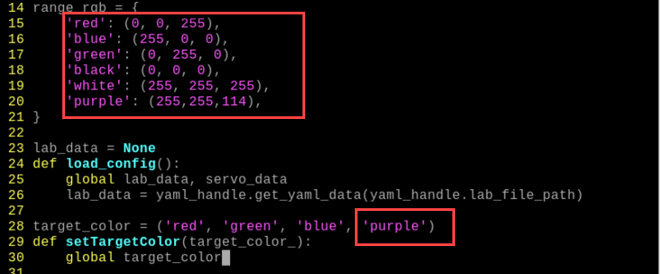
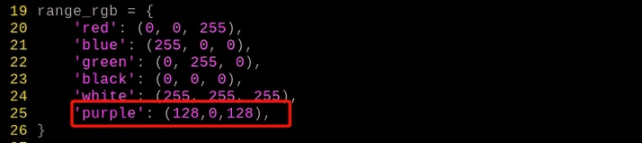
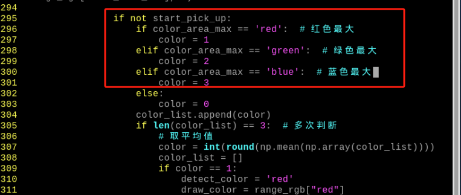

# AI视觉项目课程

## 1. 单个颜色识别

本节通过摄像头来识别颜色,识别到红色小球时，蜂鸣器发出滴滴报警声，并在回传画面中圈出，打印 "Color：red"。

### 1.1 实现原理

颜色识别的实现分为颜色识别和识别后的执行反馈两部分。

首先颜色识别部分，先进行高斯滤波（对图像中进行减噪），通过Lab颜色空间来对物品的颜色进行转换(关于Lab颜色空间的这个部分可以前往教程资料中 "**第7章 OpenCV基础课程**"进行详细学习)。

接着通过颜色阈值对圆圈中的物体颜色进行识别，再对图像部分进行掩膜（掩膜是用选定的图像、图形或物体，对处理的图像进行全局或者局部遮挡）。

然后经过对物品图片开闭运算处理后，最后将轮廓最大的物体用圆圈圈出。

开运算：先对图像腐蚀后膨胀。作用：用来消除小的物体，平滑形状边界，并且不改变其面积。可以去除小颗粒噪声，断开物体之间的粘连。

闭运算：先对图像膨胀后腐蚀。作用：用来填充物体内的小空洞，连接邻近的物体，连接断开的轮廓线，平滑其边界的同时不改变面积。

在识别后对蜂鸣器进行设置，使小车根据不同颜色来做出对应的反馈。比如识别红色，蜂鸣器响一声。

关于详细对应的反馈效果，可参考本文档[1.3 实现效果](#anchor_1_3)效果。

<p id="anchor_1_2"></p>

### 1.2 玩法开启及关闭步骤

:::{Note}
指令输入需严格区分大小写及空格，关键字可以使用"Tab"键进行补齐。
:::

1)  将设备开机，并参照课程资料的"**第1章 学前先看\第4课 远程桌面工具安装与连接**"内容，通过VNC远程连接工具连接。


2)  点击系统桌面左上角的图标，或按下快捷键"**Ctrl+Alt+T**"打开LX终端。

3)  输入指令，按下回车，则可定位到存放玩法程序的目录。

```commandline
cd ArmPi_mini/functions
```

4)  输入指令，然后按下回车键，玩法启动。

```commandline
python3 color_recognition.py
```

5)  如需关闭此玩法，只需要在LX终端界面中按下"Ctrl+c"。若关闭失败，可多次按下。

<p id="anchor_1_3"></p>

### 1.3 实现效果

玩法开启后，通过摄像头来识别颜色,识别到红色小球时，蜂鸣器发出滴滴报警声，并在回传画面中圈出，打印 "Color：red"

:::{Note}
1)  识别过程中，请尽量保证在光线充足环境下进行识别，避免因光线问题导致识别不准确。
2)  识别过程中，摄像头视觉范围之内的背景中，不要出现与要识别颜色相近或相同的物体，避免误识别。
:::

### 1.4 功能延伸

- #### 1.4.1 更换默认识别颜色

颜色识别程序内置了三种颜色：红色、绿色以及蓝色，其中默认识别到红色，蜂鸣器发出滴滴响声，并在回传画面中圈出，打印 "Color：red"。

**这里我们将识别颜色更换为绿色为例，具体修改步骤如下所示：**

1)  输入指令切换到源码路径下的指令，按下回车。

```commandline
cd ArmPi_mini/functions/
```

2)  然后再输入指令打开程序文件的指令，按下回车。

```commandline
sudo vim color_recognition.py
```

3)  按下键盘上的"**i**"键，进入到编辑模式。


4)  找到下图红框代码。


5)  将颜色参数修改为下图所示。


6)  保存修改的内容。按下"**Esc**"键，然后依次输入"**:wq**"（注意wq前为冒号：），回车即可保存并退出。


7)  输入开启颜色识别玩法的指令，按下回车。

```commandline
python3 color_recognition.py
```


<p id="anchor_1_4_2"></p>

- #### 1.4.2 增加新的识别颜色

除了内置三种识别的颜色，我们还可以设置其它可识别的颜色，**比如我们以紫色作为新增的识别颜色为例**，**具体的修改步骤如下：**

1.  双击系统桌面上位机图标，然后弹出的提示框内直接选择"**执行**"即可。


2.  在弹出的界面中依次选择"**摄像头工具**"、"**连接**"。


3.  点击"**新增**"，然后为新增颜色命名（这里以"**purple**"为例），再点击"**OK**"。


4.  然后点击颜色选框的下拉按钮，选择"**purple**"。


5.  将摄像头对准紫色物体，拖动L、A、B应的滑杆，直到左侧画面里要识别的颜色区域变为白色，其他区域变成黑色。


6.  最后，再点击"**保存**"，保存一下调节好的颜色阈值。


7.  修改完成后，我们可以检查一下修改的值是否成功被写入进去，输入进入到程序代码的目录。

```commandline
cd ArmPi_mini/yaml/
```

8.  输入打开程序文件的指令，按下回车。

```commandline
sudo vim lab_config.yaml
```

9.  打开颜色阈值程序文件后，即可查看紫色阈值参数。


10. 再按照"**4.1 更换默认识别颜色**"1—2步骤，打开程序文件并按下"i"键进入编辑模式。

11. 接着找到如下图所示代码。


12. 手动输入添加"**’purple’: (255, 255, 114),**"和"**’purple’**"，如下图所示：

(255, 255, 114)为第9步查看的紫色阈值参数的max。



13. 接着找到如下图所示代码。


14. 手动输入添加框中内容，如下图所示：


15. 保存修改的内容。按下"**Esc**"键，然后依次输入"**:wq**"（注意wq前为冒号：），回车即可保存并退出。


16. 参照"**[1.2 玩法开启及关闭步骤](#anchor_1_2)**"再次启动该玩法，将紫色物品放置到摄像头前，可在回传画面中看到将紫色圈出。用户也可参照"**4.1 更换默认识别颜色**"将默认识别颜色改为紫色。

17. 如果需要添加其他颜色作为可识别颜色，可参考前面步骤进行操作。

### 1.5 程序分析

该程序的源代码位于：**/home/pi/ArmPi_mini/functions/Color_recognition.py**

根据实现的效果，梳理程序的过程逻辑，如下图所示：


- #### 1.5.1 导入功能库


导入opencv、时间、数学、线程相关的库。我们如果想要调用功能库里的函数，就可以使用"功能库名+函数名（参数，参数...）"如：

就是调用"**time**"库中的"**sleep**"函数，sleep()的作用是延时。

在python中有一些已经内置的库，我们直接导入调用就可以，比如"**time**"、"**cv2**"、"**math**"等。我们也可以自己写一个库，比如上面的"**yaml_handle**"文件读取库。
 

- #### 1.5.2 主函数分析

python程序中"**\_\_name\_\_ == ’\_\_main\_\_:’**"就是程序的主函数。首先调用函数init()进行初始化配置。本程序中初始化包括读取颜色阈值文件。一般还有端口、外设、定时中断等配置，这些都要在初始化内容中完成。


**读取摄像头图像**


当玩法启动时，获取视频流并存储在"cap"中。

**进入图像处理**

读取到图像时，调用run()函数进行图像处理。


1)  函数img.copy()的作用是将"**img**"的内容复制给"**frame**"。

2)  函数run()进行图像处理。


- 对图片大小进行缩放，方便处理。


第一个参数"**img_copy**"是输入图像。

第二个参数"**size**"是输出图像的大小。大小可以自己设定。

第三个参数"**interpolation=cv2.INTER_NEAREST**"是插值方式。INTER_NEAREST：最邻近插值。INTER_LINEAR：双线性插值，如果最后一个参数你不指定，将默认使用这种方法。INTER_CUBIC：4x4像素邻域内的双立方插值。INTER_LANCZOS4：8x8像素邻域内的Lanczos插值。

- 高斯滤波

图像中总是会混入噪声，影响图像的质量，让特征不明显。根据不同的噪声种类选择对应的滤波方法，常见的有：高斯滤波、中值滤波、均值滤波等。

高斯滤波是一种线性平滑滤波，适用于消除高斯噪声，广泛应用于图像处理的减噪过程。


第一个参数"**frame_resize**"是输入图像。

第二个参数"**(3, 3)**"是高斯内核大小。

第三个参数"**3**"是X方向上的高斯核标准偏差。

- 将图像转换到LAB空间，其中函数cv2.cvtColor()是颜色空间转换函数。


第一个参数"**frame_gb**"是输入图像。

第二个参数"**cv2.COLOR_BGR2LAB**"是转换格式。"**cv2.COLOR_BGR2LAB**"是将BGR格式转换到LAB格式。如果要转换到RGB就可以使用"**cv2.COLOR_BGR2RGB**"。

- 将图像转换成二值图像，只有0和1，图像变得简单并且数据量减小，更容易处理。

采用cv2库中的inRange()函数对图像进行二值化处理。


第一个参数"**frame_lab**"是输入图像；

第二个参数"**(lab_data\[i\]\['min'\]\[0\],lab_data\[i\]\['min'\]\[1\],lab_data\[i\]\['min'\]\[2\])**"是颜色阈值下限；

第三个参数"**(lab_data\[i\]\['max'\]\[0\],lab_data\[i\]\['max'\]\[1\],lab_data\[i\]\['max'\]\[2\])**"是颜色阈值上限；

- 为了降低干扰，令图像更平滑，需要对图像进行开运算和闭运算，开运算是先腐蚀再膨胀，闭运算是先膨胀再腐蚀。函数cv2.morphologyEx()是形态学函数。


第一个参数"**frame_mask**"是输入图像。

第二个参数"**cv2.MORPH_OPEN**"是形态操作的类型。cv2.MORPH_ERODE（腐蚀）,cv2.MORPH_DILATE（膨胀）,cv2.MORPH_OPEN（开运算)，cv2.MORPH_CLOSE（闭运算）

第三个参数"**np.ones((3, 3)**"是卷积核。

第四个参数"**np.uint8**"是应用次数。

- 获取最大面积轮廓

完成上述的图像处理后，需要获取识别目标的轮廓，此处涉及cv2库中的findContours()函数。


第一个参数"**closed**"是输入图像；

第二个参数"**cv2.RETR_EXTERNAL**"是轮廓的检索模式；

第三个参数"**cv2.CHAIN_APPROX_NONE)\[-2\]**"是轮廓的近似方法。

在获得的轮廓中寻找面积最大的轮廓，而为了避免干扰，需要设定一个最小值，仅当面积大于该值时，目标轮廓才有效。


- 通过判断语句得到图像中面积最大的颜色。


**显示回传画面**


函数cv2.resize()的作用是把处理好的图像缩放到合适的大小。

函数cv2.imshow()的作用是在窗口显示图像，"**’frame’**"是窗口名称、"**frame_resize**"是显示内容。后面一定要有cv2.waitKey()，否则无法显示。

函数cv2.waitKey()的作用是等待按键输入，参数"**1**"是延迟时间。

## 2. 颜色识别

### 2.1 实验原理

本节课可以通过摄像头进行颜色识别控制机械臂点头和摇头。实现分为颜色识别和识别后的执行反馈两部分。

首先颜色识别部分，先进行高斯滤波（对图像中进行减噪），通过Lab颜色空间来对物品的颜色进行转换(关于Lab颜色空间的这个部分可以前往"**[OpenCV视觉基础课程](https://docs.hiwonder.com/projects/General_basic_courses/en/latest/docs/4_ros_basics_course.html)**"进行详细学习)。

接着通过颜色阈值对圆圈中的物体颜色进行识别，再对图像部分进行掩膜（掩膜是用选定的图像、图形或物体，对处理的图像进行全局或者局部遮挡）。

然后经过对物品图片开闭运算处理后，最后将轮廓最大的物体用圆圈圈出。

开运算：先对图像腐蚀后膨胀。作用：用来消除小的物体，平滑形状边界，并且不改变其面积。可以去除小颗粒噪声，断开物体之间的粘连。

闭运算：先对图像膨胀后腐蚀。作用：用来填充物体内的小空洞，连接邻近的物体，连接断开的轮廓线，平滑其边界的同时不改变面积。

然后在识别后对舵机、蜂鸣器和RGB彩灯进行设置，使机械臂根据不同颜色来做出对应的反馈。比如识别红色，将机械臂设置为"点头"，蜂鸣器响一声，RGB彩灯亮红色。

关于详细对应的反馈效果，可参考本文档[2.3 功能实现](#anchor_2_3)。

<p id="anchor_2_2"></p>

### 2.2 玩法开启及关闭步骤

:::{Note}
指令输入需严格区分大小写及空格。
:::

1)  将设备开机，并参照课程资料的"**第1章 学前先看\第4课 远程桌面工具安装与连接**"内容，通过VNC远程连接工具连接。


2)  输入玩法程序目录所在的指令，并按下回车。

```commandline
cd ArmPi_mini/functions
```

3)  输入玩法执行指令，并按下回车,玩法启动。

```commandline
python3 color_detect.py
```

4)  如需关闭此玩法，只需要在LX终端界面中按下"**Ctrl+C**"。若关闭失败，可多次按下。

<p id="anchor_2_3"></p>

### 2.3 功能实现

玩法开启后，在识别后，机械臂根据不同颜色做出对应的反馈，效果如下表所示：

| **物体颜色** | **蜂鸣器** | **RGB灯** | **执行动作** | **打印内容** |
|--------------|------------|-----------|--------------|--------------|
| 红色         | 响一声     | 红色      | **"点头"**   | red          |
| 绿色         | 响一声     | 绿色      | **"摇头"**   | green        |
| 蓝色         | 响一声     | 蓝色      | **"摇头"**   | blue         |

### 2.4 功能延伸

<span id="anchor_2_4_1" class="anchor"></span>

- ### 2.4.1 更换默认识别颜色

颜色识别程序内置了三种颜色：红色、绿色以及蓝色，其中默认识别到红色，机械臂便执行点头动作。

**这里我们将识别颜色更换为绿色为例，具体修改步骤如下所示：**

1)  输入指令，按下回车，切换至源码程序路径下。

```commandline
cd ArmPi_mini/functions/
```

2)  然后再输入指令，按下回车，即可打开程序文件。

```commandline
sudo vim color_detect.py
```

3)  找到下图所示代码：


:::{Note}
在键盘输入代码位置序号后，按下"Shift+G"键，可直接跳转到对应位置。（图示代码位置序号仅供参考，请以实际为准。）
:::

4)  按下键盘上的"**i**"键，进入到编辑模式。


5)  将"**detect_color == 'red'**"中的"red"换成"**green**"，如下图所示：


6)  接下来，保存我们修改的内容。按下"**Esc**"键，然后依次输入指令（注意wq前为冒号：），回车即可保存并退出。

```commandline
:wq
```


7)  再次输入指令，按下回车，即可开启颜色识别的玩法。

```commandline
python3 color_detect.py
```


- ### 2.4.2 增加新的识别颜色

除了内置三种识别的颜色，我们还可以设置其它可识别的颜色，**比如我们以紫色作为新增的识别颜色为例，具体的修改步骤如下：**

1)  双击系统桌面图标，在弹出的界面中点击"**Execute**"。


2)  在弹出的界面中依次选择"**摄像头工具**"、"**连接**"。


3)  点击"**新增**"，然后为新增颜色命名（这里以"**purple**"为例），再点击"**OK**"。


4)  然后点击颜色选框的下拉按钮，选择"**purple**"。


5)  将摄像头对准紫色物体，拖动L、A、B应的滑杆，直到左侧画面里要识别的颜色区域变为白色，其他区域变成黑色。


6)  最后，再点击"**保存**"，保存一下调节好的颜色阈值。


7)  修改完成后，我们可以检查一下修改的值是否成功被写入进去，输入指令，按下回车，进入到程序代码所在目录。

```commandline
cd ArmPi_mini/yaml/
```

8)  再输入指令，按下回车，打开程序文件。

```commandline
sudo vim lab_config.yaml
```

9)  打开颜色阈值程序文件后，即可查看紫色阈值参数。


10) 再按照"[2.4 功能延伸\ 更换默认识别颜色](#anchor_2_4_1)"1—2步骤，打开程序文件并按下"i"键进入编辑模式。

11) 接着找到如下图所示代码。


12) 手动输入添加"**'purple': (128, 0, 128)**"和"**'purple'"（ (128, 0, 128)** 为紫色的RGB值，此处需要调换RGB的顺序为BGR；因此，紫色的数值还是（128, 0,128），颜色的RGB值可以前往-\>[RGB颜色查询器](http://tools.jb51.net/static/colorpicker/)查询）。

如下图所示：




13) 接着找到如下图所示代码。


14) 手动输入添加框中内容，设置扩展板上的灯，亮紫色。（颜色的RGB值可以前往-\>[RGB颜色查询器](http://tools.jb51.net/static/colorpicker/)查询）如下图所示：


15) 接着找到如下图所示代码。


16) 手动输入添加框中内容，紫色面积最大时，令color=4。如下图所示：


17) 接着找到如下图所示代码。


18) 手动输入添加框中内容，如下图所示：


19) 保存我们修改的内容。按下"Esc"键，然后依次输入指令（注意wq前为冒号：），回车即可保存并退出。


```commandline
:wq
```


20) 参照本文档"[22 玩法开启及关闭步骤](#anchor_2_2)"再次启动该玩法，将紫色物品放置到摄像头前，可看到机械臂将执行"摇头"动作。如果需要执行"**点头**"动作，参照"[2.4 功能延伸\ 更换默认识别颜色](#anchor_2_4_1))"将默认识别颜色改为紫色即可。

21) 如果需要添加其他颜色作为可识别颜色，可参考前面步骤进行操作。

### 2.5 代码分析

该程序的源代码位于：**/home/pi/ArmPi_mini/functions/color_detect.py**

根据实现的效果，梳理程序的过程逻辑，如下图所示：


- #### 2.5.1 导入功能库


导入opencv、时间、数学、线程、逆运动学相关的库。我们如果想要调用功能库里的函数，就可以使用"**功能库名+函数名（参数，参数...）**"如：

就是调用"**time**"库中的"**sleep**"函数，sleep()的作用是延时。

在python中有一些已经内置的库，我们直接导入调用就可以，比如"**time**"、"**cv2**"、"**math**"等。我们也可以自己写一个库，比如上面的"**common.yaml_handle**"文件读取库、"**kinematics.arm_move_ik**"逆运动学库等。

- #### 2.5.2 实例化函数库

我们有些函数库的名称太长，并且不容易记忆，为了方便调用函数，我们经常会对函数库进行实例化，如：


进行实例化后，在使用ArmIK库中的函数，就可以像这样"**AK.函数名(参数,参数...)**"直接调用了，非常方便。

- #### 2.5.3 主函数分析

python程序中"**\_\_name\_\_ == ’\_\_main\_\_:’**"就是程序的主函数。首先调用函数init()进行初始化配置。本程序中初始化包括：机械臂回到初始位置、读取颜色阈值文件。一般还有端口、外设、定时中断等配置，这些都要在初始化内容中完成。


1. **读取摄像头图像**


打开摄像头图像并保存到"**cap**"。

函数cap.read()是读取摄像头图像，True：读取到图像"**ret**"的值，False：未读取到图像"**ret**"的值。

"**img**"是读取摄像头一帧的画面。

2. **进入图像处理**

读取到图像时，"**ret**"的值为True。


函数img.copy()的作用是将"**img**"的内容复制给"**frame**"。

函数run()进行图像处理。详细内容请看[图像处理分析](#anchor_2_5_4)。

3. **窗口显示图像**


函数cv2.resize()的作用是把处理好的图像缩放的合适大小。

函数cv2.imshow()的作用是在窗口显示图像，"**’frame’**"是窗口名称、"**frame_resize**"是显示内容。后面一定要有cv2.waitKey()，否则无法显示。

函数cv2.waitKey()的作用是等待按键输入，参数"1"是延迟时间。

<span id="anchor_2_5_4"></span>

- #### 2.5.4 图像处理分析


1. **图像缩放处理**

对图片大小缩放，方便处理。


第一个参数"**img_copy**"是输入图像。

第二个参数"**size**"是输出图像的大小。大小可以自己设定。

第三个参数"**interpolation=cv2.INTER_NEAREST**"是插值方式。INTER_NEAREST：最邻近插值。INTER_LINEAR：双线性插值，如果最后一个参数你不指定，将默认使用这种方法。INTER_CUBIC：4x4像素邻域内的双立方插值。INTER_LANCZOS4：8x8像素邻域内的Lanczos插值。

2. **高斯滤波**

图像中总是会混入噪声，影响图像的质量，让特征不明显。根据不同的噪声种类选择对应的滤波方法，常见的有：高斯滤波、中值滤波、均值滤波等。

高斯滤波是一种线性平滑滤波，适用于消除高斯噪声，广泛应用于图像处理的减噪过程。


第一个参数"**frame_resize**"是输入图像。

第二个参数"**(3, 3)**"是高斯内核大小。

第三个参数"**3**"是X方向上的高斯核标准偏差。

3. **转换颜色空间**

将图像转换到LAB空间，其中函数cv2.cvtColor()是颜色空间转换函数。


第一个参数"**frame_gb**"是输入图像。

第二个参数"**cv2.COLOR_BGR2LAB**"是转换格式。"**cv2.COLOR_BGR2LAB**"是将BGR格式转换到LAB格式。如果要转换到RGB就可以使用"**cv2.COLOR_BGR2RGB**"。

4. **二值化处理**

将图像转换成二值图像，只有0和1，图像变得简单并且数据量减小，更容易处理。

采用cv2库中的inRange()函数对图像进行二值化处理。


第一个参数"**frame_lab**"是输入图像；

第二个参数"**(lab_data\[i\]\['min'\]\[0\],lab_data\[i\]\['min'\]\[1\],lab_data\[i\]\['min'\]\[2\])**"是颜色阈值下限；

第三个参数"**(lab_data\[i\]\['max'\]\[0\],lab_data\[i\]\['max'\]\[1\],lab_data\[i\]\['max'\]\[2\])**"是颜色阈值上限；

5. **开运算和闭运算**

为了降低干扰，令图像更平滑，需要对图像进行开运算和闭运算，开运算是先腐蚀再膨胀，闭运算是先膨胀再腐蚀。函数cv2.morphologyEx()是形态学函数。


第一个参数"**frame_mask**"是输入图像。

第二个参数"**cv2.MORPH_OPEN**"是形态操作的类型。cv2.MORPH_ERODE（腐蚀）,cv2.MORPH_DILATE（膨胀）,cv2.MORPH_OPEN（开运算)，cv2.MORPH_CLOSE（闭运算）

第三个参数"**np.ones((3, 3)**"是卷积核。

第四个参数"**np.uint8**"是应用次数。

6. **获取最大面积轮廓**

完成上述的图像处理后，需要获取识别目标的轮廓，此处涉及cv2库中的findContours()函数。


第一个参数"**closed**"是输入图像；

第二个参数"**cv2.RETR_EXTERNAL**"是轮廓的检索模式；

第三个参数"**cv2.CHAIN_APPROX_NONE)\[-2\]**"是轮廓的近似方法。

在获得的轮廓中寻找面积最大的轮廓，而为了避免干扰，需要设定一个最小值，仅当面积大于该值时，目标轮廓才有效。


7. **获取位置信息**

采用cv2库中的cv2.minEnclosingCircle函数获取目标轮廓的最小外接圆，并得到最小外接圆的圆心坐标和半径。


8. **判断最大颜色**

通过判断语句得到图像中面积最大的颜色。


- #### 2.5.5 机械臂执行反馈

机械臂移动函数move()作为子线程运行，当识别到颜色后，就会执行move()函数。

主要是对图像处理结果进行判断，再执行不同的反馈，包括了RGB灯、蜂鸣器、单个舵机的控制、多个舵机的控制。


1. **点亮RGB灯**

根据识别的颜色，RGB灯颜色与识别的颜色一致。


2. **驱动蜂鸣器**


board.set_buzzer(1900, 0.1, 0.9, 1)：调用了一个函数 set_buzzer()，将蜂鸣器设置为响铃持续 0.1 秒。用于控制蜂鸣器的音响效果和持续时间。

3. **机械臂执行移动**

判断识别的颜色与设定颜色是否一致，执行点头或者摇头的动作。


使用 board.pwm_servo_set_position函数进行舵机控制，括号内的参数含义如下：

第一个参数："**0.4**"为动作持续时间，单位是秒。

第二个参数"**\[\[6,1300\]\]**"为舵机ID6和"1300"为脉冲宽度，取值范围为"500~2500"。

函数AK.setPitchRangeMoving()是逆运动学控制机械臂移动，以代码"**AK.setPitchRangeMoving((0, 6, 18), 0,-90, 90, 500)**"为例：

第一个参数"**(0, 6, 18)**"是机械臂末端坐标。0是X轴坐标,6是Y轴坐标，18是Z轴坐标。

第二个参数"**0**"是俯仰角。

第三个参数"**-90**"是俯仰角范围最小值。

第四个参数"**90**"是俯仰角范围最大值。

第五个参数"**500**"是运行时间，单位毫秒。

## 3. 颜色位置检测

### 3.1 实验原理

本节课可以通过摄像头定位色块的位置，然后在终端打印出来。实现过程分为颜色识别和定位目标坐标两部分。

首先颜色识别部分，先进行高斯滤波（对图像中进行减噪），通过Lab颜色空间来对物品的颜色进行转换(关于Lab颜色空间的这个部分可以前往"**[OpenCV视觉基础课程]()**"进行详细学习)。

接着通过颜色阈值对圆圈中的物体颜色进行识别，再对图像部分进行掩膜（掩膜是用选定的图像、图形或物体，对处理的图像进行全局或者局部遮挡）。

然后经过对物品图片开闭运算处理后，最后将轮廓最大的物体用圆圈圈出。

开运算：先对图像腐蚀后膨胀。作用：用来消除小的物体，平滑形状边界，并且不改变其面积。可以去除小颗粒噪声，断开物体之间的粘连。

闭运算：先对图像膨胀后腐蚀。作用：用来填充物体内的小空洞，连接邻近的物体，连接断开的轮廓线，平滑其边界的同时不改变面积。

定位目标坐标部分，根据圈中物体的最小外接圆，得到它的圆心坐标，即为目标颜色的位置。

### 3.2 玩法开启及关闭步骤

:::{Note}
指令的输入需严格区分大小写，另外可按键盘"**Tab**"键进行关键词补齐。
:::

1)  将设备开机，并参照课程资料的"**第1章 学前先看\第4课 远程桌面工具安装与连接**"内容，通过VNC远程连接工具连接。


2)  输入玩法程序目录所在的指令，按下回车。

```commandline
cd ArmPi_mini/functions
```

3)  输入玩法执行指令，并按下回车,玩法启动。

```commandline
python3 position_detection.py
```

4)  如需关闭此玩法，只需要在LX终端界面中按下"**Ctrl+C**"。若关闭失败，可多次按下。

### 3.3 功能实现

回传画面中圈出红色物品，并在终端打印物中心坐标的X、Y的值。


### 3.4 修改检测颜色

**默认追踪颜色为红色，本节以修改为蓝色为例进行说明：**

1)  输入指令，按下回车，切换至源码程序路径下。

```commandline
cd ArmPi_mini/functions/
```

2)  然后输入指令，按下回车，打开程序文件。

```commandline
sudo vim position_detection.py
```


3)  找到下图所示代码：


:::{Note}
在键盘输入代码位置序号后，按下"Shift+G"键，可直接跳转到对应位置。（图示代码位置序号仅供参考，请以实际为准。）
:::

4)  按一下键盘的"**i**"键，当出现"**Insert**"字样即表示进入编辑模式。


5)  将"**\_\_target_color = ('red',)**"中的"**red**"都修改为"**blue**"，如下图所示：


:::{Note}
这里修改的颜色必须是机械臂内已经有的颜色。
:::

6)  修改完成后，按下键盘上的"**Esc**"键，然后依次输入指令（注意wq前为冒号：），回车，即可保存并退出。

```commandline
:wq
```


7)  再次输入指令，按下回车，即可开启颜色识别的玩法。

```commandline
python3 position_detection.py
```


### 3.5 代码分析

该程序的源代码位于：**/home/pi/ArmPi_mini/functions/position_detection.py**

根据实现效果，梳理该玩法的实现逻辑如下图所示：


- #### 3.5.1 导入功能库


导入opencv、时间、数学、线程、逆运动学相关的库。我们如果想要调用功能库里的函数，就可以使用"**功能库名+函数名（参数，参数...）**"如：

就是调用"**time**"库中的"**sleep**"函数，sleep()的作用是延时。

在python中有一些已经内置的库，我们直接导入调用就可以，比如"**time**"、"**cv2**"、"**math**"等。我们也可以自己写一个库，比如上面的"**common.yaml_handle**"文件读取库、"**kinematics.arm_move_ik**"逆运动学库等。

- #### 3.5.2 实例化函数库

我们有些函数库的名称太长，并且不容易记忆，为了方便调用函数，我们经常会对函数库进行实例化，如：


进行实例化后，在使用ArmIK库中的函数，就可以像这样"**AK.函数名(参数,参数...)**"直接调用了，非常方便。

- #### 3.5.3 主函数分析

python程序中"**\_\_name\_\_ == ’\_\_main\_\_:’**"就是程序的主函数。首先调用函数init()进行初始化配置。本程序中初始化包括：机械臂回到初始位置、读取颜色阈值文件。一般还有端口、外设、定时中断等配置，这些都要在初始化内容中完成。


1. **读取摄像头图像**


打开摄像头图像并保存到"**cap**"。

函数cap.read()是读取摄像头图像，True：读取到图像"**ret**"的值，False：未读取到图像"**ret**"的值。

"**img**"是读取摄像头一帧的画面。

2. **进入图像处理**

读取到图像时，"**ret**"的值为True。


函数img.copy()的作用是将"**img**"的内容复制给"**frame**"。

函数run()进行图像处理。详细内容请看[3.5 代码分析\ 图像处理](#anchor_5_4)。

3. **窗口显示图像**


函数cv2.resize()的作用是把处理好的图像缩放的合适大小。

函数cv2.imshow()的作用是在窗口显示图像，"**’frame’**"是窗口名称、"**frame_resize**"是显示内容。后面一定要有cv2.waitKey()，否则无法显示。

函数cv2.waitKey()的作用是等待按键输入，参数"1"是延迟时间。

<p id="anchor_5_4"></p>

- #### 3.5.4 图像处理


1. **图像缩放处理**

对图片大小缩放，方便处理。


第一个参数"**img_copy**"是输入图像。

第二个参数"**size**"是输出图像的大小。

2. **高斯滤波**

图像中总是会混入噪声，影响图像的质量，让特征不明显。根据不同的噪声种类选择对应的滤波方法，常见的有：高斯滤波、中值滤波、均值滤波等。

高斯滤波是一种线性平滑滤波，适用于消除高斯噪声，广泛应用于图像处理的减噪过程。


第一个参数"**frame_resize**"是输入图像。

第二个参数"**(3, 3)**"是高斯内核大小。

第三个参数"**3**"是X方向上的高斯核标准偏差。

3. **转换颜色空间**

将图像转换到LAB空间，其中函数cv2.cvtColor()是颜色空间转换函数。


第一个参数"**frame_gb**"是输入图像。

第二个参数"**cv2.COLOR_BGR2LAB**"是转换格式。"**cv2.COLOR_BGR2LAB**"是将BGR格式转换到LAB格式。如果要转换到RGB就可以使用"**cv2.COLOR_BGR2RGB**"。

4. **二值化处理**

将图像转换成二值图像，只有0和1，图像变得简单并且数据量减小，更容易处理。

采用cv2库中的inRange()函数对图像进行二值化处理。


第一个参数"**frame_lab**"是输入图像；

第二个参数"**(lab_data\[i\]\['min'\]\[0\],lab_data\[i\]\['min'\]\[1\],lab_data\[i\]\['min'\]\[2\])**"是颜色阈值下限；

第三个参数"**(lab_data\[i\]\['max'\]\[0\],lab_data\[i\]\['max'\]\[1\],lab_data\[i\]\['max'\]\[2\])**"是颜色阈值上限；

5. **开运算和闭运算**

为了降低干扰，令图像更平滑，需要对图像进行开运算和闭运算，开运算是先腐蚀再膨胀，闭运算是先膨胀再腐蚀。函数cv2.morphologyEx()是形态学函数。


第一个参数"**frame_mask**"是输入图像。

第二个参数"**cv2.MORPH_OPEN**"是形态操作的类型。cv2.MORPH_ERODE（腐蚀）,cv2.MORPH_DILATE（膨胀）,cv2.MORPH_OPEN（开运算)，cv2.MORPH_CLOSE（闭运算）

第三个参数"**np.ones((3, 3)**"是卷积核。

第四个参数"**np.uint8**"是应用次数。

6. **获取最大面积轮廓**

完成上述的图像处理后，需要获取识别目标的轮廓，此处涉及cv2库中的findContours()函数。


第一个参数"**closed**"是输入图像；

第二个参数"**cv2.RETR_EXTERNAL**"是轮廓的检索模式；

第三个参数"**cv2.CHAIN_APPROX_NONE)\[-2\]**"是轮廓的近似方法。

在获得的轮廓中寻找面积最大的轮廓，而为了避免干扰，需要设定一个最小值，仅当面积大于该值时，目标轮廓才有效。


7. **获取位置信息**

采用cv2库中的cv2.minEnclosingCircle()函数获取目标轮廓的最小外接圆，并得到最小外接圆的圆心坐标和半径。

前面将图像下进行了缩放，这里使用Misc.map()把中心坐标和半径映射到实际大小。


最后在终端和画面显示中心坐标。

## 4. 目标追踪

### 4.1 实验原理

本节课可以通过摄像头进行颜色识别并读取目标位置，控制机械臂跟随目标移动而移动。实现可分为颜色识别和追踪两部分。

首先颜色识别部分，先进行高斯滤波（对图像中进行减噪），通过Lab颜色空间来对物品的颜色进行转换(关于Lab颜色空间的这个部分可以前往"**第7章 OpenCV视觉基础课程**"进行详细学习)。

接着通过颜色阈值对圆圈中的物体颜色进行识别，再对图像部分进行掩膜（掩膜是用选定的图像、图形或物体，对处理的图像进行全局或者局部遮挡）。

然后经过对物品图片开闭运算处理后，最后将轮廓最大的物体用圆圈圈出。

开运算：先对图像腐蚀后膨胀。作用：用来消除小的物体，平滑形状边界，并且不改变其面积。可以去除小颗粒噪声，断开物体之间的粘连。

闭运算：先对图像膨胀后腐蚀。作用：用来填充物体内的小空洞，连接邻近的物体，连接断开的轮廓线，平滑其边界的同时不改变面积。

追踪部分使用PID算法，根据目标的画面像素坐标与画面中心坐标进行比较，减小两个坐标之间的距离，从而实现目标追踪。

PID算法是应用最为广泛的一种自动控制器。在过程控制中，按误差的比例（P）、积分（I）和微分（D）进行控制。它具有原理简单，易于实现，适用面广，控制参数相互独立，参数的选定比较简单等优点。

<p id="anchor_4_2"></p>

### 4.2 玩法开启及关闭步骤

:::{Note}
指令的输入需严格区分大小写，另外可按键盘"**Tab**"键进行关键词补齐。
:::

1)  将设备开机，并参照课程资料的"**第1章 学前先看\第4课 远程桌面工具安装与连接**"内容，通过VNC远程连接工具连接。


2)  输入玩法程序目录所在的指令，按下回车。

```commandline
cd ArmPi_mini/functions
```

3)  输入玩法执行指令，并按下回车,玩法启动。

```commandline
python3 color_tracking.py
```

4)  如需关闭此玩法，只需要在LX终端界面中按下"**Ctrl+C**"。若关闭失败，可多次按下。

### 4.3 功能实现

程序默认的追踪颜色为红色，玩法开启后，机械臂将跟随红色木块的移动而转动。

### 4.4 功能延伸

- #### 4.4.1 调节颜色阈值

在玩法体验的过程中，如识别物体颜色效果不佳，则需调节颜色阈值。本节以调节红色为例，其他颜色设置方法皆可参考，操作步骤如下：

1)  双击系统桌面图标，在弹出的界面中点击"**Execute**"。


2)  进入界面后，点击"**摄像头工具**"。


3)  再点击"**连接**"按钮，连接成功后，在界面右下角的颜色选项栏中选择"**red**"。


4)  若在弹出的界面中未出现回传画面，说明摄像头未连接成功，需检查一下摄像头连接线是否连接好。

下图界面右侧是实时回传画面，左侧是需要被采集的颜色。将摄像头对准红色色块，然后拖动下方的六个滑杆，使得左侧画面中红色色块的区域全部变为白色，其它区域为黑色。接着点击"**保存**"按钮保存数据。


<span id="anchor_4_4_2" class="anchor"></span>

- #### 4.4.2 修改追踪颜色

**默认追踪颜色为红色，本节以修改为蓝色为例进行说明：**

1)  如需修改追踪的颜色，输入指令，按下回车，切换至源码程序路径下。

:::{Note}
cd MasterPi/functions/
:::

2)  然后输入指令，按下回车，打开程序文件。

:::{Note}
sudo vim color_tracking.py
:::


3)  找到下图所示代码：


:::{Note}
在键盘输入代码位置序号后，按下"Shift+G"键，可直接跳转到对应位置。（图示代码位置序号仅供参考，请以实际为准。）
:::

4)  按一下键盘的"**i**"键，当出现"**Insert**"字样即表示进入编辑模式。


5)  将"**\_\_target_color = ('red',)**"中的"**red**"都修改为"**blue**"，如下图所示：


:::{Note}
这里修改的颜色必须是下图颜色选项栏里出现的颜色，如想修改成其他颜色，可参照本文档"[4.4 功能延伸\ 增加新的识别颜色](#anchor_4_4_3)"步骤添加新的识别颜色。
:::

6)  修改完成后，按下键盘上的"**Esc**"键，然后依次输入指令（注意wq前为冒号：），回车，即可保存并退出。

    **:wq**


<span id="anchor_4_4_3" class="anchor"></span>

- #### 4.4.3 增加新的识别颜色

除了内置三种识别的颜色，我们还可以设置其它可识别的颜色，**比如我们以紫色作为新增的识别颜色为例，具体的修改步骤如下：**

1)  双击系统桌面上位机图标，然后弹出的提示框内直接选择"**Execute**"即可。

<figure>

<figcaption aria-hidden="true"><p></p></figcaption>
</figure>

2)  在弹出的界面中依次选择"**摄像头工具**"、"**连接**"。


3)  点击"**新增**"，然后为新增颜色命名（这里以"purple"为例），再点击"**OK**"。


4)  然后点击颜色选框的下拉按钮，选择"**purple**"。


5)  将摄像头对准紫色物体，拖动L、A、B应的滑杆，直到左侧画面里要识别的颜色区域变为白色，其他区域变成黑色。


6)  最后，再点击"**保存**"，保存一下调节好的颜色阈值。


7)  修改完成后，我们可以检查一下修改的值是否成功被写入进去，输入指令，按下回车，进入到程序代码所在目录。

```commandline
cd ArmPi_mini/yaml/
```

8)  再输入指令，按下回车，打开程序文件。

```commandline
sudo vim lab_config.yaml
```

9)  打开颜色阈值程序文件后，即可查看紫色阈值参数。


10) 再按照本文档"[4.4 功能延伸\ 修改追踪颜色](#anchor_4_4_2)"1—2步骤，打开程序文件并按下"**i**"键进入编辑模式。

11) 接着找到如下图所示代码。


12) 手动输入添加"**'purple’: (255, 255, 114)**"，将"**’red’**"改为"**’purple’**"，如下图所示：


(255, 255, 114)为第9步查看的紫色阈值参数的max

13) 接着找到如下图所示代码。


14) 手动输入添加框中内容，（颜色的RGB值可以前往-\>[RGB颜色查询器](http://tools.jb51.net/static/colorpicker/)查询）如下图所示：


15) 接着找到如下图所示代码。


16) 将"**’red’**"修改为"**'purple'**"，如下图所示：


17) 保存我们修改的内容。按下"**Esc**"键，然后依次输入指令（注意wq前为冒号：），回车即可保存并退出。

    **:wq**


18) 参照本文档"[4.2 玩法开启及关闭步骤](#anchor_4_2)"再次启动该玩法，将紫色物品放置到摄像头前，可看到机械臂追踪目标移动。如果需要添加其他颜色作为可识别颜色，可参考前面步骤进行操作。

### 4.5 代码分析

该程序的源代码位于：**/home/pi/ArmPi_Mini/functions/color_tracking.py**

根据实现效果，梳理该玩法的实现逻辑如下图所示：


通过摄像头获取图像信息，再进行图像处理，即对图像进行二值化处理。同时为了降低干扰，令图像更平滑，对图像进行腐蚀和膨胀处理。

接着获取目标最大面积轮廓和最小外接圆，得到色块追踪区域，接着根据PID算法让机械臂转向色块位置。

- #### 4.5.1 导入功能库


导入opencv、时间、数学、线程、逆运动学相关的库。我们如果想要调用功能库里的函数，就可以使用"**功能库名+函数名（参数，参数...）**"如：


就是调用"**time**"库中的"**sleep**"函数，sleep()的作用是延时。

在python中有一些已经内置的库，我们直接导入调用就可以，比如"**time**"、"**cv2**"、"**math**"等。我们也可以自己写一个库，比如上面的"**common.yaml_handle**"文件读取库、"**kinematics.arm_move_ik**"逆运动学库等。

- #### 4.5.2 实例化函数库

我们有些函数库的名称太长，并且不容易记忆，为了方便调用函数，我们经常会对函数库进行实例化，如：


进行实例化后，在使用ArmIK库中的函数，就可以像这样"**AK.函数名(参数,参数...)**"直接调用了，非常方便。

- #### 4.5.2 主函数

python程序中"**\_\_name\_\_ == ’\_\_main\_\_:’**"就是程序的主函数。首先调用函数init()进行初始化配置。本程序中初始化包括：机械臂回到初始位置、读取颜色阈值文件。一般还有端口、外设、定时中断等配置，这些都要在初始化内容中完成。


1. **读取摄像头图像**


打开摄像头图像并保存到"**cap**"。

函数cap.read()是读取摄像头图像，True：读取到图像"**ret**"的值，False：未读取到图像"**ret**"的值。

"**img**"是读取摄像头一帧的画面。

2. **进入图像处理**

读取到图像时，"**ret**"的值为True。


函数img.copy()的作用是将"**img**"的内容复制给"**frame**"。

函数run()进行图像处理。详细内容请看[4.5 代码分析\ 图像处理分析](#anchor_4_5_4)。

3. **窗口显示图像**


函数cv2.resize()的作用是把处理好的图像缩放的合适大小。

函数cv2.imshow()的作用是在窗口显示图像，"**’frame’**"是窗口名称、"**frame_resize**"是显示内容。后面一定要有cv2.waitKey()，否则无法显示。

函数cv2.waitKey()的作用是等待按键输入，参数"1"是延迟时间。

主函数首先调用函数init()进行初始化配置。然后开始读取摄像头画面，进行图像处理。

<span id="anchor_4_5_4" class="anchor"></span>

- #### 4.5.4 图像处理分析


1. **图像缩放处理**

对图片大小缩放，方便处理。


第一个参数"**img_copy**"是输入图像。

第二个参数"**size**"是输出图像的大小。大小可以自己设定。

第三个参数"**interpolation=cv2.INTER_NEAREST**"是插值方式。INTER_NEAREST：最邻近插值。INTER_LINEAR：双线性插值，如果最后一个参数你不指定，将默认使用这种方法。INTER_CUBIC：4x4像素邻域内的双立方插值。INTER_LANCZOS4：8x8像素邻域内的Lanczos插值。

2. **高斯滤波**

图像中总是会混入噪声，影响图像的质量，让特征不明显。根据不同的噪声种类选择对应的滤波方法，常见的有：高斯滤波、中值滤波、均值滤波等。

高斯滤波是一种线性平滑滤波，适用于消除高斯噪声，广泛应用于图像处理的减噪过程。


第一个参数"**frame_resize**"是输入图像。

第二个参数"**(3, 3)**"是高斯内核大小。

第三个参数"**3**"是X方向上的高斯核标准偏差。

3. **转换颜色空间**

将图像转换到LAB空间，其中函数cv2.cvtColor()是颜色空间转换函数。


第一个参数"**frame_gb**"是输入图像。

第二个参数"**cv2.COLOR_BGR2LAB**"是转换格式。"**cv2.COLOR_BGR2LAB**"是将BGR格式转换到LAB格式。如果要转换到RGB就可以使用"**cv2.COLOR_BGR2RGB**"。

4. **二值化处理**

将图像转换成二值图像，只有0和1，图像变得简单并且数据量减小，更容易处理。

采用cv2库中的inRange()函数对图像进行二值化处理。

 第一个参数"**frame_lab**"是输入图像；

第二个参数"**(lab_data\[i\]\['min'\]\[0\],lab_data\[i\]\['min'\]\[1\],lab_data\[i\]\['min'\]\[2\])**"是颜色阈值下限；

第三个参数"**(lab_data\[i\]\['max'\]\[0\],lab_data\[i\]\['max'\]\[1\],lab_data\[i\]\['max'\]\[2\])**"是颜色阈值上限；

5. **开运算和闭运算**

为了降低干扰，令图像更平滑，需要对图像进行开运算和闭运算，开运算是先腐蚀再膨胀，闭运算是先膨胀再腐蚀。函数cv2.morphologyEx()是形态学函数


第一个参数"**frame_mask**"是输入图像。

第二个参数"**cv2.MORPH_OPEN**"是形态操作的类型。cv2.MORPH_ERODE（腐蚀）,cv2.MORPH_DILATE（膨胀）,cv2.MORPH_OPEN（开运算)，cv2.MORPH_CLOSE（闭运算）

第三个参数"**np.ones((3, 3)**"是卷积核。

第四个参数"**np.uint8**"是应用次数。

6. **获取最大面积轮廓**

完成上述的图像处理后，需要获取识别目标的轮廓，此处涉及cv2库中的findContours()函数。


第一个参数"**closed**"是输入图像；

第二个参数"**cv2.RETR_EXTERNAL**"是轮廓的检索模式；

第三个参数"**cv2.CHAIN_APPROX_NONE)\[-2\]**"是轮廓的近似方法。

在获得的轮廓中寻找面积最大的轮廓，而为了避免干扰，需要设定一个最小值，仅当面积大于该值时，目标轮廓才有效。


7. **获取位置信息**

采用cv2库中的cv2.minEnclosingCircle函数获取目标轮廓的最小外接圆，并得到最小外接圆的圆心坐标和半径。


- #### 4.5.5 机械臂追踪

机械臂追踪使用PID算法，让摄像头中心靠近目标中心坐标。

PID算法是应用最为广泛的一种自动控制器。在过程控制中，按误差的比例（P）、积分（I）和微分（D）进行控制。


利用逆运动学求解，如果有解就控制机械臂追踪。


函数AK.setPitchRange()是逆运动学求解，以代码"**AK.setPitchRange((0, round(y_dis, 2), round(z_dis, 2)), -90, 90)**"为例：

第一个参数"**(0, round(y_dis, 2), round(z_dis, 2))**"是目标中心坐标。0是X轴坐标,round(y_dis, 2)是Y轴坐标，round(z_dis, 2)是Z轴坐标。

第二个参数"**-90**"是俯仰角范围最小值。

第三个参数"**90**"是俯仰角范围最大值。

函数board.pwm_servo_set_position是逆运动学控制机械臂移动，以代码"**board.pwm_servo_set_position(0.02, \[\[3, servo_data\['servo3'\]\],\[4, servo_data\['servo4'\]\],\[5, servo_data\['servo5'\]\],\[6, int(x_dis)\]\])**"为例：

第一个参数"**0.02**"是运行时间。

第三个参数"**3**"是舵机id。后面的"**4**"、"**5**"、"**6**"都是舵机ID。

第四个参数"**servo_data\['servo3'\]**"是舵机脉冲。后面的"**servo_data\['servo4'\]**"、"**servo_data\['servo5'\]**"、"**servo_data\['servo6'\]**"都是舵机脉冲。

## 5. 颜色分拣

:::{Note}
学习本节玩法之前请确保机械臂按照"第1章 学前先看\第5课 偏差调试、第6课 位置校准"课程进行偏差调节、位置校准与地图铺设，否则会影响玩法的实现效果。
:::

### 5.1 实验原理

本节课可以通过摄像头进行颜色识别区分不同颜色，然后控制机械臂对色块分拣。实现分为颜色识别和分拣两部分。

首先颜色识别部分，先进行高斯滤波（对图像中进行减噪），通过Lab颜色空间来对物品的颜色进行转换(关于Lab颜色空间的这个部分可以前往"8.拓展课程\6.拓展课程之OpenCV基础课程\第3课 颜色空间学习"课程进行详细学习)。

接着通过颜色阈值对圆圈中的物体颜色进行识别，再对图像部分进行掩膜（掩膜是用选定的图像、图形或物体，对处理的图像进行全局或者局部遮挡）。

然后经过对物品图片开闭运算处理后，最后将轮廓最大的物体用圆圈圈出。

开运算：先对图像腐蚀后膨胀。作用：用来消除小的物体，平滑形状边界，并且不改变其面积。可以去除小颗粒噪声，断开物体之间的粘连。

闭运算：先对图像膨胀后腐蚀。作用：用来填充物体内的小空洞，连接邻近的物体，连接断开的轮廓线，平滑其边界的同时不改变面积。

分拣部分，首先机械臂通过逆运动学AK.setPitchRangeMoving()函数来计算目标位置处的舵机角度，再控制机械爪闭合夹取目标，最后根据颜色识别结果夹住目标色块，并依次搬运到左侧对应的位置。

关于逆运动学的这个部分可以前往"**第6章 机械臂逆运动学基础课程\第1课 什么是逆运动学**"课程进行详细学习。

### 5.2 玩法开启及关闭步骤

:::{Note}
指令的输入需严格区分大小写及空格。
:::

1)  将设备开机，并参照课程资料的"**第1章 学前先看\第4课 远程桌面工具安装与连接**"内容，通过VNC远程连接工具连接。


2)  输入玩法程序目录所在的指令，并按下回车。

```commandline
cd ArmPi_mini/functions
```

3)  输入玩法执行指令，并按下回车,玩法启动。

```commandline
python3 color_sorting.py
```

4)  如需关闭此玩法，只需要在LX终端界面中按下"**Ctrl+C**"。若关闭失败，可多次按下。

### 5.3 功能实现

将红绿蓝方块分别放置到平整光滑的环境下，当机械臂识别到后会发出"滴"的一声，再手持被识别色块放置到机械臂爪子前方，机械臂将会夹住色块，并依次搬运到左侧对应位置。

### 5.4 更换默认放置位置

颜色分拣程序默认的效果是：将识别到的红、绿、蓝三种颜色方块夹取，放置到其左侧对应位置。如需调整色块放置的位置，须先了解机械臂的坐标系。

机械臂坐标系如下所示（以机械臂为第一视角）：


色块放置的位置与坐标参数的对应变化关系见下表：

| **坐标参数变化** | **色块位置变化**                |
|------------------|---------------------------------|
| x增大            | 色块位置往X轴方向移动（向右）   |
| x减小            | 色块位置往X轴反方向移动（向左） |
| y增大            | 色块位置往Y轴方向移动（向前）   |
| y减小            | 色块位置往Y轴反方向移动（向后） |
| z增大            | 色块位置往Z轴方向移动（向上）   |
| z减小            | 色块位置往Z轴反方向移动（向下） |

:::{Note}
参数z数值必须大于0。
:::

**我们这里将红色色块的放置位置修改为机械臂前方为例进行示范，其它色块的位置修改方法同理。具体修改步骤如下所示：**

1)  输入指令，按下回车，切换至源码程序路径下。

```commandline
cd ArmPi_mini/functions/
```

2)  然后再输入指令，按下回车，即可打开程序文件。

```commandline
sudo vim color_sorting.py
```

3)  找到下图所示代码：


:::{Note}
在键盘输入代码位置序号后，按下"**Shift+G**"键，可直接跳转到对应位置。（图示代码位置序号仅供参考，请以实际为准。）
:::

4)  按下键盘上的"i"键，当界面左下角出现"插入"字样时，表示已经进入到编辑模式。


5)  在"**'red': (-11,16,2)**"中，"**-11**"是X轴参数，"**16**"是Y轴参数，"**2**"是Z轴参数。我们将"**-12**"改为"**0**"，保持Y轴和Z轴参数不变，让色块放置到前方。修改如下图所示：


6)  然后，再找到下列代码，并将其注释（在代码前面添加"#"）。


7)  接下来，保存我们修改的内容。按下"Esc"键，然后依次输入指令（注意wq前为冒号：），回车即可保存并退出。

```commandline
:wq
```


8)  再次输入指令，按下回车，即可开启颜色分拣的玩法。

```commandline
python3 color_sorting.py
```


### 5.5 代码分析

该程序的源代码位于：/home/pi/ArmPi_mini/functions/color_sorting.py

根据实现效果，梳理该玩法的实现逻辑如下图所示：


通过摄像头获取图像信息，再进行图像处理，即对图像进行二值化处理，为了降低干扰，令图像更平滑，对图像进行腐蚀和膨胀处理，然后获取目标最大面积轮廓，判断色块颜色之后打开蜂鸣器和RGB灯，并将面前的色块夹取并放置到相应位置上。

- #### 5.5.1 导入功能库


导入opencv、时间、数学、线程、逆运动学相关的库。我们如果想要调用功能库里的函数，就可以使用"**功能库名+函数名（参数，参数...）**"如：


就是调用"**time**"库中的"**sleep**"函数，sleep()的作用是延时。

在python中有一些已经内置的库，我们直接导入调用就可以，比如"**time**"、"**cv2**"、"**math**"等。我们也可以自己写一个库，比如上面的"**common.yaml_handle**"文件读取库、"**kinematics.arm_move_ik**"逆运动学库等。

- #### 5.5.2 实例化函数库

我们有些函数库的名称太长，并且不容易记忆，为了方便调用函数，我们经常会对函数库进行实例化，如：


进行实例化后，在使用ArmIK库中的函数，就可以像这样"**AK.函数名(参数,参数...)**"直接调用了，非常方便。

- #### 5.5.3 主函数

python程序中"**\_\_name\_\_ == ’\_\_main\_\_:’**"就是程序的主函数。首先调用函数init()进行初始化配置。本程序中初始化包括：机械臂回到初始位置、读取颜色阈值文件。一般还有端口、外设、定时中断等配置。这些都要在初始化内容中完成。


1. **读取摄像头图像**


打开摄像头图像并保存到"**cap**"。

函数cap.read()是读取摄像头图像，True：读取到图像"**ret**"的值，False：未读取到图像"**ret**"的值。

"**img**"是读取摄像头一帧的画面。

2. **进入图像处理**

读取到图像时，"**ret**"的值为True。


函数img.copy()的作用是将"**img**"的内容复制给"**frame**"。

函数run()进行图像处理。详细内容请看[5.5 代码分析\ 图像处理分析](#anchor_5_5_4)。

3. **窗口显示图像**


函数cv2.resize()的作用是把处理好的图像缩放的合适大小。

函数cv2.imshow()的作用是在窗口显示图像，"**’frame’**"是窗口名称、"**frame_resize**"是显示内容。后面一定要有cv2.waitKey()，否则无法显示。

函数cv2.waitKey()的作用是等待按键输入，参数"1"是延迟时间。

<p id="anchor_5_5_4"></p>

- #### 5.5.4 图像处理分析


1. **图像缩放处理**

对图片大小缩放，方便处理。


第一个参数"**img_copy**"是输入图像。

第二个参数"**size**"是输出图像的大小。大小可以自己设定。

第三个参数"**interpolation=cv2.INTER_NEAREST**"是插值方式。INTER_NEAREST：最邻近插值。INTER_LINEAR：双线性插值，如果最后一个参数你不指定，将默认使用这种方法。INTER_CUBIC：4x4像素邻域内的双立方插值。INTER_LANCZOS4：8x8像素邻域内的Lanczos插值。

2. **高斯滤波**

图像中总是会混入噪声，影响图像的质量，让特征不明显。根据不同的噪声种类选择对应的滤波方法，常见的有：高斯滤波、中值滤波、均值滤波等。

高斯滤波是一种线性平滑滤波，适用于消除高斯噪声，广泛应用于图像处理的减噪过程。


第一个参数"**frame_resize**"是输入图像。

第二个参数"**(3, 3)**"是高斯内核大小。

第三个参数"**3**"是X方向上的高斯核标准偏差。

3. **转换颜色空间**

将图像转换到LAB空间，其中函数cv2.cvtColor()是颜色空间转换函数。


第一个参数"**frame_gb**"是输入图像。

第二个参数"**cv2.COLOR_BGR2LAB**"是转换格式。"**cv2.COLOR_BGR2LAB**"是将BGR格式转换到LAB格式。如果要转换到RGB就可以使用"cv2.COLOR_BGR2RGB"。

4. **二值化处理**

将图像转换成二值图像，只有0和1，图像变得简单并且数据量减小，更容易处理。

采用cv2库中的inRange()函数对图像进行二值化处理。


第一个参数"**frame_lab**"是输入图像；

第二个参数"**(lab_data\[i\]\['min'\]\[0\],lab_data\[i\]\['min'\]\[1\],lab_data\[i\]\['min'\]\[2\])**"是颜色阈值下限；

第三个参数"**(lab_data\[i\]\['max'\]\[0\],lab_data\[i\]\['max'\]\[1\],lab_data\[i\]\['max'\]\[2\])**"是颜色阈值上限；

5. **开运算和闭运算**

为了降低干扰，令图像更平滑，需要对图像进行开运算和闭运算，开运算是先腐蚀再膨胀，闭运算是先膨胀再腐蚀。函数cv2.morphologyEx()是形态学函数。


第一个参数"**frame_mask**"是输入图像。

第二个参数"**cv2.MORPH_OPEN**"是形态操作的类型。cv2.MORPH_ERODE（腐蚀）,cv2.MORPH_DILATE（膨胀）,cv2.MORPH_OPEN（开运算)，cv2.MORPH_CLOSE（闭运算）

第三个参数"**np.ones((3, 3)**"是卷积核。

第四个参数"**np.uint8**"是应用次数。

6. **获取最大面积轮廓**

完成上述的图像处理后，需要获取识别目标的轮廓，此处涉及cv2库中的findContours()函数。


第一个参数"**closed**"是输入图像；

第二个参数"**cv2.RETR_EXTERNAL**"是轮廓的检索模式；

第三个参数"**cv2.CHAIN_APPROX_NONE)\[-2\]**"是轮廓的近似方法。

在获得的轮廓中寻找面积最大的轮廓，而为了避免干扰，需要设定一个最小值，仅当面积大于该值时，目标轮廓才有效。


7. **获取位置信息**

采用cv2库中的cv2.minEnclosingCircle函数获取目标轮廓的最小外接圆，并得到最小外接圆的圆心坐标和半径。

8. **判断最大颜色**

通过判断语句得到图像中面积最大的颜色。


- #### 5.5.5 机械臂执行反馈

机械臂移动函数move()作为子线程运行，当识别到颜色后，就会执行move()函数。

主要是对图像处理结果进行判断，再执行不同的反馈，包括了RGB灯、蜂鸣器、单个舵机的控制、多个舵机的控制。

1. **点亮RGB灯**

根据识别的颜色，RGB灯颜色与识别的颜色一致。


2. **驱动蜂鸣器**


board.set_buzzer(1900, 0.1, 0.9, 1)：调用了一个函数 set_buzzer()，将蜂鸣器设置为响铃持续 0.1 秒。用于控制蜂鸣器的音响效果和持续时间。

3. **机械臂执行移动**

判断识别颜色，将色块夹到对应的位置。


使用 board.pwm_servo_set_position函数进行舵机控制，括号内的参数含义如下：

第一个参数："**0.4**"为动作持续时间，单位是秒。

第二个参数"**\[\[1,1500\]\]**"为舵机ID1和"1500"为脉冲宽度，取值范围为"500~2500"。

函数AK.setPitchRangeMoving()是逆运动学控制机械臂移动，以代码"**AK.setPitchRangeMoving((0, 6, 18), 0,-90, 90, 500)**"为例：

第一个参数"**(0, 6, 18)**"是机械臂末端坐标。0是X轴坐标,6是Y轴坐标，18是Z轴坐标。

第二个参数"**0**"是俯仰角。

第三个参数"**-90**"是俯仰角范围最小值。

第四个参数"**90**"是俯仰角范围最大值。

第五个参数"**500**"是运行时间，单位毫秒。

## 6. 智能码垛

:::{Note}
学习本节玩法之前请确保机械臂按照"第1章 学前先看\第5课 偏差调试、第6课 位置校准"课程进行偏差调节、地图摆放、位置校准，否则会影响玩法的实现效果。
:::

### 6.1 实验原理

本节课通过摄像头进行颜色识别，然后控制机械臂将色块夹取再叠放到指定的区域，完成码垛。整个过程包括三个部分：**识别、夹取、码垛**。

首先颜色识别部分，先进行高斯滤波（对图像中进行减噪），通过Lab颜色空间来对物品的颜色进行转换(关于Lab颜色空间的这个部分可以前往"**第7章 OpenCV视觉基础课程**"课程进行详细学习)。

接着通过颜色阈值对方框中的物体颜色进行识别，再对图像部分进行掩膜（掩膜是用选定的图像、图形或物体，对处理的图像进行全局或者局部遮挡）。

然后经过对物品图片开闭运算处理后，最后将轮廓最大的物体用方框框出。

开运算：先对图像腐蚀后膨胀。作用：用来消除小的物体，平滑形状边界，并且不改变其面积。可以去除小颗粒噪声，断开物体之间的粘连。

闭运算：先对图像膨胀后腐蚀。作用：用来填充物体内的小空洞，连接邻近的物体，连接断开的轮廓线，平滑其边界的同时不改变面积。

接下来会对放置色块的移动状态进行判断。若检测到色块已停止移动一段时间后，则机械臂便开始进入夹取流程。

最后将色块放置到码垛区域，机械臂在放置时，都会在前一个色块放置位置的高度上进行叠加。当全部色块码垛完毕之后，机械臂便回到初始位置。

夹取和码垛都是通过逆运动学AK.setPitchRangeMoving()函数来计算目标位置处的舵机角度，再控制机械臂到目标位置。

关于逆运动学的这个部分可以前往"**[机械臂逆运动学基础课程\1. 什么是逆运动学]()**"课程进行详细学习。

<p id="anchor_6_2"></p>

### 6.2 玩法开启及关闭步骤

指令的输入需严格区分大小写及空格。

1)  将设备开机，并参照课程资料的"**[学前先看\4. 远程桌面工具安装与连接]()**"内容，通过VNC远程连接工具连接。


2)  输入玩法程序目录所在的指令，按下回车。

```commandline
cd ArmPi_mini/functions
```

3)  输入玩法执行指令，并按下回车,玩法启动。

```commandline
python3 color_palletizing.py
```

4)  如需关闭此玩法，只需要在LX终端界面中按下"**Ctrl+C**"。若关闭失败，可多次按下。

### 6.3 功能实现

玩法开启，机械臂识别到颜色方块，蜂鸣器滴一声后，将颜色方块夹起，然后叠放在码垛区。

### 6.4 增加新的识别颜色

除了内置三种识别的颜色，我们还可以设置其它可识别的颜色，比如我们以紫色作为新增的识别颜色为例，具体的修改步骤如下：

1)  双击系统桌面图标，在弹出的界面中点击"**Execute**"。


2)  在弹出的界面中依次选择"**摄像头工具**"、"**连接**"。


3)  点击"**新增**"，然后为新增颜色命名（这里以"**purple**"为例），再点击"**OK**"。


4)  然后点击颜色选框的下拉按钮，选择"**purple**"。


5)  将摄像头对准紫色物体，拖动L、A、B应的滑杆，直到左侧画面里要识别的颜色区域变为白色，其他区域变成黑色。


6)  最后，再点击"**保存**"，保存一下调节好的颜色阈值。


7)  修改完成后，我们可以检查一下修改的值是否成功被写入进去，输入指令，按下回车，进入到程序代码所在目录。

```commandline
cd ArmPi_mini/yaml/
```


8)  再输入指令，按下回车，打开程序文件。

```commandline
sudo vim lab_config.yaml
```


9)  打开颜色阈值程序文件后，即可查看紫色阈值参数。


10) 输入指令，按下回车，切换至源码程序路径下。

```commandline
cd ArmPi_mini/functions/
```


11) 然后输入指令，按下回车，打开程序文件。

```commandline
sudo vim color_palletizing.py
```


12) 接着找到如下图所示代码。


13) 按下键盘的"**i**"键，进入可编辑模式。


14) 手动输入添加"'purple': (255, 255, 114)"和"'purple'"，如下图所示：


(255, 255, 114)为第9步查看的紫色阈值参数的max。

15) 接着找到如下图所示代码。


16) 手动输入添加框中内容，（颜色的RGB值可以前往-\>[RGB颜色查询器](http://tools.jb51.net/static/colorpicker/)查询）如下图所示：


17) 接着找到如下图所示代码。



18) 手动输入添加框中内容，如下图所示：


19) 接着找到如下图所示代码。


20) 手动输入添加框中内容，如下图所示：


21) 接着找到如下图所示代码。


22) 手动输入添加框中内容，如下图所示：


23) 保存我们修改的内容。按下"Esc"键，然后依次输入指令（注意wq前为冒号：），回车即可保存并退出。

```commandline
:wq
```


24) 参照本文档"[6.2 玩法开启及关闭步骤](#anchor_6_2)"再次启动该玩法，将紫色物品放置到摄像头前，可看到机械臂会夹取紫色物品。

25) 如果需要添加其他颜色作为可识别颜色，可参考前面步骤进行操作。

### 6.5 代码分析

该程序的源代码位于：/home/pi/ArmPi_mini/functions/color_palletizing.py

根据实现效果，梳理该玩法的实现逻辑如下图所示：


- #### 6.5.1 导入功能库


导入opencv、时间、数学、线程、逆运动学相关的库。我们如果想要调用功能库里的函数，就可以使用"**功能库名+函数名（参数，参数...）**"如：


就是调用"**time**"库中的"**sleep**"函数，sleep()的作用是延时。

在python中有一些已经内置的库，我们直接导入调用就可以，比如"**time**"、"**cv2**"、"**math**"等。我们也可以自己写一个库，比如上面的"**common.yaml_handle**"文件读取库、"**kinematics.arm_move_ik**"逆运动学库等。

- #### 6.5.2 实例化函数库

我们有些函数库的名称太长，并且不容易记忆，为了方便调用函数，我们经常会对函数库进行实例化，如：


进行实例化后，在使用ArmIK库中的函数，就可以像这样"**AK.函数名(参数,参数...)**"直接调用了，非常方便。

- #### 6.5.3 主函数

python程序中"**\_\_name\_\_ == ’\_\_main\_\_:’**"就是程序的主函数。首先调用函数init()进行初始化配置。本程序中初始化包括：机械臂回到初始位置、读取颜色阈值文件。一般还有端口、外设、定时中断等配置，这些都要在初始化内容中完成。


1. **读取摄像头图像**


打开摄像头图像并保存到"**cap**"。

函数cap.read()是读取摄像头图像，True：读取到图像"**ret**"的值，False：未读取到图像"**ret**"的值。

"**img**"是读取摄像头一帧的画面。

2. **进入图像处理**

读取到图像时，"**ret**"的值为True。


函数img.copy()的作用是将"**img**"的内容复制给"**frame**"。

函数run()进行图像处理。详细内容请看[5.4 图像处理分析](#_5.4 图像处理分析)。

3. **窗口显示图像**


<span id="_5.4 图像处理分析" class="anchor"></span>函数cv2.resize()的作用是把处理好的图像缩放的合适大小。

函数cv2.imshow()的作用是在窗口显示图像，"**’frame’**"是窗口名称、"**frame_resize**"是显示内容。后面一定要有cv2.waitKey()，否则无法显示。

函数cv2.waitKey()的作用是等待按键输入，参数"1"是延迟时间。

- #### 6.5.4 图像处理分析


1. **图像缩放处理**

对图片大小缩放，方便处理。


第一个参数"**img_copy**"是输入图像。

第二个参数"**size**"是输出图像的大小。大小可以自己设定。

第三个参数"**interpolation=cv2.INTER_NEAREST**"是插值方式。INTER_NEAREST：最邻近插值。INTER_LINEAR：双线性插值，如果最后一个参数你不指定，将默认使用这种方法。INTER_CUBIC：4x4像素邻域内的双立方插值。INTER_LANCZOS4：8x8像素邻域内的Lanczos插值。

2. **高斯滤波**

图像中总是会混入噪声，影响图像的质量，让特征不明显。根据不同的噪声种类选择对应的滤波方法，常见的有：高斯滤波、中值滤波、均值滤波等。

高斯滤波是一种线性平滑滤波，适用于消除高斯噪声，广泛应用于图像处理的减噪过程。


第一个参数"**frame_resize**"是输入图像。

第二个参数"**(3, 3)**"是高斯内核大小。

第三个参数"**3**"是X方向上的高斯核标准偏差。

3. **转换颜色空间**

将图像转换到LAB空间，其中函数cv2.cvtColor()是颜色空间转换函数。


第一个参数"**frame_gb**"是输入图像。

第二个参数"**cv2.COLOR_BGR2LAB**"是转换格式。"**cv2.COLOR_BGR2LAB**"是将BGR格式转换到LAB格式。如果要转换到RGB就可以使用"**cv2.COLOR_BGR2RGB**"。

4. **二值化处理**

将图像转换成二值图像，只有0和1，图像变得简单并且数据量减小，更容易处理。

采用cv2库中的inRange()函数对图像进行二值化处理。


第一个参数"**frame_lab**"是输入图像；

第二个参数"**(lab_data\[i\]\['min'\]\[0\],lab_data\[i\]\['min'\]\[1\],lab_data\[i\]\['min'\]\[2\])**"是颜色阈值下限；

第三个参数"**(lab_data\[i\]\['max'\]\[0\],lab_data\[i\]\['max'\]\[1\],lab_data\[i\]\['max'\]\[2\])**"是颜色阈值上限；

5. **开运算和闭运算**

为了降低干扰，令图像更平滑，需要对图像进行开运算和闭运算，开运算是先腐蚀再膨胀，闭运算是先膨胀再腐蚀。函数cv2.morphologyEx()是形态学函数


第一个参数"**frame_mask**"是输入图像。

第二个参数"**cv2.MORPH_OPEN**"是形态操作的类型。cv2.MORPH_ERODE（腐蚀）,cv2.MORPH_DILATE（膨胀）,cv2.MORPH_OPEN（开运算)，cv2.MORPH_CLOSE（闭运算）

第三个参数"**np.ones((3, 3)**"是卷积核。

第四个参数"**np.uint8**"是应用次数。

6. **获取最大面积轮廓**

完成上述的图像处理后，需要获取识别目标的轮廓，此处涉及cv2库中的findContours()函数。


第一个参数"**closed**"是输入图像；

第二个参数"**cv2.RETR_EXTERNAL**"是轮廓的检索模式；

第三个参数"**cv2.CHAIN_APPROX_NONE)\[-2\]**"是轮廓的近似方法。

在获得的轮廓中寻找面积最大的轮廓，而为了避免干扰，需要设定一个最小值，仅当面积大于该值时，目标轮廓才有效。


7. **获取位置信息**

采用cv2库中的cv2.minEnclosingCircle函数获取目标轮廓的最小外接圆，并得到最小外接圆的圆心坐标和半径。

8. **判断最大颜色**

通过判断语句得到图像中面积最大的颜色。


- #### 6.5.5 机械臂执行反馈

机械臂移动函数move()作为子线程运行，当识别到颜色后，就会执行move()函数。

主要是对图像处理结果进行判断，再执行不同的反馈，包括了RGB灯、蜂鸣器、单个舵机的控制、多个舵机的控制。

1. **点亮RGB灯**

根据识别的颜色，RGB灯颜色与识别的颜色一致。


2. **驱动蜂鸣器**


board.set_buzzer(1900, 0.1, 0.9, 1)：调用了一个函数 set_buzzer()，将蜂鸣器设置为响铃持续 0.1 秒。用于控制蜂鸣器的音响效果和持续时间。

3. **机械臂执行移动**

判断识别颜色，将色块夹到对应的位置码垛。


使用 board.pwm_servo_set_position函数进行舵机控制，括号内的参数含义如下：

第一个参数："**0.4**"为动作持续时间，单位是秒。

第二个参数"**\[\[6,1300\]\]**"为舵机ID6和"1300"为脉冲宽度，取值范围为"500~2500"。

函数AK.setPitchRangeMoving()是逆运动学控制机械臂移动，以代码"**AK.setPitchRangeMoving((0, 6, 18), 0,-90, 90, 500)**"为例：

第一个参数"**(0, 6, 18)**"是机械臂末端坐标。0是X轴坐标,6是Y轴坐标，18是Z轴坐标。

第二个参数"**0**"是俯仰角。

第三个参数"**-90**"是俯仰角范围最小值。

第四个参数"**90**"是俯仰角范围最大值。

第五个参数"**500**"是运行时间，单位毫秒。

## 7. 人脸检测

### 7.1 玩法简要说明

识别到人脸后，蜂鸣器发声滴滴报警，并在回传画面中圈出人脸。

人工智能中最为一个广泛的应用当属图像识别，而图像识别中的人脸识别是最火热的应用，常常应用于门锁和手机人脸解锁等场景。

本节我们训练好的人脸模型，首先进行缩放画面检测人脸。然后将识别到的人脸坐标转换为未缩放前的坐标，进而判断是否为最大的人脸，并将识别到的人脸框出，蜂鸣器发出滴滴声。

### 7.2 玩法开启及关闭

:::{Note}
指令的输入需严格区分大小写及空格。
:::

1)  将机器人开机，然后通过VNC远程连接树莓派桌面。关于VNC的安装及连接，可参考"**第1章** **学前先看\第4课** **远程桌面工具安装与连接**"。

2)  在树莓派的桌面单击左上角的图标，或按住快捷键Ctrl+Alt+T，打开LX终端。

3)  输入指令，按下回车键则可定位到存放了玩法程序的目录。

```commandline
cd ArmPi_mini/functions
```


4)  输入指令，然后按下回车键将玩法启动。

```commandline
python3 face_detect.py
```


5)  如需关闭此玩法，只需要在LX终端界面中按下"**Ctrl+C**"。如果关闭失败，可多次按下。

### 7.3 实现效果

:::{Note}
本玩法请尽量避免在强光照射下进行，如太阳光、近距离白炽灯照射等，强光会影响人脸识别的效果，因此建议本玩法在室内进行，并且人脸距离摄像头范围以50cm-1m内为佳。
:::

玩法开启后，摄像头云台将进行左右转动。当识别到人脸后，云台会停止转动，此时机器人将执行招手动作。

### 7.4 程序简要分析

该程序的源代码位于：**/home/pi/ArmPi_mini/functions/face_detect.py**


- #### 7.4.1 导入参数模块

| **导入模块** | **作用** |
|----|----|
| import sys | 导入了Python的sys模块，用于访问系统相关的功能和变量 |
| import cv2 | 导入了OpenCV库，用于图像处理和计算机视觉相关的功能 |
| import time | 导入了Python的time模块，用于时间相关的功能，例如延时操作 |
| import numpy as np | numpy模块，为数组运算提供大量的数学函数库 |
| import threading | 提供多线程运行的环境 |
| import mediapipe as mp | 集成的机器学习视觉算法的工具库(包含人脸检测、人脸关键点、手势识别、头像分割和姿态识别等各种模型) |
| Import yaml_handle | 包含一些与处理YAML格式文件相关的功能或工具 |
| from common.ros_robot_controller_sdk import Board | 导入了board库，可以控制传感器，用于执行控制的操作 |


- #### 7.4.2 功能逻辑

根据实现效果，梳理该玩法的实现逻辑如下图所示：


通过摄像头获取图像信息，再进行图像处理，即对图像进行颜色空间转化，方便进行人脸检测。

接着使用mediapipe的人脸模型库对图像进行人脸检测，获取人脸检测结果并调用动作组进行反馈。

- #### 7.4.3 程序逻辑及对应的代码分析

从程序文件梳理得到程序逻辑流程图如下图所示。


从上图得到，程序的逻辑流程主要为图像处理与人脸识别，以下的文档内容将依照上述程序逻辑流程图进行编写。

1. **初始化**

- **导入功能库**

  在初始化的这一步，首先就需要将功能库导入进来，方便后续程序的调用，关于导入进来的内容。可以前往4.1导入参数模块进行查看。


- **设定初始状态**

设置初始状态，这里就包括了舵机的初始位置、人脸识别模块、最小人脸置信度等。


2. **图像处理**

- **颜色空间转换**

将BGR图像转换为RGB图像


- **使用mediapipe人脸模型识别**

进行人脸检测，并在检测到的人脸位置绘制矩形框。然后，根据判断人脸中心的位置是否在画面中心，如果是则将start_greet设置为True,用来执行动作组。


3. **人脸识别**

如果识别到人脸，则驱动蜂鸣器发出响声。


## 8. 人脸识别

### 8.1 玩法简要说明

未识别到人脸时，机械臂左右转动扫描，识别到人脸，爪子上下转动打个招呼。

人工智能中最为一个广泛的应用当属图像识别，而图像识别中的人脸识别是最火热的应用，常常应用于门锁和手机人脸解锁等场景。

本节我们训练好的人脸模型，首先进行缩放画面检测人脸。然后将识别到的人脸坐标转换为未缩放前的坐标，进而判断是否为最大的人脸，并将识别到的人脸框出。

然后设定云台舵机进行左右转动来获取人脸，通过调用动作组让机器人来执行识别后的反馈。

### 8.2 玩法开启及关闭

:::{Note}
指令的输入需严格区分大小写及空格。
:::

1)  将机器人开机，然后通过VNC远程连接树莓派桌面。关于VNC的安装及连接，可参考"**[学前先看\4. 远程桌面工具安装与连接](https://docs.hiwonder.com/projects/ArmPi_mini/en/latest/docs/1_read_before_studying.html#id12)**"。

2)  在树莓派的桌面单击左上角的图标，或按住快捷键Ctrl+Alt+T，打开LX终端。

3)  输入指令，按下回车键则可定位到存放了玩法程序的目录。

```commandline
cd ArmPi_mini/functions/
```


4)  输入指令，然后按下回车键将玩法启动。

```commandline
python3 face_recognition.py
```


6)  如需关闭此玩法，只需要在LX终端界面中按下"**Ctrl+C**"。如果关闭失败，可多次按下。

### 8.3 实现效果

:::{Note}
本玩法请尽量避免在强光照射下进行，如太阳光、近距离白炽灯照射等，强光会影响人脸识别的效果，因此建议本玩法在室内进行，并且人脸距离摄像头范围以50cm-1m内为佳。
:::

玩法开启后，摄像头云台将进行左右转动。当识别到人脸后，云台会停止转动，此时机器人将执行招手动作。

### 8.4 程序简要分析

该程序的源代码位于：**/home/pi/ArmPi_mini/functions/face_recgonition.py**


- #### 8.4.1 导入参数模块

| **导入模块** | **作用** |
|----|----|
| import sys | 导入了Python的sys模块，用于访问系统相关的功能和变量 |
| import cv2 | 导入了OpenCV库，用于图像处理和计算机视觉相关的功能 |
| import time | 导入了Python的time模块，用于时间相关的功能，例如延时操作 |
| import numpy as np | numpy模块，为数组运算提供大量的数学函数库 |
| import threading | 提供多线程运行的环境 |
| import mediapipe as mp | 集成的机器学习视觉算法的工具库(包含人脸检测、人脸关键点、手势识别、头像分割和姿态识别等各种模型) |
| Import yaml_handle | 包含一些与处理YAML格式文件相关的功能或工具 |
| from common.ros_robot_controller_sdk import Board | 导入了board库，可以控制传感器，用于执行控制的操作 |

- #### 8.4.2 功能逻辑

根据实现效果，梳理该玩法的实现逻辑如下图所示：


通过摄像头获取图像信息，再进行图像处理，即对图像进行颜色空间转化，方便进行人脸检测。

接着使用mediapipe的人脸模型库对图像进行人脸检测，获取人脸检测结果并调用动作组进行反馈。

- #### 8.4.3 程序逻辑及对应的代码分析

从程序文件梳理得到程序逻辑流程图如下图所示。


从上图得到，程序的逻辑流程主要为图像处理与人脸识别，以下的文档内容将依照上述程序逻辑流程图进行编写。

1. **初始化**

- **导入功能库**

在初始化的这一步，首先就需要将功能库导入进来，方便后续程序的调用，关于导入进来的内容。可以前往4.1导入参数模块进行查看。


- **设定初始状态**

设置初始状态，这里就包括了舵机的初始位置、人脸识别模块、最小人脸置信度等。


2. **图像处理**

- **颜色空间转换**

将BGR图像转换为RGB图像


- **使用mediapipe人脸模型识别**

进行人脸检测，并在检测到的人脸位置绘制矩形框。然后，根据判断人脸中心的位置是否在画面中心，如果是则将start_greet设置为True,用来执行动作组。


3. **人脸识别**

如果识别到人脸，使用board.pwm_servo_set_position函数对伺服电机设置PWM（脉冲宽度调制）从而实现上下挥手动作组。


如果没有识别到人脸，控制云台舵机左右转动来寻找人脸。


