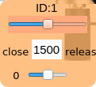
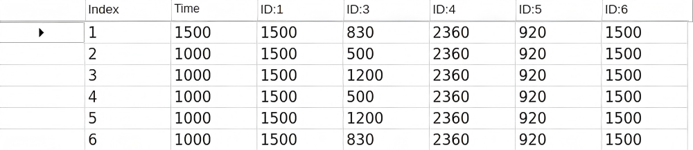
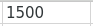
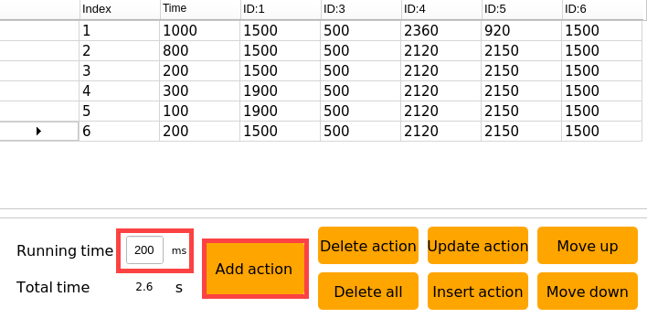
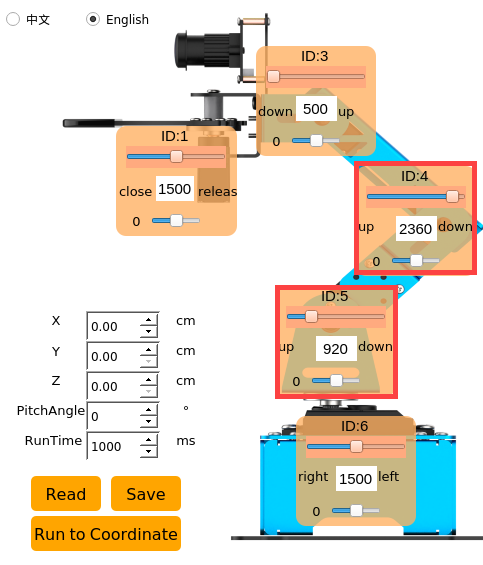
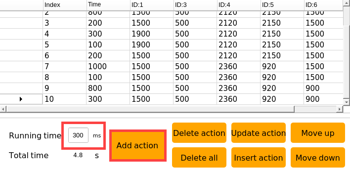
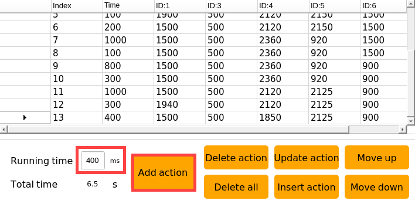

# 上位机动作编辑课程

## 1. 上位机界面介绍

上位机软件是系统自带的一款动作编辑软件，用户可以利用上位机来控制机械臂的舵机以完成动作编辑，还能用它来调节舵机偏差和颜色阈值。

这节课将介绍上位机软件的界面分布及功能使用。

### 1.1 启动上位机

**采用桌面图标启动（初学者推荐）**

1)  双击桌面上的ArmPi mini上位机的图标。

2)  双击系统桌面图标，在弹出的提示框中点击"Execute"，即可进入上位机界面。


**采用命令行形式启动**

1)  点击桌面左上角的图标，打开终端。

2)  输入指令，并按下回车，即可打开上位机。

```commandline
python3 ArmPi_mini/armpi_mini_software/ArmPi_mini.py
```

### 1.2 上位机界面分布

上位机有两个功能界面，分别是普通模式界面和摄像头工具界面。

#### 普通模式

普通模式主要用来控制舵机、调节偏差以及位置校准，界面如下图所示：


1.  **语言选项**

用于切换上位机界面的显示语言，可切换为中文或英文（将同步"**摄像头工具**"界面的显示语言）。

2.  **舵机操控区域**

此区域的舵机图标对应了机械臂上的5个舵机，调整对应滑杆数值即可调整舵机的转动位置，我们以1号舵机的图标进行说明。



|  |  |
|:--:|:--:|
| **图标** | **功能说明** |
|  | 舵机ID编号，这里为1号舵机。 |
|  | 舵机滑杆（大滑杆），用于调整舵机的角度位置，范围是500~2500，换算成角度为0°~180°，1500是中间值，也就是90°。 |
|  | 偏差滑杆（小滑杆），用于调整舵机的偏差，范围是-150~150，换算成角度为-13°~13°。 |

3.  **逆运动学操控区域**

逆运动学操控区域可用于校准机械爪的夹取位置。在机械臂使用的过程中，若发现夹取的位置不准确，可调节此区域的位置信息，使夹取位置变得更加准确。


<table class="docutils-nobg" border="1">
<colgroup>
<col style="width: 35%" />
<col style="width: 64%" />
</colgroup>
<tbody>
<tr>
<td style="text-align: center;"><strong>图标</strong></td>
<td style="text-align: center;"><strong>功能</strong></td>
</tr>
<tr>
<td style="text-align: center;"></td>
<td style="text-align: left;">（以机械臂为第一视角）用于控制机械爪在左右方向上移动。</td>
</tr>
<tr>
<td style="text-align: center;"></td>
<td style="text-align: left;">（以机械臂为第一视角）用于控制机械爪在前后方向上移动。</td>
</tr>
<tr>
<td style="text-align: center;"></td>
<td style="text-align: left;"><p>（以机械臂为第一视角）用于控制机械爪在上下方向上移动。</p>
<p>注意：程序已设定Z轴的值为1cm，此时机械爪刚好在木块的两侧的中间位置，因此不建议修改此处数值。</p></td>
</tr>
<tr>
<td style="text-align: center;"></td>
<td style="text-align: left;">机械爪与X轴水平面的夹角，程序设定原因，无需进行修改。</td>
</tr>
<tr>
<td style="text-align: center;"></td>
<td style="text-align: left;">机械爪从上一个位置移动到当前设置的坐标位置所用的时间。（仅作调整坐标时查看效果时用）</td>
</tr>
<tr>
<td style="text-align: center;"></td>
<td style="text-align: left;">读取当前机械爪的夹取位置信息。</td>
</tr>
<tr>
<td style="text-align: center;"></td>
<td style="text-align: left;">保存调整好的夹取位置坐标值。</td>
</tr>
<tr>
<td style="text-align: center;"></td>
<td style="text-align: left;">控制机械爪移动到当前设置的坐标位置。</td>
</tr>
</tbody>
</table>

4.  **动作详情列表**

动作详情列表显示了当前动作组每个动作的执行时间，以及每个动作里各个舵机值。



|  |  |
|:--:|:--:|
| **图标** | **功能说明** |
|  | 动作编号。 |
|  | 动作运行的时间，即执行该动作需所用的时间。 |
|  | 该ID下对应的动作数值，双击下方数值可直接修改。 |

5.  **动作组设置区域**

<table class="docutils-nobg" border="1">
<colgroup>
<col style="width: 28%" />
<col style="width: 71%" />
</colgroup>
<tbody>
<tr>
<td style="text-align: center;"><strong>图标</strong></td>
<td style="text-align: center;"><strong>功能说明</strong></td>
</tr>
<tr>
<td style="text-align: center;"></td>
<td style="text-align: left;">运行单个动作所需的时间，点击可进行修改。</td>
</tr>
<tr>
<td style="text-align: center;"></td>
<td style="text-align: left;">动作组运行所需的总时长。</td>
</tr>
<tr>
<td style="text-align: center;"></td>
<td style="text-align: left;">将当前舵机操控区域的舵机数值作为一个动作，添加至动作详情列表的最后一行。</td>
</tr>
<tr>
<td style="text-align: center;"></td>
<td style="text-align: left;">删除动作详情列表里选中的动作。</td>
</tr>
<tr>
<td style="text-align: center;"></td>
<td style="text-align: left;">删除动作详情列表里所有动作。</td>
</tr>
<tr>
<td style="text-align: center;"></td>
<td style="text-align: left;"><p>替换动作详情列表中选中动作的数值。</p>
<p>（舵机数值替换为舵机操控区域的当前舵机值，动作运行时间替换为"动作时间"内设定的时间）</p></td>
</tr>
<tr>
<td style="text-align: center;"></td>
<td style="text-align: left;"><p>在选中的动作上面插入一行动作。</p>
<p>（动作时间为"动作时间(ms)"的时间，角度数值为舵机操控区域的舵机值）</p></td>
</tr>
<tr>
<td style="text-align: center;"></td>
<td style="text-align: left;">将选中的动作与其上一行进行位置交换。</td>
</tr>
<tr>
<td style="text-align: center;"></td>
<td style="text-align: left;">将选中的动作与其下一行进行位置交换。</td>
</tr>
<tr>
<td style="text-align: center;"></td>
<td style="text-align: left;"><p>单击该按钮后将会运行一次动作详情列表的动作。</p>
<p>（如果勾选了"<strong>循环</strong>"，机械臂则重复运行动作）</p></td>
</tr>
<tr>
<td style="text-align: center;"></td>
<td style="text-align: left;"><p>单击后选择要打开的动作组即可将动作组数据加载到动作详情列表中。</p>
<p>（动作组文件路径：/home/pi/ArmPi_mini/action_groups）</p></td>
</tr>
<tr>
<td style="text-align: center;"></td>
<td style="text-align: left;"><p>将此时动作详情列表里的动作保存到指定位置。</p>
<p>（动作组文件路径：/home/pi/ArmPi_mini/action_groups）</p></td>
</tr>
<tr>
<td style="text-align: center;"></td>
<td style="text-align: left;">打开一个动作组后，点击此按钮，继续打开另一个动作组文件，可将两个动作组文件串联成一个新的动作组。</td>
</tr>
<tr>
<td style="text-align: center;"></td>
<td style="text-align: left;">可在上位机中显示已保存的动作组。</td>
</tr>
<tr>
<td style="text-align: center;"></td>
<td style="text-align: left;">刷新动作组选择栏。</td>
</tr>
<tr>
<td style="text-align: center;"></td>
<td style="text-align: left;">删除当前动作组文件。</td>
</tr>
<tr>
<td style="text-align: center;"></td>
<td style="text-align: left;">（<strong>慎点</strong>）删除所有动作组文件。</td>
</tr>
<tr>
<td style="text-align: center;"></td>
<td style="text-align: left;">执行动作组（选定序号）一次。</td>
</tr>
<tr>
<td style="text-align: center;"></td>
<td style="text-align: left;">停止正在运行的动作组。</td>
</tr>
<tr>
<td style="text-align: center;"></td>
<td style="text-align: left;">退出当前上位机操作界面。</td>
</tr>
</tbody>
</table>

6.  **偏差设置区域**

|  |  |
|:--:|:--:|
| **图标** | **功能说明** |
|  | 单击后即可自动读取保存的偏差。 |
|  | 单击后即可将通过上位机调整好的偏差保存到机械臂中。 |
|  | 单击后即可将舵机操控区域的所有舵机恢复至1500位置。 |

#### 摄像头工具

摄像头工具用于调节识别颜色的阈值，界面如下图所示：


摄像头工具使用方法和请参考"**[AI视觉项目课程\ 1. 单个颜色识别\ 增加新的识别颜色](https://docs.hiwonder.com/projects/ArmPi_mini/en/latest/docs/8_ai_vision.html#anchor_1_4_2)**"章节步骤。

## 2. 动作组调用及导入

ArmPi mini在出厂时就已内置部分动作组文件，文件位于目录"**/home/pi/ArmPi_mini/action_groups**"下，用户自己编辑的动作组也需保存到这个目录。


本节课会讲解如何通过上位机调用动作组，以及如何将动作组导入ArmPi mini系统内。

### 2.1 通过上位机调用动作组

1)  安装VNC，远程连接ArmPi mini的系统桌面。如需了解具体操作步骤，可查看目录"**[学前先看\ 4. 远程桌面工具安装与连接](https://docs.hiwonder.com/projects/ArmPi_mini/en/latest/docs/1_read_before_studying.html#id12)**"下的文档。

2)  双击系统桌面图标，在弹出的提示框中点击"**Execute**"，即可进入上位机界面。


3)  点击"**打开动作组**"按钮，选择想要执行的动作组，并点击"**Open**"按键。


4)  动作详情列表处会显示该动作组的舵机数值。


5)  点击"**运行**"按钮，即可运行当前动作详情列表内的所有动作，若想重复当前动作组，可勾选"**循环**"选项。


### 2.2 导入动作组

:::{Note}
1.  动作组文件必须以英文或数字命名，文件格式为"d6a"。
2.  如需导出动作组，将U盘插入树莓派主板的任意一个USB接口，并将动作组文件复制到U盘即可。
:::

将外部动作组导入ArmPi mini的方式有两种，用户可以通过U盘将动作组文件传入ArmPi mini系统，也可以通过系统桌面快捷传输来导入动作组文件。本节以"**3.d6a**"动作组为例。

- 通过U盘导入动作组

1)  通过VNC远程连接ArmPi mini的系统桌面。

2)  将存放了动作组文件的U盘插入树莓派主板的任意一个USB接口。


3)  当VNC端的系统出现下图所示弹窗，点击"**确定**"按键即可。


4)  通过复制粘贴的形式将动作组文件复制到系统桌面。


5)  点击系统状态栏的图标，打开文件管理器。

6)  进入目录"**/home/pi/ArmPi_mini/action_groups**"，将导入的动作组文件移动到此目录下。


6)  双击系统桌面图标，在弹出的提示框中点击"Execute"，即可进入上位机界面。


7)  点击上位机界面的"**打开动作组**"按键，选择前面导入的动作组文件，并点击"**Open**"按键。


8)  动作详情列表处可以查看到导入动作组的各舵机数值和运行时间。


## 3. 动作编辑教学

:::{Note}
本节课所设置的动作参数仅供参考，用户可根据实际情况进行调整。
:::

上位机具有编辑动作的功能，本节课会以创建一个动作组（**机械臂向下夹取木块，并将其放置在右侧**）为例，介绍动作编辑的方法。

### 3.1 动作编辑

**通过VNC远程连接ArmPi mini的系统桌面。**

1)  双击系统桌面图标，在弹出的提示框中点击"**Execute**"，即可进入上位机界面。


2)  点击"**打开动作文件**"按键，选择"**start**"动作组后，点击"**Open**"按键，将此动作设置为动作组的第一个动作。


3)  双击动作详情列表中1号动作前面的三角按键，令ArmPi mini同步为此动作状态。


4)  滑动4、5号舵机的滑杆，使机械臂向下移向色块。


5)  时间设为800ms，点击"**添加动作**"，即可得到第2个动作。


6)  为了使整套动作更加连贯流畅，我们每设置一个动作之后，就添加一个过渡动作。在上一个动作基础上，将时间修改为200ms，再次点击"**添加动作**"，即可得到第3个动作。


7)  接下来，我们让机械爪张开，准备夹取色块，这里需要滑动1号舵机的滑杆。


8)  时间设为300ms，点击"**添加动作**"，即可得到4号动作。


9)  再添加一个过渡动作，时间设置为100ms，点击"**添加动作**"，就得到了5号动作。


10) 然后滑动1号舵机滑杆，使机械爪闭合。


11) 时间为200ms，然后点击"**添加动作**"，得到6号动作。



12) 再让机械臂夹取色块抬高，拖动的是4、5号舵机的滑杆。



13) 时间设置为1000ms，最后点击"**添加动作**"，就得到了7号动作。


14) 再将时间设为100ms，添加一个过渡动作。


15) 接下来让机械臂转向右侧，调整的6号舵机的数值滑杆。


16) 时间设置为800ms，点击"**添加动作**"，得到9号动作。


17) 添加一个过渡动作，时间设为300ms，就得到了10号动作。



18) 滑动4、5号舵机的滑杆，使机械臂放下色块。


19) 时间设为1000ms，点击"**添加动作**"，得到11号动作。


20) 现在，需要将色块放下，滑动1号舵机的滑杆，即可让机械爪松开。


21) 时间设为300ms，最后点击"**添加动作**"，就得到了12号动作。


22) 将机械爪闭合并稍微抬高，调节的是1号和4号舵机。


23) 时间设为400ms，再点击"**添加动作**"，就得到了13号动作。



24) 最后，使机械臂回到初始姿态。点击1号动作的" "按钮，运行1号动作。 再将时间设置为1000ms，点击"**添加动作**"，即可得到14号动作。


### 3.2 动作保存

:::{Note}
命名动作组时，尽量使用数字或者英文来命名，切勿使用空格键，以免导致后期调试出现保存不成功的情况，空格建议使用下划线"-"来代替。
:::

为了便于后期的调试和管理，可将动作保存起来。单击"**保存动作文件**"按钮，这里以"**4"**为例进行命名，单击"**Save**"。


## 4. 串联动作文件

本节课以串联动作组"**1.d6a**"和"**3.d6a**"为例，讲解如何将多个动作组串联在一起。

### 4.1 串联多个动作组

1)  通过VNC远程连接ArmPi mini的系统桌面。

2)  双击系统桌面图标，在弹出的提示框中点击"Execute"，即可进入上位机界面。


3)  点击"**串联动作文件**"按键。


4)  选择动作组"**1.d6a**"，并点击"**Open**"按键。


此时，可以在动作详情列表中看到"**1.d6a**"动作组的动作参数。


5)  再次点击"**串联动作文件**"，选择"**3**"号动作组，点击"**Open**"。


此时，动作详情列表中，"**3.d6a**"动作组的动作参数衔接在了"**1.d6a**"动作组的后面。


6)  选中动作详情列表中的第一个动作后，点击"**运行**"按键，令ArmPi mini运行一次串联后的动作组。


### 4.2 保存串联所得动作组

点击"**保存动作文件**"按钮，保存串联所得动作组，以便后期进行调试。此处命名为"**Hiwonder**"。


:::{Note}
建议使用数字或英文命名动作组，建议使用下划线"-"来代替空格键，以免后期调试出现保存不成功的情况。
:::
