# 5. PC Software Learning

## 5.1 PC Software Interface Introduction

PC software is a system built-in software for programming robot action. You can use it to control the servo movement, adjust servo deviation and color threshold.

This lesson will introduction the layout and function of PC software.

### 5.1.1 Start PC Software

* **Use Desktop Icon (for beginner)**

(1) Double click  to open PC software.

(2) Click **"Execute"** in the pop-up window and open PC software.


* **Use Command Line**

(1) Click on  to open command line terminal.

(2) Enter the command and press "**Enter**" to start PC software.

```bash
python3 ArmPi_mini/armpi_mini_software/ArmPi_mini.py
```

### 5.1.2 Software Interface Layout

PC software has two function interfaces including normal mode and camera tool.

* **Normal Mode**

Under normal mode, you can control servo, adjust deviation and calibrate position. The interface is shown below:

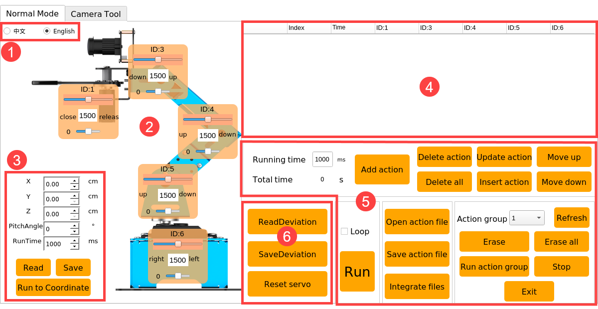

(1) Language Option

The language of PC software can be switched between Chinese and English. It will synchronize with the interface language of camera tool.

(2)  Servo Control Area

The icons on servo control area correspond to five servos of robotic arm. You can rotate servo by dragging the corresponding slider. 


| **Icon** | **Function** |
|:--:|:--:|
|  | Servo ID number. Here it refers to ID1 servo. |
|  | Servo slider (big slider) is used to adjust servo angle. It ranges from 500 to 2500, corresponding to angles 0°-180°. The middle value of 1500 corresponding to 90 degrees. |
|  | Deviation slider (small slider) is used to adjust servo deviation. It ranges from -150 to 150, corresponding to angle -13°-13°. |

(3) Inverse Kinematics Control Area 

This area is mainly for calibrating the gripping position of robot arm. If the gripping position is incorrect during using robotic arm, you can adjust its position in this area.


<table class="docutils-nobg" border="1">
<colgroup>
<col style="width: 35%" />
<col style="width: 64%" />
</colgroup>
<tbody>
<tr>
<td style="text-align: center;"><strong>Icon</strong></td>
<td style="text-align: center;"><strong>Function</strong></td>
</tr>
<tr>
<td style="text-align: center;"></td>
<td style="text-align: left;">(Take robot as the first ) Used to control the gripper to move left or right.</td>
</tr>
<tr>
<td style="text-align: center;"></td>
<td style="text-align: left;">(Take robot as the first ) Used to control the gripper to move forward and backward.</td>
</tr>
<tr>
<td style="text-align: center;"></td>
<td style="text-align: left;"><p>Used to control the gripper to move up and down.</p>
<p>Note: the program has set the z-axis value to 1cm and the gripper will be in the middle of the two sides of the block, so it is not commended to modify this value.</p></td>
</tr>
<tr>
<td style="text-align: center;"></td>
<td style="text-align: left;">The angel between gripper and x axis. Due to the program settings, it does not need to modify.</td>
</tr>
<tr>
<td style="text-align: center;"></td>
<td style="text-align: left;">The movement time used by the gripper to move from the previous position to the set coordinate value. (just for checking the running effect ) </td>
</tr>
<tr>
<td style="text-align: center;"></td>
<td style="text-align: left;">Read the current position information of gripper</td>
</tr>
<tr>
<td style="text-align: center;"></td>
<td style="text-align: left;">Save the adjusted position coordinate value</td>
</tr>
<tr>
<td style="text-align: center;"></td>
<td style="text-align: left;">Control robot to the set coordinate value.</td>
</tr>
</tbody>
</table>

(4) Action Date List

The action data list will display the running time of each action and the value of each servo.


| **Icon ** | Function |
|:--:|:--:|
|  | Action number |
|  | Running time |
|  | Double click the valueunder this ID to modify. |

(5) Action Setting Area

<table class="docutils-nobg" border="1">
<colgroup>
<col style="width: 28%" />
<col style="width: 71%" />
</colgroup>
<tbody>
<tr>
<td style="text-align: center;"><strong>Icon</strong></td>
<td style="text-align: center;"><strong>Function</strong></td>
</tr>
<tr>
<td style="text-align: center;"></td>
<td style="text-align: left;">The time required to run a single action. You can click it to modify.</td>
</tr>
<tr>
<td style="text-align: center;"></td>
<td style="text-align: left;">The total time for running an action group</td>
</tr>
<tr>
<td style="text-align: center;"></td>
<td style="text-align: left;">Add the current action in servo control area to the last line of the action data list.</td>
</tr>
<tr>
<td style="text-align: center;"></td>
<td style="text-align: left;">Delete all the selected actions in action data list</td>
</tr>
<tr>
<td style="text-align: center;"></td>
<td style="text-align: left;">Delete all the actions in action data list</td>
</tr>
<tr>
<td style="text-align: center;"></td>
<td style="text-align: left;"><p>Replace the value of the selected actions in action data list.</p>
<p>(The value will be replaced with the current servo value in servo control area, and the running time will be replaced with the set running time.)</p></td>
</tr>
<tr>
<td style="text-align: center;"></td>
<td style="text-align: left;"><p>Insert a line of action in front of the selected action</p>
<p> </p></td>
</tr>
<tr>
<td style="text-align: center;"></td>
<td style="text-align: left;">Swap the selected action with its previous action</td>
</tr>
<tr>
<td style="text-align: center;"></td>
<td style="text-align: left;">Swap the selected action with its next action</td>
</tr>
<tr>
<td style="text-align: center;"></td>
<td style="text-align: left;"><p>Click on "**Run**" button to run the action group in action data list once.</p>
<p>（If check "**loop**" robot arm will cyclically execute the action.）</p></td>
</tr>
<tr>
<td style="text-align: center;"></td>
<td style="text-align: left;"><p>Click it to select and open the action group to load it to action data list.</p>
<p>（The path of the action group file：/home/pi/ArmPi_mini/action_groups）</p></td>
</tr>
<tr>
<td style="text-align: center;"></td>
<td style="text-align: left;"><p>Save the action group in action data list to the specific position.</p>
<p>（The path of the action group file：/home/pi/ArmPi_mini/action_groups）</p></td>
</tr>
<tr>
<td style="text-align: center;"></td>
<td style="text-align: left;">After opening an action group, click it and open another action group file. Then two action groups are integrated into a new action group.</td>
</tr>
<tr>
<td style="text-align: center;"></td>
<td style="text-align: left;">Display the action group saved in PC software</td>
</tr>
<tr>
<td style="text-align: center;"></td>
<td style="text-align: left;">Refresh the selection bar of the action group</td>
</tr>
<tr>
<td style="text-align: center;"></td>
<td style="text-align: left;">Delete the current action group file</td>
</tr>
<tr>
<td style="text-align: center;"></td>
<td style="text-align: left;">（<strong>Caution</strong>）Delete all action group files</td>
</tr>
<tr>
<td style="text-align: center;"></td>
<td style="text-align: left;">Run the selected action group once</td>
</tr>
<tr>
<td style="text-align: center;"></td>
<td style="text-align: left;">Stop running action group</td>
</tr>
<tr>
<td style="text-align: center;"></td>
<td style="text-align: left;">Exit PC software</td>
</tr>
</tbody>
</table>

(6) Deviation Setting Area

| **Icon** | Function |
|:--:|:--:|
|  | Click to read the saved deviation automatically |
|  | After clicking, the deviation adjusted by PC software can be saved to the robot arm |
|  | Click it to restore all servos in servo control area to 1500 |

* **Camera Tool**

The camera tool is used to adjust the threshold of the recognized color, as the figure shown below.

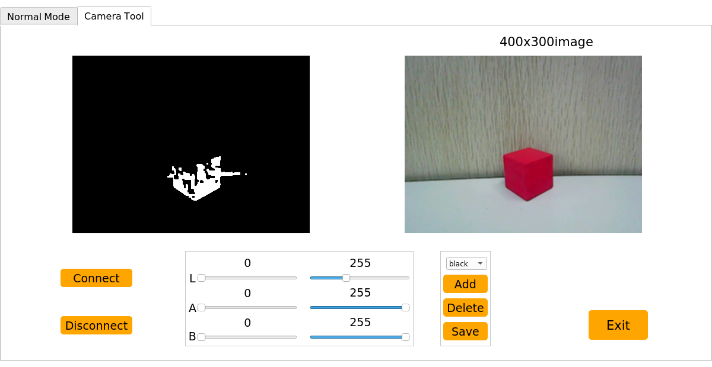

Please refer to the contentin [AI Vision Learning -> 4.2 Color Recognition ->Add Recognition Color]().

## 5.2 Import and Call Action

ArmPi mini has built in action group files before shipping and the path of the files is "**/home/pi/ArmPi_mini/action_groups**". The action group you edit can also be saved in this directory.


This lesson will tell you how to call action group and how to import it into the system of ArmPi mini.

### 5.2.1 Call Action Group by PC Software

(1) Power on the robot and use VNC Viewer to connect to the remote desktop.

(2) Double clickand click **"Execute"** in the pop-up window to open PC software.


(3) Click **"Open action file"** button to select the action group to be executed, and click **"Open"**.

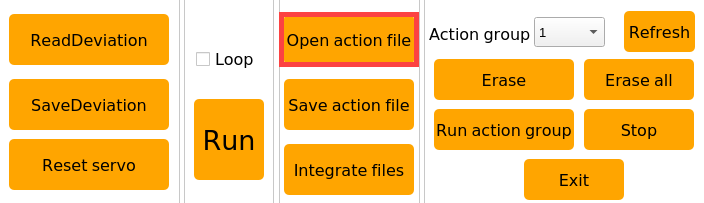


(4) The servo values will be displayed in action data list.

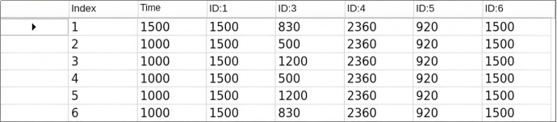

(5) Click **"Run"** to run all the actions in action data list. You can click **"Loop"** to cyclically run this action group. 


### 5.2.2 Import Action Group 

:::{Note}
* The action group must be named in English or with numbers, and the file format is "d6a".

* If want to export action group, you can a insert U disk into one of USB interfaces of Raspberry Pi and paste the action group file to the U disk.

  :::

There are two ways to import the external action group file to ArmPi mini. You can transfer action file to ArmPi mini system with a U disk, or use transfer tool to import action file to system desktop. This lesson will take "3.6a" action as example.

* **Use a U Disk**

(1) Connect to ArmPi mini system desktop via VNC tool.

(2) Insert the U disk with action group files into one of USB interfaces of Raspberry Pi.

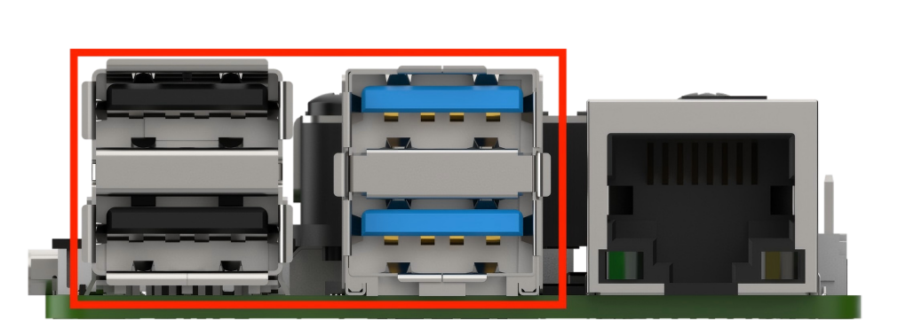

(3) When the following pop-up window shows in VNC viewer, click **"OK"**.


(4) Paste the action group file to the system desktop.


(5) Click on  icon to open file manger.

(6) Enter the directory "/home/pi/ArmPi_mini/action_groups", and import the action file to this directory.


(7) Double clickicon and click **"Execute"** to open PC software.


(8) Click **"Open action group"** button to select the imported action group file, and click **"Open"**.


(9) You can view the servo values and running time of the imported action group in servo data list.

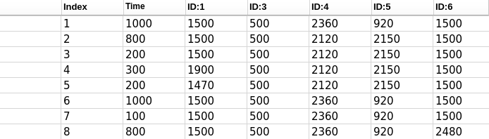

## 5.3 Action Programming

:::{Note}
All action parameters in this lesson is only for reference, please operate according to the actual situation.
:::

This lesson will use PC software to edit an action group. Robot Arm will grip down the block and place it on the right side for example. 

### 5.3.1 Edit Action

(1) Connect to ArmPi mini system desktop via VNC tool.

(2) Double click on icon, and click **"Execute"** to open PC software.


(3) Click **"Open action file"** and select **"start"** action group, and then click **"Open"** to set this action as the first action group.


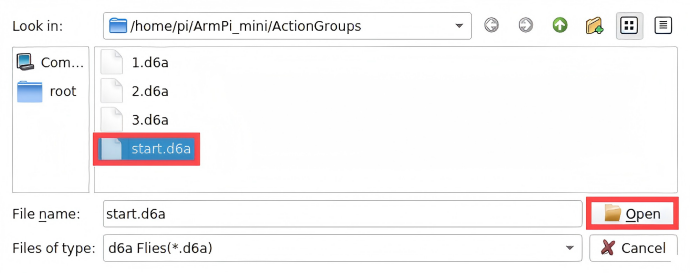

(4) Double click the triangle button in front of No.1 action in action data list to synchronize the action status of ArmPi mini. 


(5) Set the running time to 800ms and click **"Add action"** to get No.2 action. 


(6) To make the action group run smoother. After setting an action, we need to add a transition action and change the running time to 200ms. Then click **"Add action"** again to get No.3 action.

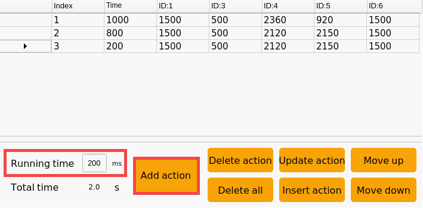

(7) Next, the gripper is controlled to grip the block. We need to drag the slider of No.1 servo.


(8) Set the running time to 800ms and click **"Add action"** to get No.4 action.


(9) Add a transition action and set the running time to 100ms. Then click **"Add action"** to get No.5 action. 


(10) Then drag the slide of No.1 servo to control the gripper to close.


(11) Set the running time to 200ms and click **"Add action"** to get No.6 action.


(12) Then drag the slider of ID4 and ID5 servos to control the robot arm to grip and lift up the block.


(13) Set the running time to 1000ms and click **"Add action"** to get No.7 action.


(14) Set the running time to 100ms and click **"Add action"** to add a transition action.


(15) Then drag the slider of ID6 servo to control the robot arm to rotate to the right.


(16) Set the running time to 800ms and click **"Add action"** to get No.9 action.

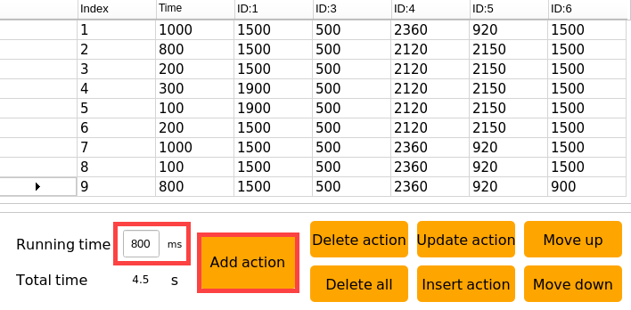

(17) Add a transition action. Set the running time to 300ms and click **"Add action"** to get No.10 action.


(18) Drag the slider of ID4 and ID5 servos to control the robot arm to put down the block.


(19) Set the running time to 1000ms and click **"add action"** to get No.11 action.


(20)  Now, drag the slider of ID1 servo to control the gripper to release the block. 


(21) Set the running time to 300ms and click **"Add action"** to get No.12 action.


(22) Drag the slider of ID1 and ID4 servos to control the gripper to close and lift up.


(23) Set the running time to 400ms and click **"Add action"** to get No.13 action.


(24) Finally, robot arm is controlled to return to the initial position. Click "  " in front of No.1 action to run it and set the running time to 1000ms. Then click "Add action" to get No.14 action.


### 3.2 Save Action

:::{Note}
 It is recommended to use English or numbers to name action group , and use underscore "_" instead of the space bar to avoid failure saving.
:::

To facilitate later debugging and management, it is recommended to save the action. Click **"Save Action File"**, name the file and click **"Save"**.


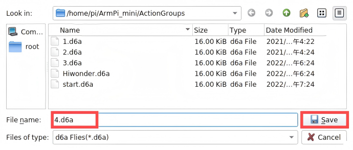

## 5.4 Integrate Action Files

This lesson will integrate action group **"1.d6a"** and **"3.d6a"** to explain how to integrate action files.

### 5.4.1 Integrate Action Groups

(1) Connect to ArmPi mini system desktop via VNC.

(2) Double clickicon, and click **"Execute"** to open PC software.


(3) Click **"Integrate action file"**.


(4) Select action group **"1.d6a"** and click **"Open"**.


At this time, the parameters of action group **"1.d6a"** are displayed in action data list.


(5) Then click **"Integrate action file"** and select **"3.d6a"** action group. Then click **"Open"**.


Now, the parameters of action group **"1.d6a"** is followed by that of action group **"3.d6a"**.

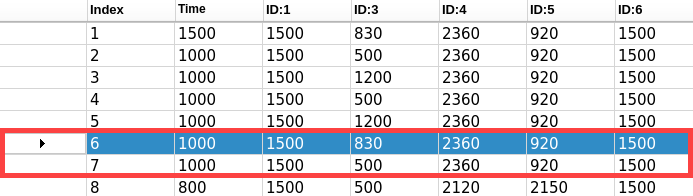

(6) Select the first action in action data list, and click **"run"** to execute the integrated action group once.


### 5.4.2 Save Integrated Action Group

Click **"Save action file"** to save the integrated action group for later debugging. The new action group is named as  **"Hiwonder"**.


:::{Note}
 It is recommended to use English or numbers to name action group , and use underscore "_" instead of the space bar to avoid failure saving.
:::
